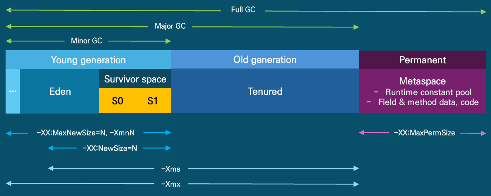

# Garbage Collector

- 아래 그림은 JVM Heap 영역의 구조이며, GC가 동작하는 방식이다
  
  - Permanent 영역은 Heap영역에 포함이 되지 않는 Native 영역이며, OS의 메모리를 할당받는다
- 어플리케이션 상황에 따라서 각 영역을 알맞게 튜닝하면 더 좋은 성능을 낼 수 있다

## Eden

- 객체 생성 직후 저장되는 영역
- Minor GC 발생 시 Survivor 영역으로 이동
- Copy & Scavenge 알고리즘

## Survivor 0, 1

- Minor GC 발생 시 Eden, S0에서 살아남은 객체는 S1로 이동
  - Survivor 0, Survivor 1 영역은 세대 구분을 위해 있는 게 아니라, 메모리 파편화를 줄이고 객체 복사를 관리하기 위한 구조다
  - Eden에 새로 생성된 객체가 들어가고, GC(Minor GC)가 발생하면 살아남은 객체들을 한 Survivor 영역으로 복사한다
  - 다음 GC 때는 다른 Survivor 영역으로 다시 복사하면서 번갈아 사용한다 (Copying 방식)
  - 이렇게 함으로써 메모리 파편화를 방지하고, 살아남은 객체들이 연속적인 메모리에 모이게 된다
- S1에서 살아남은 객체는 Old 영역으로 이동
- age bit 사용 (참조계수)

## Old (Old generation)

- Young generation 영역에서 소멸하지 않고 남은 개체들이
  사용하는 영역
- Full GC 발생 시 개체 회수
- Mark & Compact 알고리즘

## Permanent(Meta space)

- 로드되는 클래스, 메소드 등에 관한 메타 정보 저장 (자동확장 가능)
- Java heap이 아닌 Native 메모리 영역사용
- 리플렉션 클래스 로드 시 해당 영역 사용 (Spring)
