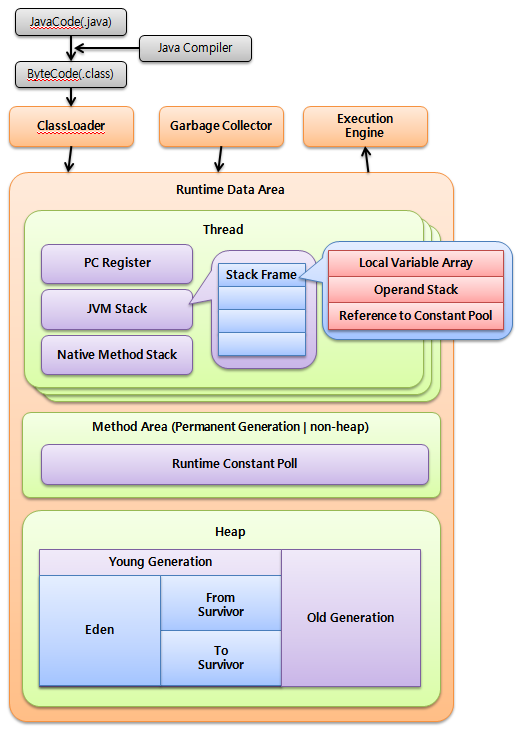

# Heap의 Metaspace와 Method 영역

- 위 그림에서 JRE의 Method 영역과 Heap의 Permanent영역의 Meta space영역은 Class의 메타데이터를 저장하는 같은 역할을 한다
  - Metaspace 영역은 Heap영역에 포함이 되지 않는 Native 영역이며, JVM의 메모리가 아닌 OS의 메모리를 할당받는다

## Metaspace와 method영역의 차이

| 항목                | 메소드 영역(Method Area)            | 메타스페이스(Metaspace)                |
|-------------------|---------------------------------|-------------------------------------|
| 개념                | JVM 명세에서 정의된 클래스 메타데이터 저장 논리적 영역 | Java 8 이후 HotSpot JVM에서 구현한 Method 영역의 실제 메모리 영역 |
| 저장 내용           | 클래스 구조, 메서드, 필드, 상수풀, 런타임 데이터 등 | 클래스 구조, 메서드, 필드, 상수풀, 런타임 데이터 등 |
| 메모리 위치         | X (JVM명세상의 개념적 영역)| OS 네이티브 메모리 (Heap 외부)        |
| 크기 조절           | 고정 크기 (Java 7 이전 PermGen)   | 필요에 따라 동적 확장 가능             |
| GC 영향             | Heap GC에 포함될 수도 있음        | GC 대상 아님, 클래스 메타데이터 관리용만 GC 발생 가능 |
| Java 버전 적용      | 모든 버전 존재, PermGen 형태는 Java 7 이전 | Java 8 이상에서 PermGen 대체           |
| 특징                | JVM 명세 상 개념적 영역             | Method 영역을 실제로 구현한 물리적 구조 |
