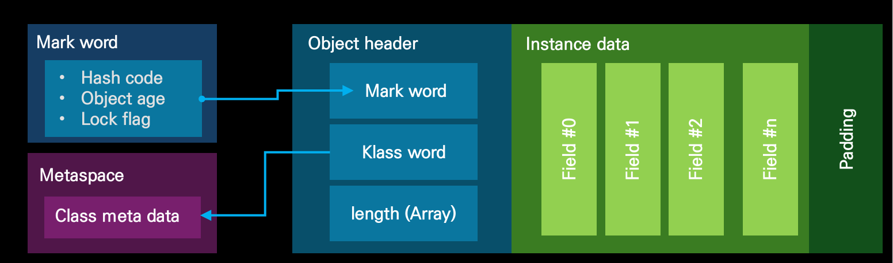

# Object Memory layout & HashCode

- JAVA 객체 메모리 레이아웃
  

- Object age는 gc에서 살아남은 횟수
- Meta space는 heap의 Meta space와 메모리를 공유한다

## Hash code

- Hashcode는 Lazy Loading으로 함수 호출 시점에 계산된다

```java
public class MyTest {
 int a = 10;
 public int getA() {
     return a;
 }
}
```

```plaintext
// MyTest object internals 분석
// -----------------------------------------------------------
// OFF: 객체 필드 오프셋, SZ: 필드 크기, TYPE: 필드 타입
// DESCRIPTION: 설명, VALUE: 실제 값

// 객체 초기 생성 직후
0   8   (object header: mark)    N/A
    // mark word: 객체의 내부 상태를 담는 헤더 (락 상태, GC age 등)
8   4   (object header: class)   N/A
    // klass pointer: 객체가 속한 클래스 메타데이터 주소
12  4   int MyTest.a             N/A
    // 인스턴스 필드 a, 아직 초기화 전

// 인스턴스 필드 초기화 후
0   8   (object header: mark)    0x0000000000000001
    // non-biasable 상태, age = 0
8   4   (object header: class)   0x01001c00
    // 클래스 메타데이터 주소는 그대로
12  4   int MyTest.a             10
    // 필드 값 10으로 초기화

// hashCode 호출 후 (lazy-loading)
0   8   (object header: mark)    0x00000079B4D0F01
    // mark word에 hashCode가 저장됨
    // 처음 hashCode를 요청할 때 계산되어 저장됨 (lazy-loading)
8   4   (object header: class)   0x01001c00
12  4   int MyTest.a             10
```

### Hash

- f(x) = y만 가능한 단방향 함수
  - 모듈러 연산이 대표적인 단방향 함수이다
- 단방향성
- 입력 값의 크기와 상관없이 결과 값의 길이(혹은 크기)가 일정한 것
- 데이터 무결성과 관련해 IT전반에 사용됨
- 대표적 해시 알고리즘
  - MD-5, SHA-1
  - SHA-128, 256, 384, 512