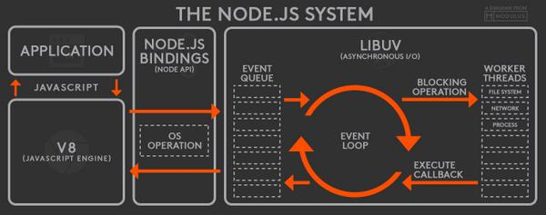

# Evenloop

> 자바스크립트는 싱글 스레드 기반의 언어이며, 동시에 하나의 작업만 처리할 수 있는 인터프리터이다.

> 자바스크립트의 함수가 실행되는 방식을 run-to-complete라고 부른다. 하나의 함수가 실행되면 끝날 때 까지 다른 어떤 작업도 끼어들지 못한다. JS에서는 하나의 호출 스택을 사용하며, 현재 스택에 쌓여있는 함수들이 모두 실행되기 전까지는 다른 어떤 함수도 실행될 수 없다.

> JS 엔진은 싱글 스레드이지만 JS가 동작하는 실제 환경인 웹 브라우저에서는 여러 개의 스레드가 사용된다.
JS엔진이 WEB API와 상호 연동을 하기 위해서 필요한 장치가 콜백 큐와 이벤트 루프다.

> 이벤트 루프는 호출 스택과 콜백 큐를 계속해서 주시하다가, 호출 스택이 비어있으면 콜백 큐에 먼저 들어온 순서대로 콜백 큐에 있는 콜백 함수들을 호출 스택으로 차례 차례 집어 넣는 역할을 한다.

## 이벤트 루프의 작업 처리 순서

0. Call Stack

현재 실행 중인 코드가 위치하며, 모든 작업은 콜 스택에서 처리된다.

> LIFO 로 Stack자료구조이다.

1. Microtask Queue

마이크로태스크 큐는 비동기 작업의 결과를 처리하기 위해 사용되는 큐로, 주로 promise의 이행 및 거부 처리와 MutationObserver/async/await 작업들이 대기한다.
MutationObserver는 DOM(문서 객체 모델)의 변화를 감지하는 데 사용되는 웹 API이며, 주로 웹 애플리케이션에서 DOM의 구조, 속성 또는 텍스트 내용의 변화를 감지할 때 사용된다
Promise, async/await 과 같은 콜백 함수들이 대기하는 영역이다.
이벤트 루프는 최우선적으로 Microtask Queue를 확인하고 처리한다.
마이크로 태스크큐에서 나온 결과는 바로 콜 스택으로 가서 실행된다.

2. requestAnimationFrame

requestAnimationFrame은 브라우저에게 애니메이션을 수행할 준비가 되었음을 알리고, 다음 화면 업데이트 시 실행될 콜백 함수를 등록하는 메서드이다.
애니메이션 프레임 콜백은 마이크로태스크 큐 다음에 실행되지만, 마이크로태스크가 완료된 후에 처리된다

3. Task Queue(=callback Queue)

애니메이션 프레임이 처리된 후, 태스크 큐의 작업을 처리한다.
task queue는 작업을 실행하는 곳이 아니고 결과를 받아서 콜스택에 넘기는 곳이다.

### 예외. WEB API

WEB API는 브라우저에서 멀티 스레드로 동작한다. 나온 결과를 Task Queue(callback Queue)에 넣어준다.
브라우저에서 제공하는 비동기 기능들을 담당하는 영역이다. DOM, Ajax, setTimeout, Event Handler 등이 있다. Call Stack에서 실행된 비동기 기능은 Web API를 호출하고, Web API는 콜백 함수를 Task Queue에 넣는다.

### 순서 요약
1. Call Stack 비움: 현재 콜 스택에 있는 작업이 모두 완료되면 이벤트 루프가 활성화된다.
2. Microtask Queue 큐 확인: 이벤트 루프는 Microtask Queue를 확인한다.
3. Microtask Queue 실행: Microtask Queue에 대기 중인 모든 작업이 실행된다.
4. Microtask Queue 작업은 call stack이 비어 있을 때 직접적으로 call stack으로 이동하여 실행된다. 즉, Microtask Queue에서 나온 결과는 task queue를 거치지 않고 call stack에서 즉시 실행된다.
5. requestAnimationFrame 처리 : Microtask Queue이 비워지면 이벤트 루프는 requestAnimationFrame을 처리한다.
6. Task Queue 처리: requestAnimationFrame가 비워진 후 이벤트 루프는 Task Queue를 확인하고, 대기 중인 태스크를 call stack으로 가져와 실행한다.

> 즉, 이벤트 루프의 동적 순서는 콜 스택이 비워지면 대기 중인 모든 작업을 처리하여 콜백 큐에 넣은 다음, 콜백 큐에서 하나씩 차례대로 실행하는 방식이다. 이 과정은 콜 스택이 비어 있는지 확인하고, 비어 있을 경우 태스크 큐에 있는 콜백을 shift하여 실행하는 방식으로 반복된다. 이를 통해 JavaScript는 싱글 스레드 환경에서도 비동기 처리를 효율적으로 수행할 수 있다.