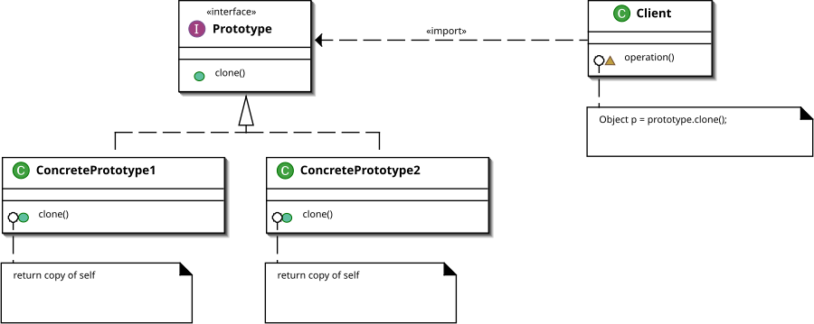

# JS의 Prototype

> Prototype은 일종의 "유전자"이다.

> 객체지향 프로그래밍에서 객체의 상속과 메서드 공유를 가능하게 하는 핵심 메커니즘이다

> Javascript에서 기본 데이터 타입을 제외한 모든 것이 객체이다. 객체가 만들어지기 위해서는 자신을 만드는 데 사용된 원형인 프로토타입 객체를 이용하여 객체를 만든다.

> 만들어진 객체 안에 __proto__속성이 자신을 만들어낸 원형을 의미하는 프로토타입 객체를 참조하는 숨겨진 링크가 있고, 이 숨겨진 링크를 프로토타입이라고 정의 한다.



프로토타입 디자인 패턴은 JavaScript의 프로토타입 상속을 활용하여 객체를 생성하는 방식에 기반한다. 이 패턴을 사용하면 새로운 객체는 원본 객체(프로토타입)의 속성과 메서드를 그대로 상속받아 일종의 복제본처럼 동작할 수 있다. 이 방식은 특히 다른 애플리케이션에서 재사용할 객체를 생성할 때 필요한 데이터베이스 조회나 복잡한 연산이 필요한 경우에 유용하다.

즉, 동일한 작업을 수행할 때, 이미 만들어진 객체를 처음부터 다시 만드는 대신, 원본 객체를 복제하여 필요한 데이터를 손쉽게 재사용할 수 있다. 이를 통해 효율성을 높이고, 객체 생성에 필요한 자원을 절약할 수 있다.

## 사용 예제

```javascript

// 생성자 함수
function Person(name, age) {
    this.name = name;
    this.age = age;
}

// 프로토타입에 메서드 추가
Person.prototype.greet = function() {
    console.log(`안녕하세요, 제 이름은 ${this.name}입니다.`);
};

// 객체 생성
const alice = new Person("Alice", 30);
alice.greet(); // 출력: 안녕하세요, 제 이름은 Alice입니다.

```
## 사용하는 이유
> 메모리 효율성: 메서드를 프로토타입에 추가하면 모든 인스턴스가 동일한 메서드를 공유하게 되어 메모리를 절약할 수 있다.

> 동적 속성 추가: 프로토타입을 통해 런타임 중에도 메서드나 속성을 추가할 수 있으며, 이는 코드의 유연성을 증가시킨다.

## 모든 자바스크립트 객체는 Object의 프로토타입을 물려받는가?

> 자바스크립트에서는 모든 객체가 기본적으로 Object의 프로토타입을 상속받는다. 하지만 이는 내장 API 객체(예: Array, Function 등)와 사용자 정의 객체에 따라 세부적으로 약간씩 다르게 동작한다. 

###  사용자 정의 객체와 Object 프로토타입
모든 사용자 정의 객체는 기본적으로 Object.prototype에 정의된 프로퍼티와 메서드를 상속받는다.
예를 들어, toString(), hasOwnProperty() 같은 메서드는 Object.prototype에 정의된 메서드이기 때문에 모든 객체에서 사용할 수 있다.

### 내장 API 객체와 고유 프로토타입
배열(Array), 함수(Function), 날짜(Date)와 같은 내장 API 객체들은 고유한 프로토타입을 가지고 있다. 예를 들어 Array 객체는 Array.prototype을, Function 객체는 Function.prototype을 상속받는다.
내장 객체들은 자신의 고유한 프로토타입에 정의된 메서드와 프로퍼티(예: Array.prototype.push, Function.prototype.call)를 상속하지만, 이들도 최종적으로는 Object.prototype을 참조한다. 즉, 내장 객체의 프로토타입도 프로토타입 체인의 최상단에 있는 Object.prototype을 상속한다.

### 객체 생성 방식과 프로토타입 연결
객체를 생성할 때 Object.create(null)을 사용하면 프로토타입 체인이 없는 객체가 생성된다. 이 경우에는 Object.prototype을 상속받지 않으며, toString()이나 hasOwnProperty() 같은 Object의 기본 메서드를 사용할 수 없다.


## Recap
> prototype은 객체 생성자 함수에 의해 생성되는 객체들이 공유하는 속성과 메소드를 저장하는 특수 객체이다.
모든 javascript 객체는 선언 할당하면 해당 생성자 함수의 prototype객체와 연결되며 프로토타입 체이닝을 통해 해당 객체의 속성, 메소드에 접근 가능하다.