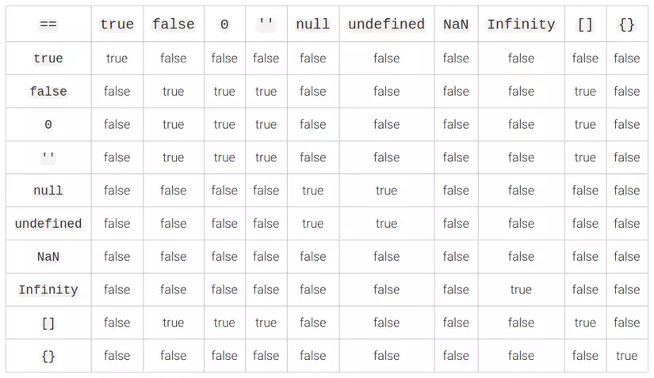

# Truthy & Falsy

> truthy 값은 '참 같은 값', falsy 값은 '거짓 같은 값'이다.

> boolean을 기대하는 문맥 (if, && 연산자, 삼항 연산자 등)에서 truthy 값은 true, falsy 값은 false로 평가가 되는 값이다.

> falsy값을 제외한 다른 모든 값은 truthy값으로 평가된다.

## Falsy 값

- 0
- -0
- NaN
- null
- undefined
- ''
- false

## Truthy 값

> Falsy값을 제외한 모든 값은 Truthy값이다

- true
- 모든 비어있지 않은 문자열 - ex) 'hi'
- 모든 숫자 - ex) 1, -1, 3.14 ...
- 모든 객체 - ex) {}, [] (빈 객체나 배열 포함)
- Infinity 

