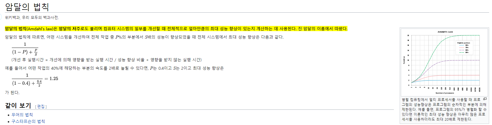

# Thread

- The benefits of multithreaded programing
  - Reponsiveness: may allow continued execution
    - if part of process is blocked, especially important for user interfaces
  - Resource Sharing: threads share resources of process
    - easier than shared-memory or message-passing
  - Economy: cheaper than process creation
    - thread switching lower overhead than context switching
  - Scalability: process can take advantage of multiprocessor architectures
    - multiprocessor 환경을 더 가치있게 사용할 수 있다(e.g. `Runtime.getRuntime().availableProcessors()`로 core 갯수만큼 thread 생성해 최적화 시키는 등의 동작을 할 수 있다)

## Multicore Programming

- Multithreading in a Multicore system
  - more efficient use of multiple cores from improved concurrency
- Consider an application with four threads
  - single core: threads will be interleaved(교차로 배치) over time
  - multiple cores: some threads can run in parallel
- Programming Challenges in Multicore systems
  1. Identifying tasks: find areas can be divided into separate tasks
  2. Balance: ensure the tasks to perform equal work of equal value
  3. Data splitting: data also must be divded to run on separate cores
  4. Data dependency: ensure that the execution of task is synchronized to accommodate the data dependency
  5. Testing and debugging: more difficult than single-thread

### amdahl's law



- 코어는 무조건 많을수록 좋은가?
- 결론: 프로세서의 수를 늘려도, 결국 한계가 존재한다
  - 일반적은 컴퓨터가 8코어인 이유도, 이상적으로 봐도 병렬 가능한 수치는 낮을 수 밖에없고, 그나마 최대로 성능을 높일 수 있는 효율적인 코어 수가 8코어 이기 떄문이다(하드웨어 비용 대비 성능 효율 최적화)
- 병렬 처리 한계의 원인
  1. 순차적 작업(Serial Portion)
  - 어떤 프로그램이든 병렬화할 수 없는 부분이 존재
  - e.g. 결과를 모아서 합산, 최종 출력, 상태 업데이트 등
  - CPU가 아무리 많아도 이 부분은 한 스레드에서 순차적으로 처리해야 함
  - → 이것이 Amdahl’s Law에서 (1-P)에 해당
  2. 결과 집계(Join) 비용
  - 병렬로 처리된 데이터도 최종 결과를 모아야 하는 단계가 있음
  - e.g. 여러 스레드가 계산한 값을 합산하거나, DB 트랜잭션을 커밋, **thread의 결과를 집계 후 메모리에 전달
  - 이 과정에서 동기화, 메모리 접근, 캐시 일관성 문제로 시간이 걸림
  3. 메모리/버스 병목
  - 여러 코어가 동시에 메모리나 버스에 접근 → 충돌 가능
  - 캐시 일관성 유지, 메모리 락(lock) 등 때문에 병렬 효율 저하
  4. 통신/동기화 오버헤드
  - 스레드/프로세스 간 결과 공유, lock 획득, barrier 동기화 등
  - 병렬이더라도 오버헤드가 발생 → 전체 속도 향상 제한
- 프로그래머 코드와는 별개로 존재하는 하드웨어/구조적 한계
- CPU 코어 증가 → 병렬 처리 향상 가능하지만, 순차적 처리와 메모리/캐시 오버헤드 때문에 한계가 있음
- Amdahl’s Law는 바로 이 구조적 한계를 수학적으로 보여주는 법칙

## Mutithread Models

- two types of threads
  - user threads and kernel threads
  - user threads
    - supported above the kervel
    - managed without kernel support
  - kernel threads are
    - supported and managed directly by the operating system
- Three relationships between user and kernel threads
  - many-to-one model
  - one-to-one model
  - many-to-many model
- user thread는 실제로 kernel에 생성되지 않은 논리적인 스레드를 말한다
  - e.g. go의 goroutine, java의 virtual thread, kotlin의 coroutine
  - 실제로 스레드를 생성하지 않기에 비용이 낮고, 병렬성을 얻지 못하고 동시성을 가지고 단일 코어에서 실행된다
  - compiler가 동시에 실행 가능한 코드로 생성하며, Runtime이 단일 코어에서 스케줄링 한다
- kernel thread는 실제로 kernel에 생성된 스레드를 말한다
  - e.g. jvm이 생성하는 thread(kernel thread와 1:1 매핑), C의 Pthread
  - 실제로 스레드를 생성하기에 비용이 크고, 동시성이 아닌 병렬성을 가져 멀티 코어에서 실행된다

## Implicit Threading

- The strategy of implicit threading
  - the design of concurrent and parallel applications
    - i.e., the design of multithreading in multicore systems
    - is too difficult for application developers
  - So, transfer the difficulty to compiler and runtime libraries
- 개발자들의 멀티스레드 이해도가 전부 완벽하지도 않고, 다루기가 어려워 생산성을 높이기 위한 전략이다
- Tomcat, spring boot이 개발자를 위한 implicit threading의 대표적인 예제이다
  - tomcat은 java nio API를 사용하여 client socket과의 연결을 수립한다
    - 수립한 연결을 worker thread와 바로 연동시키는 것이아니고, socket이 readable 상태가 될 때까지 java nio API를 이용해 감시한 후, readable 상태가 되면 worker thread에 mapping시켜 spring의 처리 로직을 시작한다
    - `selector.isReadable()`의 true 기준: 운영체제(OS) 커널의 소켓 수신 버퍼(Receive Buffer)에 1바이트라도 데이터가 들어왔는가? 이다. 
      - 경우의 수 A (데이터가 충분함): HTTP Header가 다 들어와 있다면, 내용을 해석하고 Controller로 보냅니다.
      - 경우의 수 B (데이터가 덜 옴): 아직 패킷이 덜 도착해서 Header가 잘렸거나, Body가 덜 왔다면? 여기서 Worker Thread는 나머지 데이터가 올 때까지 대기(Blocking)합니다. (이것이 Servlet의 Blocking I/O 특성입니다.)
    - 연결 수립(socket.accept(), 3-way handshake)은 즉시 완료되는 단순 반복잡업이고, 데이터 수신(READ, isReadable())은 상대방을 기다려야하는 불확실한 긴 작업이기 때문에, thread를 '단순 대기'에 낭비시키지 않기 위해 분리한 것이다
    - `serverSocket.accept()`실행 시점 전, OS에서는 먼저 3-way-handshake를 시작하고 socket을 생성하고 할당한다. 3-way-handshake가 끝난 socket은 OS 내부의 '연결 완료 큐(Accept Queue)'에 존재하며, 이 곳에서 fetch해오는 메서드가 `serverSocket.accept()`이다
      - 즉, `serverSocket.accpet()`에서 OS, Accept Queue 맨 앞에 있는 socket 하나만(유저 영역으로)넘기라는 요청을 보내는 것이다
  - spring boot는 실행시 내장서버(tomcat)를 이용해 thread pool을 생성하는 것을 기본 config로 삼으며, boundedQueue에 요청이 쌓이면 config에 따라 thread를 추가 생성한다
    - spring boot은 1thread - 1request model을 사용한다
```java
// JExpres
// 예전 방식 BIO(blocking I/O)
int portInteger = Integer.parseInt(port);

try (ServerSocket serverSocket = new ServerSocket(portInteger)) {
    while (true) {
        Socket clientSocket = serverSocket.accept();
        threadPool.execute(() -> handleClient(clientSocket, applicationContext));
    }
} finally {
    threadPool.shutdown();
}
```
```java
// tomcat pseudo code
// 현대 server의 동작
// non blocking I/O 사용
// 1. [준비] Selector(감시자)와 ServerSocketChannel(문지기) 생성
int portInteger = Integer.parseInt(port);
Selector selector = Selector.open(); 
ServerSocketChannel serverSocket = ServerSocketChannel.open();
serverSocket.bind(new InetSocketAddress(portInteger));
serverSocket.configureBlocking(false); // Non-blocking 모드 설정

// 문지기(ServerSocket)도 감시자에게 "새 손님 오면 알려줘"라고 등록
serverSocket.register(selector, SelectionKey.OP_ACCEPT);

while (true) {
    // 2. [감시] 이벤트가 발생할 때까지 대기 (여기서 1개 스레드로 수천 개 소켓 감시 가능!)
    // 데이터가 오거나 새 연결이 올 때까지 멈춰있음 (CPU 낭비 없음)
    selector.select(); 

    // 3. [이벤트 처리] 발생한 이벤트 목록을 가져옴
    Set<SelectionKey> selectedKeys = selector.selectedKeys();
    Iterator<SelectionKey> iter = selectedKeys.iterator();

    while (iter.hasNext()) {
        SelectionKey key = iter.next();

        // -----------------------------------------------------
        // Case A: 새 손님이 왔다! (Acceptor 역할)
        // -----------------------------------------------------
        if (key.isAcceptable()) {
            // 문지기가 연결을 수락함 (아직 워커 스레드 안 씀)
            ServerSocketChannel server = (ServerSocketChannel) key.channel();
            SocketChannel clientSocket = server.accept(); // 연결 수립 (3-way handshake 완료)
            
            clientSocket.configureBlocking(false); // 이 손님도 Non-blocking으로 설정
            
            // 핵심: 워커 스레드에 바로 안 던짐!
            // "너도 대기실(Selector)에 가서 데이터 보낼 때까지 기다려" 하고 등록(OP_READ)
            clientSocket.register(selector, SelectionKey.OP_READ);
            System.out.println("신규 연결 생성. 감시 목록에 추가됨.");
        }

        // -----------------------------------------------------
        // Case B: 기존 손님이 데이터를 보냈다! (Poller -> Worker 역할)
        // -----------------------------------------------------
        else if (key.isReadable()) {
            // 드디어 "실제 데이터"가 도착함.
            // 이 시점에 Thread Pool에서 스레드를 꺼내서 일을 시킴
            SocketChannel client = (SocketChannel) key.channel();
            
            // Tomcat에서는 이 부분을 threadPool.execute(() -> { ... })로 처리
            runWorkerThread(client); 
        }
        iter.remove(); // 처리한 이벤트 삭제
    }
}
```