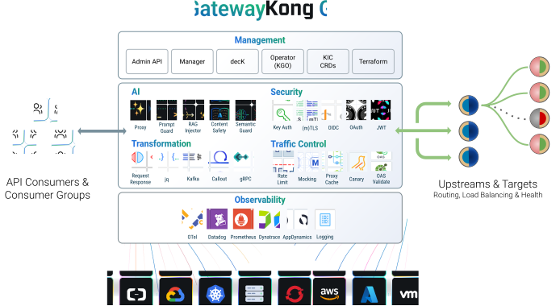

# Gateway란?

- Gateway란 API gateway를 뜻한다
  - 이는 모든 클라이언트의 요청을 단일 지점에서 받아 각각의 마이크로서비스로 전달하는 관문의 역할을 하는 서버이다
  - 복잡한 마이크로서비스 아키텍처(MSA) 환경에서 서비스 내부 구조를 외부로부터 숨기고 다양한 공통 기능을 효율적으로 처리하기 위한 필수 구성요소이다
  - 클라이언트는 어느 마이크로 아키텍처로 가야할지, 인증은 어떻게 할지 등의 역할을 Gateway를 통해 한번에 해결 할 수 있다
  - Kong gateway는 nginx기반으로 구축되어 높은 성능과 안정성을 가지며, 플러그인 아키텍처를 통해 손쉽게 기능을 확장할 수 있는 것이 특징이다

## Kong gateway의 핵심 기능

1. Routing

- 클라이언트로부터 들어온 요청을 미리 정의된 규칙에 따라 적절한 마이크로서비스로 전달한다
- 예를 들어, shopping.com/users라는 요청은 '사용자 정보 서비스'로, shopping.com/products라는 요청은 '상품 정보 서비스'로 보내주는 역할을 한다
- 같은 서비스로 다른 url로 접근하게 만들수도 있으며, 규칙도 다르게 할 수 있다

2. 인증 및 인가

- API를 보호하기 위해 허가된 사용자 인지 확인(인증)
- 해당 요청을 처리할 권한이 있는지 확인(인가)
- Kong은 API키, JWT, OAuth2등 다양한 인증 플러그인을 제공하여 각 서비스가 개별적으로 인증 로직을 구현해야하는 부담을 덜어준다

3. 트래픽 제어

- rate limit, proxy cache등을 사용

4. 로깅 및 모니터링

- Datadog 등 다양한 로깅/모니터링 도구와 연동 가능한 플러그인 지원

5. 요청/응답 변환

- 클라이언트의 요청 형식과 내부 서비스가 이해하는 형식이 다를 경우 중간에서 변환해주는 역할을 한다
