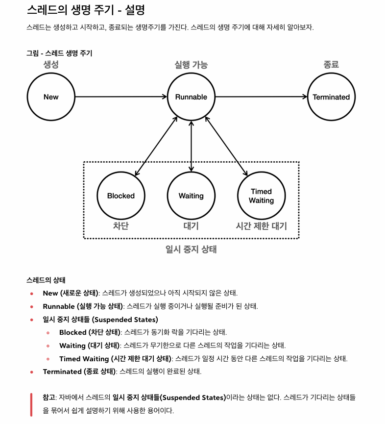

# 스레드의 생명주기

- 일시 중지 상태들에서는 CPU가 거의 사용되지 않고, JAVA가 대기한다

## 스레드의 상태

### NEW

- 스레드가 생성되고 아직 시작되지 않은 상태
- Thread 객체가 생성됬지만, start() 메서드가 호출되지 않은 상태

### Runnable(실행 가능 상태)

- 스레드가 실행될 준비가 된 상태
  - 이 상태의 CPU는 실제로 CPU에서 실행될 수 있다
- start() 메서드가 호출되면 스레드는 이 상태가 된다
- 이 상태는 CPU에서 실제로 실행될 수 있는 상태이긴 하지만, 모든 스레드가 동시에 실행되는 것은 아니다
  - 운영체제 스케쥴러의 실행 대기열에 있든, CPU에서 실제로 실행되든 모두 RUNNABLE 상태가 된다
  - Context Switching을 통해 실행되고 있다면, 실제로 동시에 실행되는 것이 아닌 하나는 대기열에 들어가 있는 상태라는 것을 설명하는 것이다

### Blocked(차단 상태)

- 스레드가 다른 스레드에 의해 동기화 락을 얻기 위해 기다리는 상태이다
- synchronized 블록에 진입하기 위해 락을 얻어야하는 경우 이 상태

### Waiting(대기 상태)

- 다른 스레드의 특정 작업이 완료되기를 `무기한` 기다리는 상태
- wait(), join() 메서드가 호출될 때 이 상태가 된다

### Timed Waiting(시간 제한 대기 상태)

- 스레드가 특정 시간 동안 다른 스레드의 작업이 완료되기를 기다리는 상태
- sleep(long millis), wait(long timeout), join(long millis) 메서드 호출 시
- 주어진 시간이 경과하거나 다른 스레드가 해당 스레드를 깨우면 이 상태를 벗어난다

### Terminated

- 스레드의 실행이 완료 된 상태이다
- 스레드가 종료되거나, 예외가 발생하여 종료된 경우 이상태가 된다
- 스레드는 한번 종료되면 다시 시작할 수 없다
  - 스레드가 생성되면 스택이 생성되고, 이 스택 프레임이 비게 되면 스레드가 종료된다
