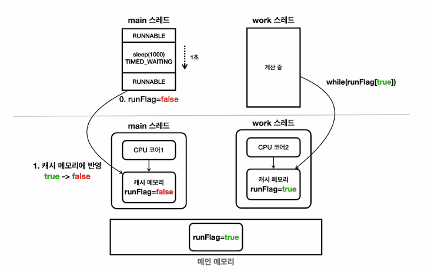
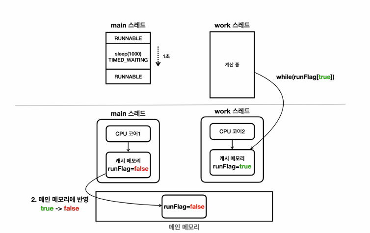

# Volatile

> main 스레드에서 자식 스레드인 work스레드의 flag를 변경한 코드에서의 상태 그림

- 자바의 멀티스레드 환경에서는 여러 스레드가 같은 메모리 공간(Heap) 을 공유한다.
  - Heap을 공유하지만, Heap의 정보를 스레드의 캐시에 보관한다
    - 이로 인해, 한 스레드가 변수 값을 변경해도 다른 스레드가 그 변경을 인식하지 못하는 문제(가시성 문제) 가 발생할 수 있다.
- 그림의 스레드의 변경 값이 메인 메모리에는 언제 반영되고, 메인 메모리에 변경된 runFlag 값이 언제 CPU 코어 2의 캐시메모리에 반영될까?
  - 정답은 "알수 없다", CPU 설계 방식과 종류에 따라 다르며 평생 반영되지 않을 수도 있다
  - 언젠가 CPU 코어2의 캐시메모리에 runflag의 값을 불러오게 되면 while문을 탈출할 수 있다
  - 주로 컨텍스트 스위칭이 될 때 캐시메모리도 함께 갱신된다(이 부분도 환경에 따라 달라짐)
    - Thread.sleep() 의 경우 스레드가 쉬는데, 이럴 때 컨텍스트 스위칭이 되면서 주로 갱신된다
    - 하지만 이것도 갱신을 보장하지는 않는다
- 성능 최적화를 위해 각 스레드(정확히는 CPU 코어)는 변수 값을 CPU 캐시(레지스터 포함)에 저장하고 접근한다.
  - 이 캐시메모리로 인해 속도의 차이가 5배 가량 난다
- 이 문제를 '메모리 가시성' 문제라고 한다

## 해결 방법

- 이러한 문제를 해결하기 위해 Java는 volatile 키워드를 제공한다.
  - 값을 읽을때, 값을 쓸때 모두 메인 메모리(Heap)에 접근하는 키워드
- volatile로 선언된 변수는 모든 스레드가 항상 메인 메모리의 값을 읽고 씀을 보장한다.
- 즉, 캐시가 아닌 메인 메모리와 직접 동기화되므로, 가시성 문제가 해결된다.

## 주의할 점

- volatile은 가시성(visibility) 은 보장하지만, 원자성(atomicity) 은 보장하지 않는다.
  - 예: count++ 같은 연산은 volatile로도 안전하지 않다.
- volatile은 성능이 캐시를 사용하는 것보다 떨어진다(값을 읽을때, 값을 쓸 때 모두 메인 메모리에 접근하기 때문)
  - 대략 5배정도의 성능차이가 있다
