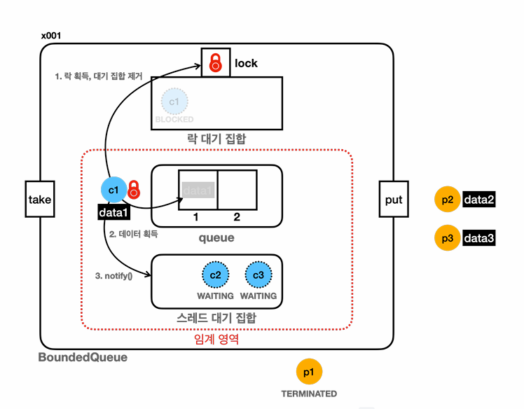
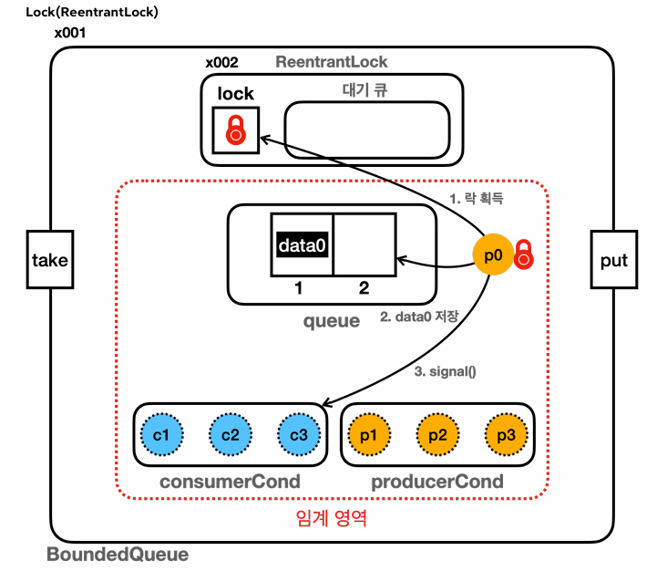

# 스레드의 대기 상태

## synchronized 대기

> 개념상 락 대기 집합이 1차 대기소이고, 스레드 대기 집합이 2차 대기소이다

- 대기1: 락 획득 대기
  - BLOCKED 상태로 락 획득 대기
    - 자바 내부의 락 대기 집합에서 대기(개발자가 확인 불가)
  - synchronized를 시작할 때 락이 없으면 대기
  - 다른 스레드가 synchronized를 빠져나갈 때 대기가 풀리며 락 획득 시도
- 대기2: wait() 대기
  - WAITING 상태로 대기
  - wait()을 호출하면 스레드 대기 집합에서 대기
    - 스레드 대기 집합에서 대기(모니터 락을 반납한다)
    - wait()를 호출해서 스레드 대기집합에 들어가기 위해서는 모니터 락이 필요하다
      - 스레드 대기 집합에 들어가면 모니터락을 반납한다
  - 다른 스레드가 notify()를 호출했을 때 빠져나감
    - 스레드 대기 집합 중 하나가 스레드 대기 집합을 빠져나온다
    - 빠져나오며 모니터락 획득을 시도한다
      - 모니터락을 획득하면 임계영역을 수행한다
      - 모니터 락을 획득하지 못하면 락 대기 집합에 들어가서 BLOCKED 상태로 락을 기다린다

## reentrantlock 대기

> 같은 락 구조라서 크게 다를게 없으며, 락 대기 집합대신 대기 큐가 존재하게 된다

- 대기1 : ReentrantLock 락 획득 대기
  - ReentrantLock의 대기 큐에서 관리
  - WAITING 상태로 락 획득 대기
  - lock.lock()을 호출 했을 때 락이 없으면 대기
  - 다른 스레드가 lock.unlock()를 호출 했을 때 대기가 풀리며 락 획득 시도, 락을 획득하면 대기 큐를 빠져나감
- 대기2: await() 대기
  - condition.await()을 호출했을 때, condition 객체의 스레드 대기 공간에서 관리
  - WAITING 상태로 대기
  - 다른 스레드가 condtion.signal()을 호출 했을 때 condtion 객체의 스레드 대기 공간에서 빠져나감

## Lock의 개념

- lock의 개념은 1950-60년대에 만들어진 개념
- 생산자-소비자 문제는 오래전부터 있던 문제이며, 이미 해결 방법이 있다
  - java의 경우 생산자-소비자 문제는 BlockingQueue 구현체를 이용해 해결할 수 있다
- 맞는 구현체를 찾아서, 올바르게 사용하기만 하면 된다
- java의 해결 방법은 synchronized - reentrantlock의 순으로 발전해 온 것이다