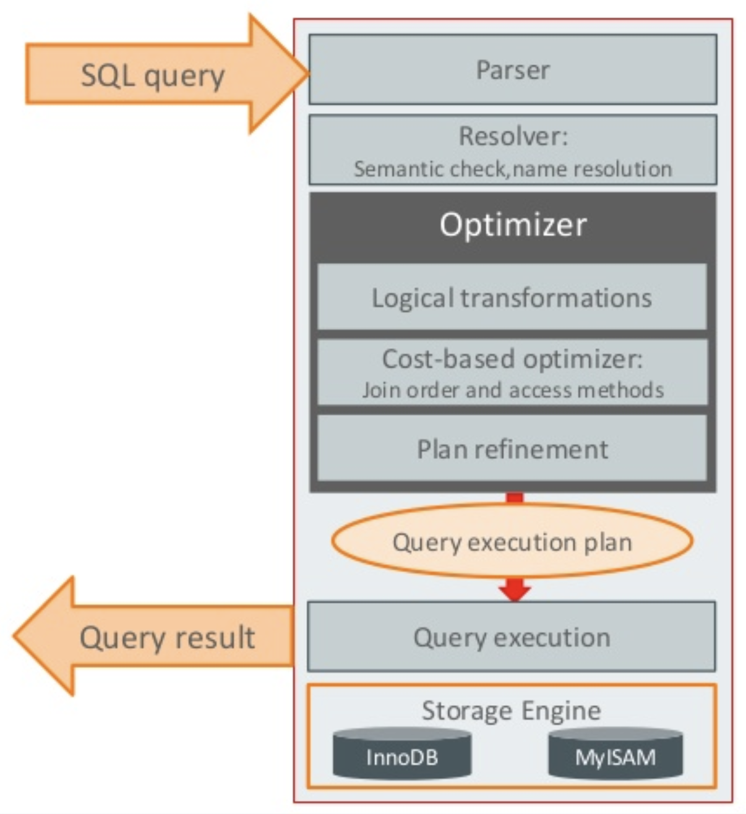
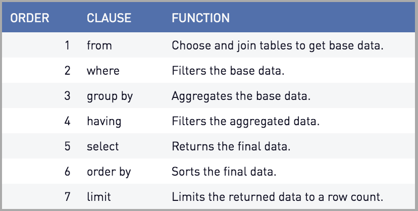

# MySQL 옵티마이저와 힌트

- 옵티마이저의 종류 2가지(MySQL은 비용기반 최적화 사용)
    - 1. 비용 기반 최적화 : 쿼리를 처리하기 위한 여러 방법을 만들고, 각 단위 작업의 비용 정보와 대상 테이블의 예측된 통계 정보(테이블 메타데이터)를 통해 실행 계획별 비용을 산축한다. 이렇게 산출된 실행 방법별로 비용이 최소로 소요되는 처리 방식을 선택해 최종적으로 쿼리를 실행한다.
    - 2. 규칙 기반 최적화 : 대상 테이블의 레코드 건수나 선택도 등을 고려하지 않고 옵티마이저에 내장된 우선순위에 따라 실행 계획을 수립하는 방식이다, 예전에 많이 사용되었지만 현재는 거의 사용되지 않는다

- 옵티마이저는 다음과 같은 역할을 수행한다
    - SQL 파싱 : SQL 문장을 잘게 쪼개서 MySQL 서버가 이해할 수 있는 수준으로 분리 (파싱 트리, parsing tree)
    - 최적화 및 실행계획 수립 : SQL 파싱 트리를 확인하면서 어떤 테이블부터 읽고 어떤 인덱스를 이용해 테이블 읽을지 선택
    - 스토리지 엔진으로부터 데이터 가져오기 : 앞 단계에서 만들어진 실행계획을 기반으로 스토리지 엔진으로부터 데이터 로드

## SQL Parsing

- SQL 파싱은 MySQL 서버의 SQL 파서라는 모듈로 처리한다.
- SQL 문장이 잘못된 문법을 가지고 있다면 첫 번째 단계에서 걸러진다.
- 첫 단계를 무사히 지나가면 SQL파싱트리 가 생기는데 이를 기반으로 MySQL 서버에서는 쿼리를 실행한다.

## 최적화 및 실행계획 수립
- 비용 기반 최적화를 시행한다
- 쿼리의 기본적인 실행 순서

### 최적화 방법

1. 풀 데이터 스캔
    - 테이블의 레코드 건수가 너무 작아 인덱스를 통해 읽는 것보다 풀 테이블 스캔을 하는 편이 더 빠를 경우(일반적으로 테이블이 페이지 1개로 구성된 경우)
    - MySQL(InnoDB)은 데이터를 페이지(Page) 단위로 관리하며, 기본적으로 한 페이지 크기는 16KB이다.
    - Where절이나 On절에 인덱스를 사용할 수 있는 적절한 조건이 없는 경우
    - 인덱스 레인지 스캔이 가능한 쿼리라고 하더라도 옵티마이저 판단한 조건 일치 레코드가 너무 많은 경우(메타데이터 탐색)

2. 인덱스 최적화
    - 인덱스 레인지 스캔
        - Where절에서 범위 조건을 만족하는 경우
    - 인덱스 풀 스캔
        - Order by가 인덱스 정렬과 일치하면 인덱스 전체를 활용한다
    - 커버링 인덱스
        - 인덱스에 저장된 데이터만으로 모든 조회가 가능할때

3. 조인 최적화
    - Nested Loop Join (기본적인 조인 방식)
    - Hash Join (임시 테이블을 활용하여 조인 속도 향상)
    - Index Join (조인 시 인덱스를 활용하여 속도 향상)

4. 정렬(ORDER BY) 및 그룹핑(GROUP BY) 최적화
    - Order by 최적화
        - 인덱스를 활용하여 정렬 비용을 줄일 수 있음
    - Group by 최적화
        - 인덱스를 활용하거나 임시테이블을 사용하여 최적화 할 수 있다

5. Limit 최적화
    - Limit이 있는 경우 불필요한 데이터 조회를 줄이는 방향으로 최적화
    - 인덱스를 활용하여 정렬 후 바로 n개만 가져오도록 최적화
    
## 스토리지 엔진으로부터 데이터 가져오기
- 수립된 실행 계획대로 스토리지 엔진에 레코드를 읽어오도록 요청하고 MySQL 엔진에서는 받은 레코드를 조인하거나 정렬하는 작업을 수행한다