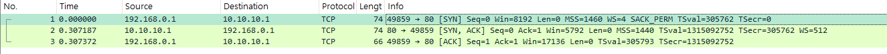
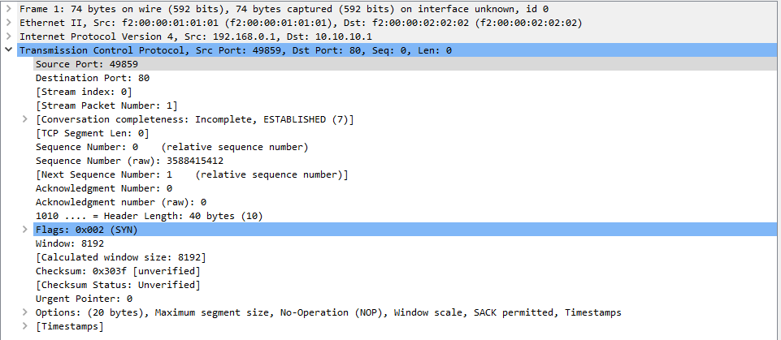
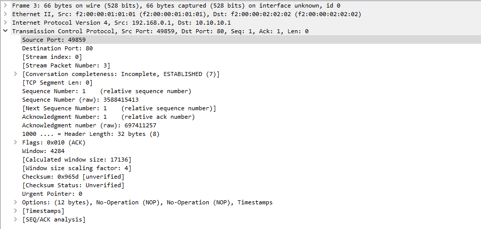
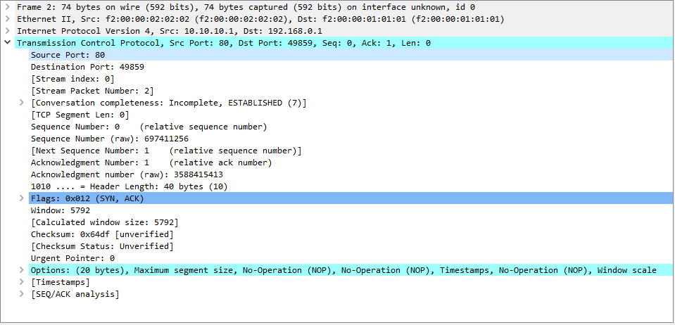
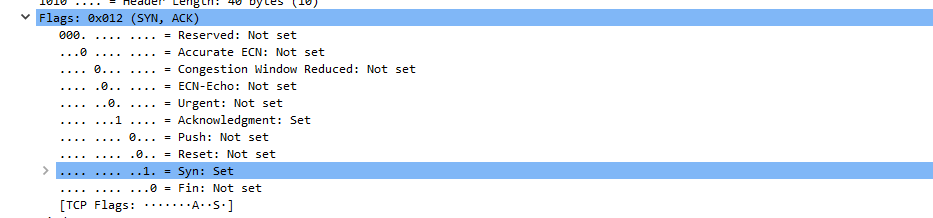

# TCP

- 3-way-handshake로 연결한다
- port번호를 직접 관리하는 계층이다
- TCP에는 ACK필드가 반드시 포함되어야 TCP연결이라고 할 수 있다(신뢰성)
    - 필요가 없는 경우도 0으로 전송한다(데이터 확인 응답이 필요 없는 상태)
- tcp전송은 port에 대한 정보가 반드시 포함된다
- tcp flags에는 해당 정보가 포함되었는지 OX여부이며, 정보는 다른 곳에 들어있다
- tcp에는 ACK(수신양호)을 활용해 정보의 수신여부를 반드시 포함한다

## 3-way-handshake

- 해당 handshake 과정의 구성
    1. 192.168.0.1이 10.10.10.1 에게 연결 요청을 보내는 패킷
    2. 10.10.10.1이 192.168.0.1에게 확인 응답을 보내는 패킷
    3. 192.168.0.1이 10.10.10.1 에게 확인 응답을 보내는 패킷

1. 192.168.0.1이 10.10.10.1 에게 연결 요청을 보내는 패킷 분석
    - 송신지 포트번호 49589(동적 포트번호), 목적지 포트번호 80
    - SYN bit(시작시 1, 0x002)
    - 실제 순서 번호 3588415412
2. 10.10.10.1이 192.168.0.1에게 확인 응답을 보내는 패킷
    - 송신지 포트번호 80, 목적지포트번호 49859
    - flags 0x012로 SYN,ACK flag가 활성화 된 것을 확인할 수 있다
    - 실제 순서 번호 697411256
3. 192.168.0.1이 10.10.10.1 에게 확인 응답을 보내는 패킷
    - 송신지 포트번호 49589, 목적지 80
    - flags 0x010 으로 ACK만 활성화
    - 실제 순서 번호 3588415413(첫번째 요청 이후로 순서를 알린다)

- TCP의 특징은 순서가 있는 연결(전송 순서 보장)이라 순서가 중요하기에 데이터의 순서 보장과 패킷 재전송이 필요한 경우 이를 기준으로 데이터를 처리한다