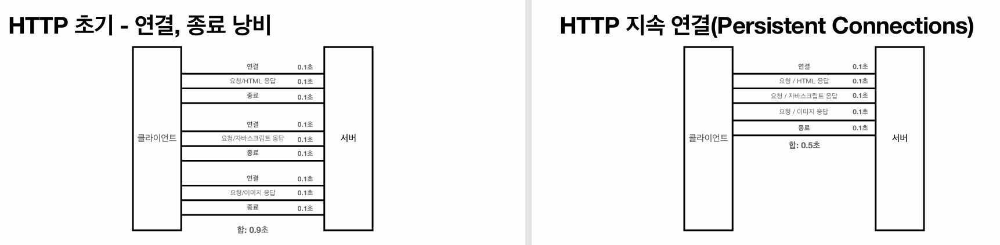
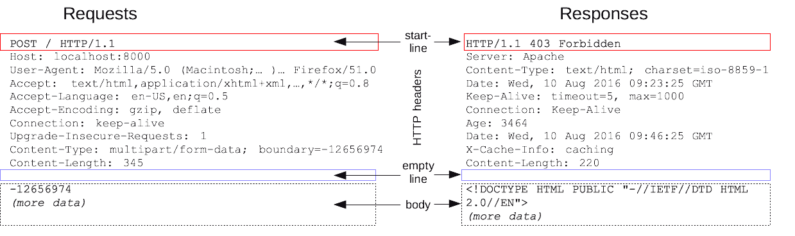
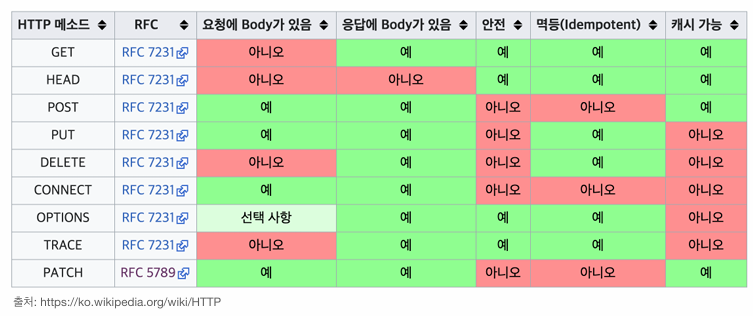

# 모든 개발자를 위한 HTTP 웹 기본지식 - 김영한

> 네트워크 계층(NIC) > 인터넷 계층(IP) > 전송 계층(TCP, UDP) > 애플리케이션 계층(HTTP, FTP)

> 뒤로 갈수록 앞쪽이 가진 문제점을 보완하고, 캡슐화 시킨다. (뒤로 갈수록 크기가 커짐)

## 네트워크 계층

- 데이터를 포장하지만, 가야 할 곳을 알 수없다.
- 그래서 다음 계층인 인터넷 계층에서 IP 프로토콜을 사용해서 전송 위치를 찾는다.

## IP - 네트워크 계층의 보완

- 지정한 IP주소로 데이터를 전달한다
- 패킷(Packet)단위로 전달하며, MTU를 넘는다면 여러개로 나뉜다.
- 여러개로 나뉘면 같이 보내는 패킷이라도 같은 노드를 방문할것이라는 보장이 없다(라우팅 테이블 이용)
- 비연결성 : 패킷을 받을 대상이 없거나 서비스 불능 상태여도 패킷을 전송한다
- 비신뢰성 : 패킷이 사라지거나 순서대로 안오면 대처하지 못한다.
- 프로그램 구분 : 같은 서버에서 애플리케이션이 둘 이상이라면 대응 할 수 없다

## TCP/UDP - IP프로토콜의 보완

### TCP
- 연결 지향(TCP 3way HandShake)
    - 실제 연결이 아닌 논리적인 연결, 중간 노드들은 두 곳이 연결됬다는 것을 모른다.
- 데이터 전달 보증(패킷 누락을 알 수 있음.)
- 순서 보장
- 신뢰 가능 프로토콜
- 요즘은 대부분 TCP를 사용한다.
- PORT가 추가되어서 프로그램 구분이 가능하다.
- TCP 세그먼트는 TCP 프로토콜에서 전송하는 데이터 단위로, 헤더(Header)와 데이터(Payload)로 구성된다.
    - 헤더(Header)에는 전송 제어와 관련된 정보(예: 송수신 포트 번호, 순서 번호, 체크섬 등)가 포함됩니다.
    - TCP는 데이터를 세그먼트라는 단위로 나누어서 전달하며, 이 세그먼트가 여러 개의 패킷으로 나누어져 IP 네트워크를 통해 전달된다.

### UDP

- 하얀 도화지에 비유 할 수 있다(기능이 거의 없다/ 커스텀 할 수 있음)
- 연결 지향 X
- 데이터 전달 보증 X
- 순서 보장 X
- 단순하고 빠르다
- IP와 거의 비슷하지만 PORT / 체크섬(데이터 전송 체크) 정도만 추가된다.
- 애플리케이션에서 추가 작업 필요

## HTTP (애플리케이션 계층 프로토콜)
> 클라이언트-서버 모델을 기반으로 웹 상에서 리소스를 요청하고 응답하는 방식을 정의하는 프로토콜이다.

> HTTP는 TCP를 기반으로 작동하며, 실제 웹 페이지를 요청하거나 데이터를 주고받을 때 HTTP가 동작하는 방식은 TCP 연결을 통해 이루어진다.

> HTTP는 애플리케이션 레벨에서 데이터를 주고받는 방식을 정의하고, 실제 데이터가 전송되는 과정에서는 TCP 프로토콜을 사용하여 데이터를 연결된 두 지점 사이에 전송한다. 즉, HTTP는 데이터를 어떻게 요청하고 응답할지에 대한 규칙을 정하며, 실제 데이터 전송은 TCP가 담당한다.

- HTTP 메시지로 거의 모든 것을 전송 할 수 있다
     - IMG, 음성, 영상, 파일 등등...
- TCP : HTTP/1.1 , HTTP/2
- UDP : HTTP/3 
- 현재는 HTTP1.1을 주로 사용하고 있으며, HTTP/2와 HTTP/3도 점점 증가하고 있다.

### HTTP의 특징
- 클라이언트 - 서버 구조(요청과 응답, 명확한 책임의 분리)
- 무상태 프로토콜(Stateless), 비연결성
- 단순함, 확장가능

#### Stateless
- 서버가 클라이언트의 상태를 보존하지 않는다
- 서버 확장성이 높다(중간에 다른 서버로 바뀌어도 이상 없이 작동한다)
- 그러나 클라이언트가 추가 데이터 전송을 해야한다
- 하지만 실제로 모든것을 무상태로 설계하기는 힘들다
    - ex) 로그인 상태 유지/ 쿠키와 세션 이용

#### 비연결성
- HTTP는 기본이 연결을 유지하지 않는다
- 초 단위 이하의 빠른 응답 가능
- 1시간동안 수천명이 서비스를 사용해도 실제 서버에서 동시에 처리하는 요청은 수십개이하 이다.
- 서버 자원을 매우 효율적으로 사용 가능
- 매번 새로운 연결을 해야하는 단점이 존재
- 하지만 많은 자원이 필요하면 너무 비효율적이 되어, HTTP 지속연결(Keep-alive)로 문제를 해결하였다.

### HTTP 프로토콜의 구조

> Method를 사용해 행위를 분리한다(GET/POST/PUT/PATCH/DELETE)

> HTTP Method는 안전/멱등/캐시가능의 속성을 가진다

#### HTTP 헤더
- HTTP 전송에 필요한 모든 부가 정보
- 표준헤더가 많다
- 필요시 임의의 헤더 추가 가능
- 본문 데이터 해석이 필요한 정보가 있다(데이터유형/데이터길이/압축정보 등등..)
- 협상(클라이언트가 선호하는 표현 요청)
    - 서버가 다양한 언어 제공 가능할때, 선호 언어를 요청한다.
- Referer(이전 웹 페이지 주소)(요청에서 사용된다.)
- Host(필수)(요청한 호스트 정보, 가상호스트를 통해 여러 도메인을 한번에 처리할 수 있는 서버도 있어서 필수적으로 필요하다.)
- 쿠키(Set-Cookie/ Cookie)

#### HTTP 바디

- 요청이나 응답에서 전달할 실제 데이터
- 헤더는 본문을 해석할 수 있는 정보를 제공한다
    - 데이터유형/데이터길이/압축정보 등등..

#### HTTP Method의 속성
- 안전
    - 호출해도 리소스를 변경하지 않는다
- 멱등
    - 한 번 호출하든, 100번 호출 하든 결과가 언제나 똑같다
- 캐시가능
    - 로컬 PC에 웹 브라우저가 캐시에 저장할 수 있는가?

