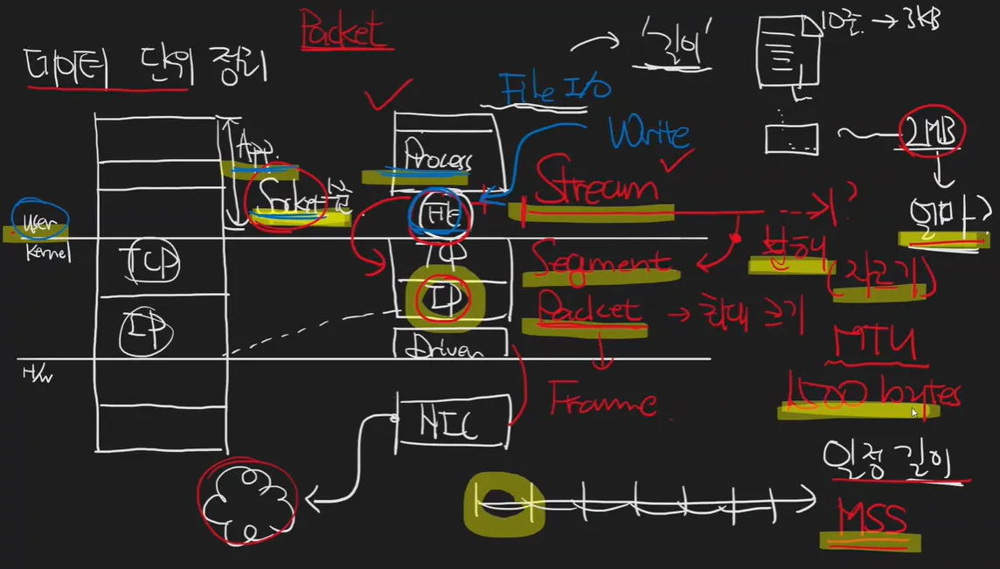

- 데이터 단위
    
    
    
    process 수준에서 stream으로 내보내고, tcp로 가면 segment로 자른다.
    
    ip수준에서 패킷화 시키며, 캡슐화 시킨다.
    
    - 추가설명
        
        tcp에서 세그먼트화 시키고, ip에서 패킷화 시키면 어떻게 캡슐화 시킬 수 있음? 이전 데이터 에 손대는것이 세그먼트화랑 패킷화아님?
        
        Answer
        
        **세그먼트화와 패킷화는 데이터에 "손대는" 것이 맞습니다.**
        
        - **세그먼트화(Segmentation):** TCP는 응용 프로그램에서 받은 데이터 스트림을 적절한 크기의 세그먼트로 나눕니다. 이때 각 세그먼트에는 TCP 헤더가 추가됩니다. 즉, 원본 데이터에 TCP 헤더라는 정보가 추가되는 것이죠.
        - **패킷화(Packetization):** IP는 TCP 세그먼트(또는 UDP 데이터그램)를 페이로드로 받아 IP 헤더를 붙여 IP 패킷을 만듭니다. 이 역시 원본 데이터(TCP 세그먼트)에 IP 헤더라는 정보가 추가되는 것입니다.
        
        **캡슐화는 이렇게 추가된 정보들을 통해 이루어집니다.**
        
        - **상위 계층 데이터를 하위 계층 데이터에 포함:** TCP 세그먼트는 IP 패킷의 페이로드 부분에 포함됩니다. 즉, IP 패킷은 TCP 세그먼트를 "담고 있는" 형태가 됩니다.
        - **헤더를 통해 추가 정보 제공:** 각 계층의 헤더는 해당 계층에서 필요한 정보를 담고 있습니다. 예를 들어, TCP 헤더는 포트 번호, 순서 번호 등을 통해 TCP 연결 관리에 필요한 정보를 제공하고, IP 헤더는 출발지/목적지 IP 주소를 통해 패킷 라우팅에 필요한 정보를 제공합니다.
        
        **따라서, 세그먼트화와 패킷화는 데이터에 헤더를 추가하는 과정이며, 이렇게 추가된 헤더 정보를 통해 상위 계층 데이터를 하위 계층 데이터에 캡슐화하여 전송할 수 있게 됩니다.**
        
        **정리**
        
        - 세그먼트화와 패킷화는 데이터에 헤더를 추가하는 과정입니다.
        - 캡슐화는 상위 계층 데이터를 하위 계층 데이터에 포함시키는 것을 의미합니다.
        - TCP 세그먼트는 IP 패킷의 페이로드에 캡슐화되어 전송됩니다.
        - 각 계층의 헤더는 해당 계층에서 필요한 정보를 제공합니다.
        
        **추가 설명**
        
        이러한 캡슐화 방식은 TCP/IP 모델과 같은 계층형 네트워크 모델의 핵심 개념입니다. 각 계층은 자신의 역할에 집중하고, 하위 계층의 서비스를 이용하여 상위 계층의 기능을 구현합니다. 이를 통해 네트워크 통신의 복잡성을 줄이고, 각 계층의 독립성과 유연성을 높일 수 있습니다.