# 인터넷 프로토콜

- IPv4
    
    0~255 . 0~255 . 0~255 . 0~255로 구성되어 있다.
    
    (약 43억개 , 부족해서 IPv6가 나왔음)
    
    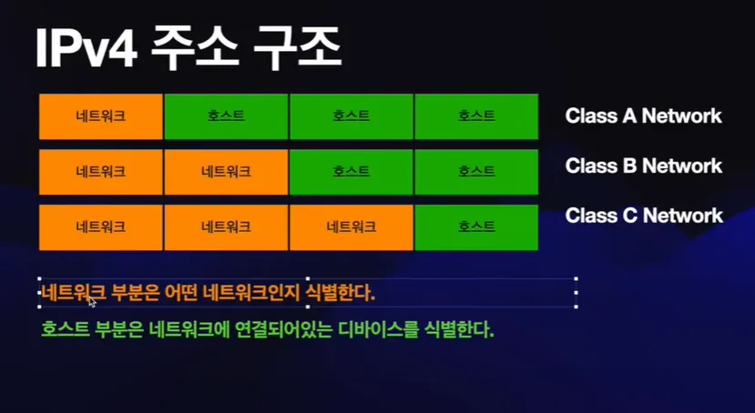
    
    CLASS A
    
    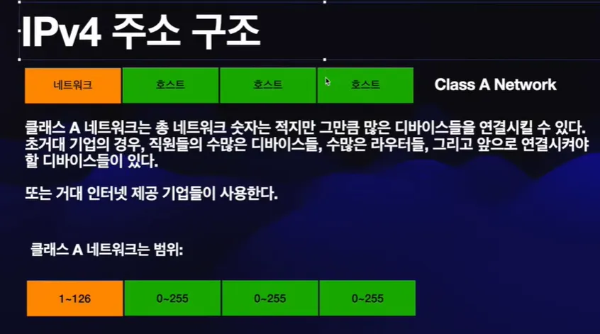
    
    CLASS B
    
    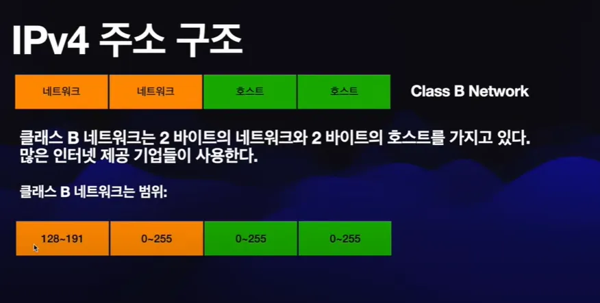
    
    127이 없는이유 = 127…은 로컬호스트이기 때문이다.
    
    CLASS C
    
    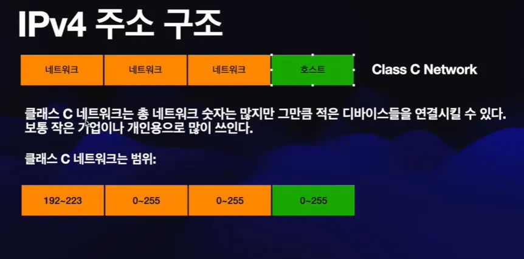
    
    이후의 번호는, 굳이 몰라도 될정도인듯 → 궁금하면 검색해보기
    
    127.0.0.0 ~ 127.255.255.255는 호스트주소 이다.
    
    IP 주소 범위 `127.0.0.0`부터 `127.255.255.255`는 **루프백(Loopback) 주소** 또는 **로컬호스트(Localhost)** 주소로 사용됩니다. 이 주소들은 네트워크 장치나 소프트웨어가 자기 자신에게 통신 요청을 보낼 때 사용됩니다.
    
    ### 루프백 주소의 주요 특징:
    
    - **자기 자신과의 통신**: 이 주소를 사용하여, 컴퓨터는 자신에게 데이터를 보낼 수 있습니다. 예를 들어, `127.0.0.1`로 데이터를 전송하면, 실제로 네트워크를 통해 다른 장치로 나가는 것이 아니라, 자신의 컴퓨터로 되돌아옵니다.
    - **로컬 테스트**: 소프트웨어 개발자들이 네트워크 프로그램을 개발하고 테스트할 때, 실제 네트워크를 통해 다른 컴퓨터와 통신하지 않고도 로컬에서 테스트할 수 있습니다.
    - **루프백 범위**: `127.0.0.1`은 가장 일반적으로 사용되는 루프백 주소이지만, 이 범위 내의 다른 주소들도 루프백으로 사용될 수 있습니다. 이 범위 내의 모든 IP 주소는 동일한 기능을 합니다.
    
    ### 사용 예시:
    
    - 웹 개발자가 로컬에서 웹 서버를 설정할 때, `localhost` 또는 `127.0.0.1`을 사용하여 웹사이트를 테스트할 수 있습니다.
    - 네트워크 장치의 설정을 테스트하거나, 네트워크 문제를 디버깅할 때도 이 주소를 사용할 수 있습니다.
    
    따라서 `127.0.0.0`부터 `127.255.255.255`까지의 IP 주소는 모두 동일한 컴퓨터 내에서의 통신을 위해 예약된 주소 범위입니다.
    
    Operating system과 네트워크가 제대로 연결 되었는지 확인한다.
    
- IPv4 / subnetMask
    
    단순히 클래스를 표기하는 표기법에 가깝다
    
    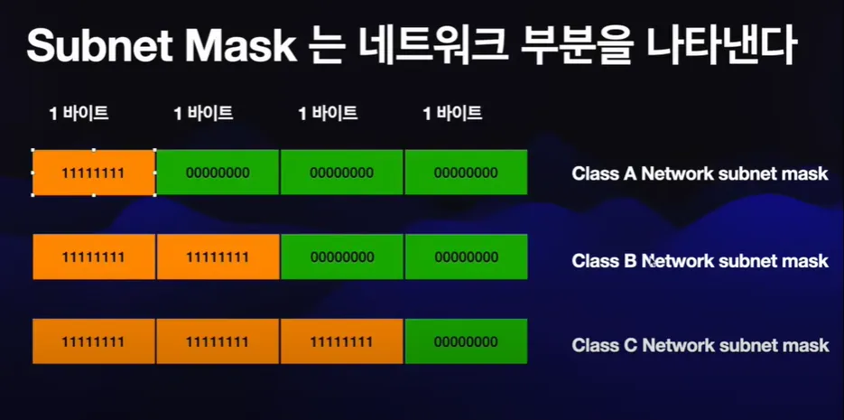
    
    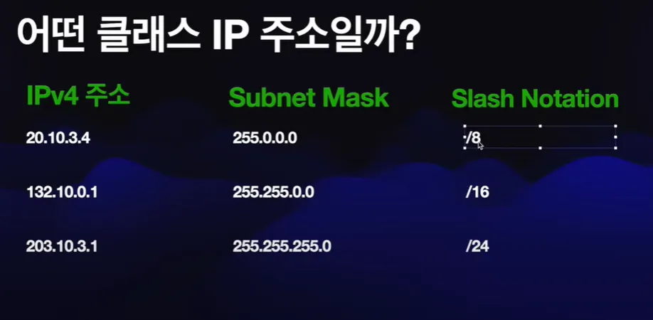
    
    slash Notation은 어디까지가 ipv4가 어디까지 subnetmask인지를 알려준다.
    
- IPv4 Address Subnetting
    
    IP주소를 효율적으로 사용하기 위한 방법
    
    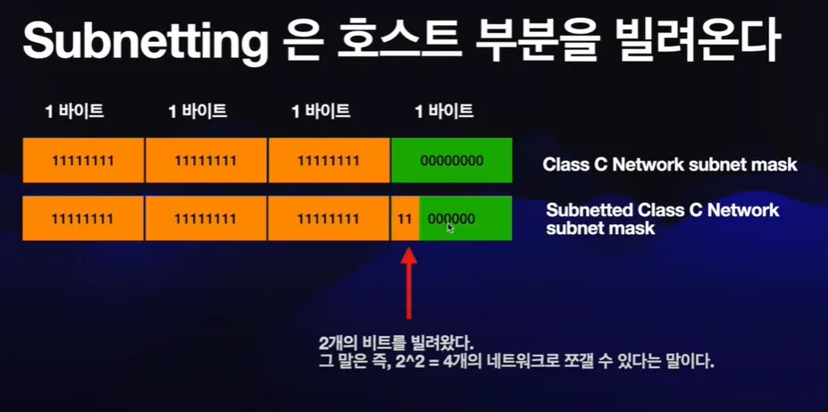
    
    subnetting에 대해 알려줘
    
    ### ChatGPT의 말:
    
    ChatGPT
    
    - *서브네팅(Subnetting)**은 IP 주소를 더 작은 네트워크로 나누어 효율적으로 관리하는 방법입니다. 이 과정은 대규모 네트워크를 여러 개의 작은 서브네트워크(서브넷)로 분할하여, IP 주소를 보다 효율적으로 할당하고 네트워크 성능을 향상시키는 데 사용됩니다.
    
    ### 서브네팅의 기본 개념
    
    1. **IP 주소 구조**:
        - IP 주소는 두 부분으로 구성됩니다: **네트워크 부분**과 **호스트 부분**.
        - 예를 들어, IPv4 주소 `192.168.1.0/24`에서:
            - `192.168.1`은 네트워크 부분을 나타내며,
            - `0`은 호스트 부분을 나타냅니다.
        - `/24`는 서브넷 마스크를 나타내며, 네트워크 부분의 비트 수를 의미합니다. 즉, 이 경우 네트워크 부분이 24비트이고, 나머지 8비트가 호스트 부분입니다.
    2. **서브넷 마스크**:
        - 서브넷 마스크는 IP 주소에서 네트워크와 호스트를 구분하는 역할을 합니다.
        - 예를 들어, `255.255.255.0`이라는 서브넷 마스크는 `/24`와 동일하며, 첫 24비트가 네트워크를 나타내고, 마지막 8비트가 호스트를 나타냅니다.
        - 서브넷 마스크는 1과 0으로 구성되며, 1은 네트워크 비트를, 0은 호스트 비트를 나타냅니다.
    3. **서브네팅의 목적**:
        - IP 주소 공간을 보다 효율적으로 사용.
        - 네트워크 성능 향상: 각 서브넷은 트래픽을 자체 내에서 관리하여 불필요한 트래픽을 줄입니다.
        - 보안: 서브넷 간의 트래픽을 분리하여 보안을 강화할 수 있습니다.
    
    ### 서브네팅 예시
    
    ### 예: `192.168.1.0/24` 네트워크를 두 개의 서브넷으로 나누기
    
    - **원래 네트워크**: `192.168.1.0/24`는 256개의 IP 주소(0~255)를 가지고 있습니다.
        - 여기서 호스트 비트는 8비트(0~255)입니다.
    - **두 개의 서브넷으로 나누기**:
        - 새 서브넷 마스크: `/25` (즉, 25비트가 네트워크 부분, 7비트가 호스트 부분)
        - 각 서브넷은 128개의 IP 주소를 가집니다.
    - **결과 서브넷**:
        1. 첫 번째 서브넷: `192.168.1.0/25`
            - 네트워크 주소: `192.168.1.0`
            - 브로드캐스트 주소: `192.168.1.127`
            - 사용 가능한 호스트 IP 범위: `192.168.1.1` ~ `192.168.1.126`
        2. 두 번째 서브넷: `192.168.1.128/25`
            - 네트워크 주소: `192.168.1.128`
            - 브로드캐스트 주소: `192.168.1.255`
            - 사용 가능한 호스트 IP 범위: `192.168.1.129` ~ `192.168.1.254`
    
    이렇게 하면, 원래의 하나의 네트워크를 두 개의 서브넷으로 분할할 수 있습니다. 이는 네트워크 자원을 보다 효율적으로 사용할 수 있게 해주며, 특정 용도에 맞게 네트워크를 구성할 수 있습니다.
    
    ### 서브네팅의 장점
    
    1. **IP 주소 공간의 효율적인 사용**: IP 주소 낭비를 줄이고, 필요에 맞게 네트워크를 최적화할 수 있습니다.
    2. **네트워크 성능 향상**: 트래픽을 더 작은 그룹으로 분산시켜 네트워크 혼잡을 줄입니다.
    3. **보안 강화**: 서브넷 간의 접근을 제어할 수 있어 보안 수준을 높일 수 있습니다.
    
    서브네팅은 네트워크 설계와 관리를 더욱 유연하고 효율적으로 만들어 줍니다. 이 개념을 잘 이해하고 활용하면, 복잡한 네트워크 환경에서도 효율적인 IP 주소 관리와 네트워크 성능 최적화를 이룰 수 있습니다.
    
- 클래스 C subnetting
    
    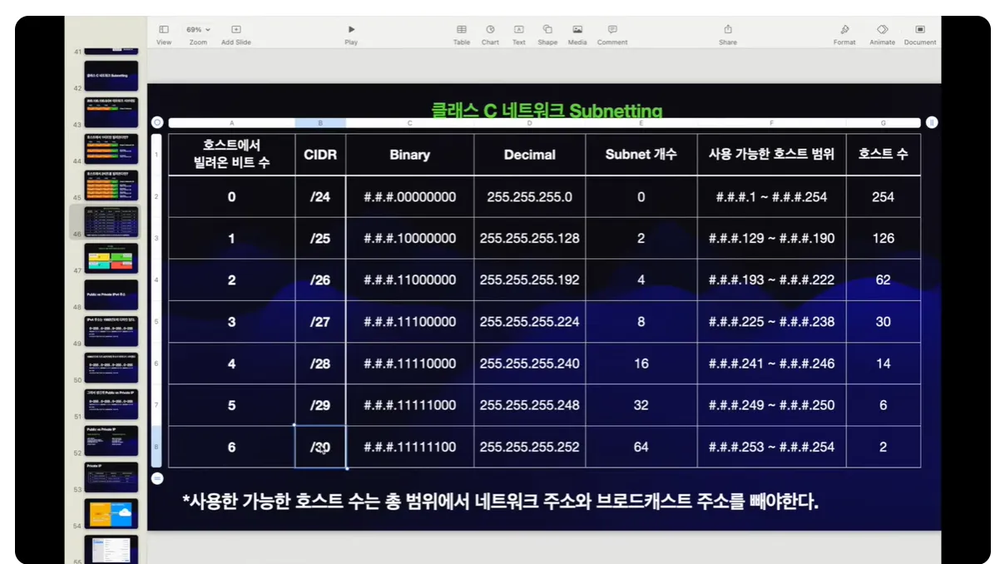
    
    -2씩 해야한다, 네트워크 주소 + 브로드캐스트 주소
    
    네트워크주소와 브로드캐스트 주소란?
    
    **네트워크 주소**와 **브로드캐스트 주소**는 IP 네트워크에서 중요한 두 가지 개념으로, 각각 네트워크의 식별과 전체 네트워크에 데이터를 전달하는 역할을 합니다.
    
    ### 1. **네트워크 주소(Network Address)**
    
    **네트워크 주소**는 특정 IP 네트워크를 식별하는 주소입니다. 네트워크 내의 모든 장치가 동일한 네트워크 주소를 공유합니다. 네트워크 주소는 네트워크의 시작점을 나타내며, 일반적으로 네트워크 내에서 첫 번째 IP 주소입니다.
    
    - **역할**: 네트워크를 식별하고, 네트워크의 범위를 정의합니다.
    - **특징**: 네트워크 주소는 호스트 부분의 모든 비트가 0인 주소입니다. 예를 들어, IP 주소 `192.168.1.0/24`에서 `192.168.1.0`은 네트워크 주소입니다.
    
    **예시**:
    
    - `192.168.1.0/24` 네트워크에서는 `192.168.1.0`이 네트워크 주소입니다.
    
    ### 2. **브로드캐스트 주소(Broadcast Address)**
    
    **브로드캐스트 주소**는 네트워크 내의 모든 장치에게 데이터를 전달하기 위해 사용되는 주소입니다. 즉, 이 주소로 패킷이 전송되면 해당 네트워크에 연결된 모든 장치가 그 패킷을 수신하게 됩니다.
    
    - **역할**: 네트워크 내의 모든 장치에 데이터를 전송할 때 사용됩니다.
    - **특징**: 브로드캐스트 주소는 호스트 부분의 모든 비트가 1인 주소입니다. 예를 들어, IP 주소 `192.168.1.0/24`에서 `192.168.1.255`가 브로드캐스트 주소입니다.
    
    **예시**:
    
    - `192.168.1.0/24` 네트워크에서는 `192.168.1.255`가 브로드캐스트 주소입니다.
    
    ### **네트워크 주소와 브로드캐스트 주소 요약**
    
    - **네트워크 주소**: 네트워크의 시작을 나타내며, 해당 네트워크에 속하는 모든 IP 주소의 공통 식별자입니다. (예: `192.168.1.0/24`에서 `192.168.1.0`)
    - **브로드캐스트 주소**: 네트워크 내의 모든 장치에게 데이터를 전송하기 위한 주소입니다. (예: `192.168.1.0/24`에서 `192.168.1.255`)
    
    이 두 주소는 네트워크의 경계를 설정하고, 네트워크 상의 통신을 관리하는 데 중요한 역할을 합니다. 네트워크 주소는 네트워크를 식별하는데 사용되고, 브로드캐스트 주소는 전체 네트워크에 정보를 전송하는데 사용됩니다.
    
    - *브로드캐스팅(Broadcasting)**은 네트워크에서 특정 데이터를 네트워크 내의 모든 장치로 동시에 전송하는 방법입니다. 이는 네트워크의 효율성을 높이고, 여러 장치가 동시에 동일한 정보를 받을 수 있도록 하기 위해 필요합니다.
    
    ### 브로드캐스팅의 주요 목적과 필요성
    
    1. **네트워크 초기 설정과 디스커버리(Discovery)**:
        - **IP 주소 할당(DHCP)**: 장치가 네트워크에 처음 연결될 때, DHCP 서버로부터 IP 주소를 받아야 합니다. 이때 브로드캐스트를 통해 DHCP 서버에 요청을 보냅니다. DHCP 서버는 네트워크 내에 여러 개 있을 수 있으므로, 클라이언트가 특정 서버에 연결하기 위해 네트워크 전체로 요청을 브로드캐스트하게 됩니다.
        - **ARP 요청**: ARP(주소 결정 프로토콜)는 IP 주소를 물리적 주소(MAC 주소)로 매핑하는 데 사용됩니다. 장치가 네트워크 내에서 특정 IP 주소를 가진 장치의 MAC 주소를 찾기 위해 ARP 요청을 브로드캐스트로 보냅니다.
    2. **알림과 업데이트**:
        - **라우터 알림**: 네트워크에서 라우터는 주기적으로 자신이 존재함을 알리기 위해 브로드캐스트를 사용하여 라우터 알림을 전송할 수 있습니다. 이는 네트워크 내 다른 장치들이 올바른 라우터를 통해 외부 네트워크와 통신할 수 있도록 도와줍니다.
        - **네트워크 관리**: 일부 네트워크 관리 프로토콜이나 서비스는 브로드캐스트를 사용하여 네트워크 내 모든 장치에 관리 명령이나 업데이트를 전송할 수 있습니다.
    3. **그룹 통신**:
        - 특정 그룹에 속한 모든 장치가 동일한 데이터를 받아야 하는 경우, 예를 들어, 네트워크 상의 모든 장치에 시스템 경고를 보내야 할 때 브로드캐스트를 사용합니다.
    
    ### 브로드캐스팅의 장점
    
    1. **효율적인 자원 사용**: 동일한 데이터를 개별적으로 여러 장치에 전송하는 것보다, 한 번의 브로드캐스트로 네트워크 내 모든 장치에 동시에 데이터를 전달하는 것이 더 효율적입니다.
    2. **편리한 네트워크 구성**: 네트워크에 새로 연결된 장치가 네트워크 환경을 자동으로 탐색하고 설정하는 데 도움을 줍니다. 예를 들어, DHCP와 ARP를 통해 IP 주소와 MAC 주소를 쉽게 얻을 수 있습니다.
    
    ### 브로드캐스팅의 단점과 대안
    
    - **네트워크 혼잡**: 브로드캐스트가 빈번하게 발생하면 네트워크 트래픽이 증가하여 성능이 저하될 수 있습니다. 이를 **브로드캐스트 스톰(Broadcast Storm)**이라고 합니다.
    - **보안 문제**: 네트워크 내 모든 장치가 동일한 브로드캐스트 메시지를 받기 때문에, 민감한 정보가 불필요한 장치로도 전송될 수 있습니다.
    
    ### 대안: **멀티캐스트(Multicast)**와 **유니캐스트(Unicast)**
    
    - **멀티캐스트(Multicast)**: 특정 그룹의 장치에만 데이터를 전송하는 방법입니다. 브로드캐스트보다 효율적이며, 네트워크 트래픽을 줄일 수 있습니다.
    - **유니캐스트(Unicast)**: 특정 장치 하나에만 데이터를 전송하는 방법입니다. 개별 통신이 필요할 때 사용됩니다.
    
    ### 결론
    
    브로드캐스팅은 네트워크 내에서 특정 데이터를 동시에 여러 장치에 전달할 필요가 있을 때 사용됩니다. 네트워크 초기 설정, 장치 탐색, 네트워크 관리 등의 작업에서 중요한 역할을 합니다. 하지만 브로드캐스트는 과도하게 사용될 경우 네트워크 성능을 저하시킬 수 있으므로, 필요에 따라 멀티캐스트나 유니캐스트를 사용하는 것이 좋습니다.
    

    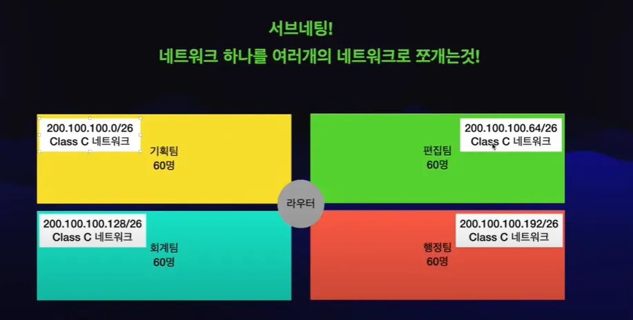
    
- public IP / private IP
    
    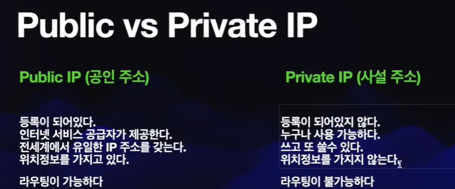
    
    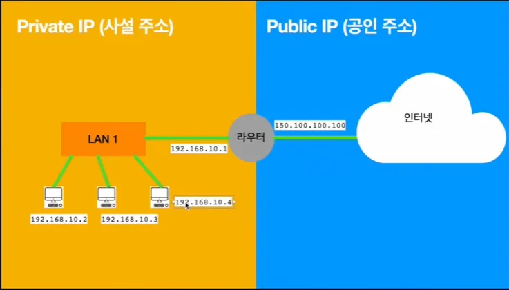
    
    인터넷에 진입하기 위해서는 public IP가 필요하다.
    
    local에서는 필요하지않다.
    
    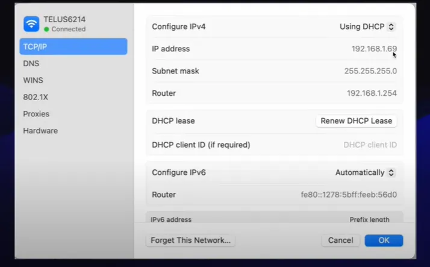
    
    192.168 만봐도 class C 의 private IP를 사용하고 있다는 것을 알 수 있다.
    
    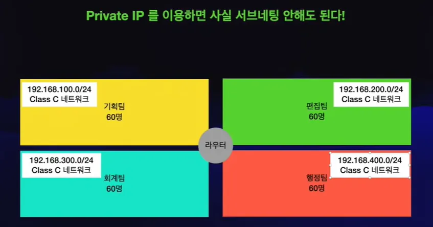
    
- 192.168.x.x가 어째서 private id임?
    
    `192.168.x.x` 주소가 프라이빗(Private) IP 주소로 간주되는 이유는 다음과 같습니다.
    
    ### IP 주소 체계와 사설 네트워크
    
    IP 주소는 인터넷 프로토콜(IP)을 사용하는 네트워크 장치들이 서로를 식별하고 통신하기 위해 사용됩니다. 이 IP 주소는 두 가지 종류로 나뉩니다:
    
    1. **공인 IP 주소 (Public IP Address)**: 인터넷에 직접 연결되어 있는 장치에 할당되는 주소입니다. 이러한 주소는 전 세계적으로 고유해야 하며, 인터넷 서비스 제공자(ISP)에 의해 할당됩니다.
    2. **사설 IP 주소 (Private IP Address)**: 내부 네트워크(예: 가정, 회사 등) 내에서만 사용되며, 인터넷에서 직접 접근할 수 없는 주소입니다. 이러한 주소는 동일한 네트워크 내에서만 고유하면 되므로, 여러 네트워크에서 동일한 사설 IP 주소를 사용할 수 있습니다.
    
    ### 프라이빗 IP 주소 범위
    
    IETF(Internet Engineering Task Force)는 RFC 1918 문서에서 사설 네트워크에서 사용할 수 있는 프라이빗 IP 주소 범위를 지정했습니다. 이 범위는 다음과 같습니다:
    
    - **10.0.0.0 ~ 10.255.255.255** (10.0.0.0/8)
    - **172.16.0.0 ~ 172.31.255.255** (172.16.0.0/12)
    - **192.168.0.0 ~ 192.168.255.255** (192.168.0.0/16)
    
    ### 192.168.x.x 주소
    
    `192.168.x.x` 범위는 위에서 언급한 세 번째 프라이빗 IP 주소 범위에 속합니다. 따라서 `192.168.0.0`부터 `192.168.255.255`까지의 모든 주소는 사설 네트워크에서 사용하기 위한 것입니다.
    
    이러한 사설 IP 주소는 가정이나 소규모 네트워크에서 흔히 사용되며, NAT(Network Address Translation) 장치(예: 라우터)가 이 주소들을 공인 IP 주소로 변환하여 인터넷과의 통신을 가능하게 합니다. 이로 인해 많은 네트워크가 동일한 `192.168.x.x` 주소를 사용할 수 있지만, 서로 간의 충돌이 발생하지 않습니다.
    
- DHCP 프로토콜
    
    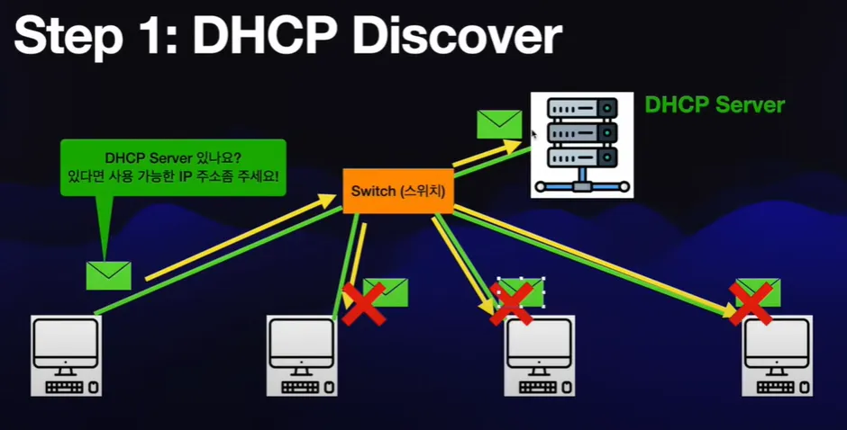
    
    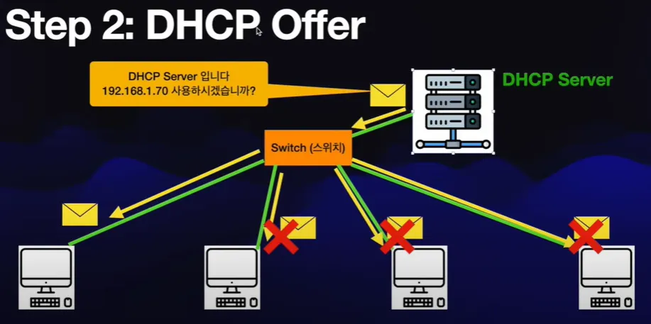
    
    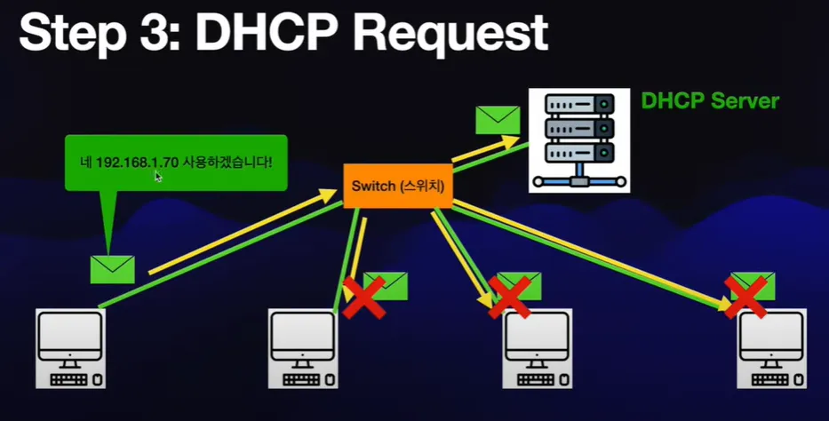
    
    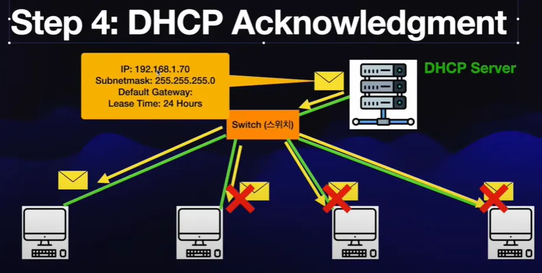
    
    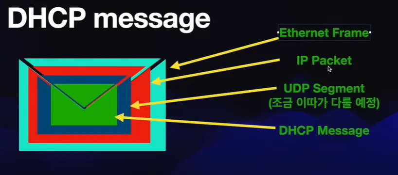
    
    그래서 DHCP가 뭐임?
    
    **DHCP (Dynamic Host Configuration Protocol)** 서버는 네트워크 상의 장치들이 자동으로 IP 주소와 기타 네트워크 설정을 받을 수 있도록 해주는 서버입니다. DHCP 서버는 네트워크 장치들이 수동으로 설정할 필요 없이 자동으로 네트워크에 연결될 수 있도록 해주는 중요한 역할을 합니다.
    
    ### DHCP 서버의 주요 역할
    
    1. **IP 주소 할당**: DHCP 서버는 네트워크에 연결된 장치(클라이언트)에게 IP 주소를 할당합니다. IP 주소는 장치가 네트워크에서 다른 장치들과 통신할 수 있도록 해주는 고유한 주소입니다.
    2. **네트워크 설정 제공**: DHCP 서버는 IP 주소 외에도 서브넷 마스크, 기본 게이트웨이, DNS 서버 등의 네트워크 설정 정보를 클라이언트에게 전달합니다. 이러한 정보는 장치가 네트워크 상에서 올바르게 동작하기 위해 필요합니다.
    3. **IP 주소 관리**: DHCP 서버는 IP 주소를 관리하고, 중복되지 않도록 할당합니다. IP 주소는 일정 시간 동안만 장치에 할당되며(임대 기간, lease time), 임대 기간이 만료되면 IP 주소는 다시 DHCP 서버에 반환되고, 다른 장치에 할당될 수 있습니다.
    
    ### DHCP 서버의 동작 과정
    
    1. **DHCPDISCOVER**: 클라이언트가 네트워크에 처음 연결될 때, DHCP 서버를 찾기 위해 브로드캐스트 메시지를 전송합니다. 이 메시지를 **DHCPDISCOVER**라고 합니다.
    2. **DHCPOFFER**: DHCP 서버는 DHCPDISCOVER 메시지를 받고, 클라이언트에게 사용 가능한 IP 주소와 네트워크 설정을 제안하는 **DHCPOFFER** 메시지를 보냅니다.
    3. **DHCPREQUEST**: 클라이언트는 DHCPOFFER 메시지에 응답하여 제안된 IP 주소를 요청하는 **DHCPREQUEST** 메시지를 보냅니다. 이 단계에서 클라이언트는 하나의 DHCP 서버를 선택합니다.
    4. **DHCPACK**: DHCP 서버는 클라이언트의 요청을 확인하고, IP 주소와 네트워크 설정 정보를 최종적으로 할당하는 **DHCPACK** 메시지를 보냅니다. 이 메시지를 받은 클라이언트는 할당된 IP 주소와 설정을 사용하여 네트워크에 연결됩니다.
    
    ### DHCP의 장점
    
    - **자동화**: 네트워크 관리자가 각 장치에 IP 주소를 수동으로 설정할 필요 없이, DHCP 서버가 이를 자동으로 처리합니다.
    - **효율성**: IP 주소를 효율적으로 관리할 수 있으며, 필요한 만큼만 할당합니다.
    - **유연성**: 네트워크 환경이 변경되더라도 DHCP 서버에서 설정을 조정하면 모든 장치에 자동으로 적용됩니다.
    
    ### DHCP의 일반적인 사용 사례
    
    - **가정용 네트워크**: 대부분의 가정용 라우터는 DHCP 서버 기능을 내장하고 있어, 컴퓨터, 스마트폰, 태블릿 등 다양한 장치에 자동으로 IP 주소를 할당합니다.
    - **기업 네트워크**: 기업 환경에서는 수백 대 이상의 장치들이 DHCP 서버를 통해 네트워크 설정을 자동으로 받습니다.
    
    ### 결론
    
    DHCP 서버는 네트워크에서 클라이언트 장치들이 자동으로 IP 주소와 네트워크 설정을 받을 수 있도록 해주는 중요한 장치입니다. 이를 통해 네트워크 관리가 자동화되고, IP 주소 관리가 효율적으로 이루어지며, 사용자가 네트워크 설정을 일일이 조정할 필요 없이 장치를 쉽게 연결할 수 있게 됩니다.
    
- Transport Layer protocol
    - 프로토콜이란?
        
        방법 또는 룰
        
        
        
        
        
    - 포트란?
        
        프로토콜을 구분하기 위해서 사용한다.
        
        논리적 접속 위치를 뜻한다.
        
        실제로 이곳에서 접속하지는 않는다.
        
        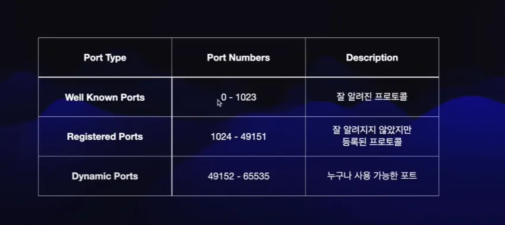
        
    - 포트와 프로토콜
        
        **프로토콜**과 **포트**는 네트워크 통신에서 중요한 개념입니다. 이 둘을 이해하면 인터넷과 네트워크 상의 데이터가 어떻게 이동하고, 특정 서비스에 접근할 때 어떻게 연결되는지 알 수 있습니다.
        
        ### 프로토콜 (Protocol)
        
        **프로토콜**은 네트워크에서 데이터 전송을 관리하는 규칙이나 표준을 의미합니다. 프로토콜은 데이터를 어떻게 포맷하고 전송할지, 오류를 어떻게 처리할지 등을 정의합니다. 여러 가지 프로토콜이 있으며, 각 프로토콜은 특정한 목적을 가지고 있습니다.
        
        ### 주요 프로토콜
        
        - **HTTP (HyperText Transfer Protocol)**: 웹 브라우저와 웹 서버 간에 데이터를 주고받을 때 사용하는 프로토콜입니다. 웹 페이지의 텍스트, 이미지, 비디오 등을 전송합니다. HTTP의 기본 포트는 80번입니다.
        - **HTTPS (HTTP Secure)**: HTTP의 보안 버전으로, 데이터를 암호화하여 전송합니다. HTTPS는 SSL/TLS를 사용해 통신의 기밀성을 보장합니다. HTTPS의 기본 포트는 443번입니다.
        - **FTP (File Transfer Protocol)**: 파일을 전송하기 위한 프로토콜입니다. FTP 서버와 클라이언트 간에 파일을 업로드하거나 다운로드할 때 사용됩니다. FTP의 기본 포트는 21번입니다.
        - **SMTP (Simple Mail Transfer Protocol)**: 이메일 전송을 관리하는 프로토콜입니다. 이메일 클라이언트에서 메일 서버로 이메일을 전송할 때 사용됩니다. SMTP의 기본 포트는 25번입니다.
        - **IMAP (Internet Message Access Protocol) 및 POP3 (Post Office Protocol 3)**: 이메일을 수신하기 위한 프로토콜입니다. IMAP은 이메일을 서버에 저장한 채로 관리하며, POP3는 이메일을 다운로드하여 로컬에 저장합니다. IMAP의 기본 포트는 143번, POP3의 기본 포트는 110번입니다.
        - **TCP (Transmission Control Protocol)**: 데이터의 정확한 전달을 보장하는 연결 지향 프로토콜입니다. 데이터의 전송 순서가 보장되며, 패킷 손실이 발생하면 재전송을 요청합니다.
        - **UDP (User Datagram Protocol)**: TCP와 달리, 데이터 전송의 신뢰성을 보장하지 않는 연결less 프로토콜입니다. 빠른 전송이 필요하지만, 일부 데이터 손실이 허용될 수 있는 상황에서 사용됩니다(예: 스트리밍, 온라인 게임).
        
        ### 포트 (Port)
        
        **포트**는 네트워크에서 특정 프로토콜이나 서비스를 식별하는 숫자입니다. 포트는 IP 주소와 함께 사용되어, 어떤 서비스로 데이터를 전송할지 결정합니다. 포트 번호는 0부터 65535까지의 숫자로 이루어져 있으며, 특정 서비스에 대한 기본 포트가 지정되어 있습니다.
        
        ### 포트의 범주
        
        - **Well-known Ports (잘 알려진 포트)**: 0번에서 1023번까지의 포트로, 주로 널리 사용되는 프로토콜에 할당됩니다. 예를 들어, HTTP(80), HTTPS(443), FTP(21), SMTP(25) 등이 포함됩니다.
        - **Registered Ports (등록된 포트)**: 1024번에서 49151번까지의 포트로, 특정 애플리케이션이나 프로토콜을 위해 등록된 포트입니다. 주로 특정 애플리케이션이나 서비스를 위한 포트입니다.
        - **Dynamic/Private Ports (동적/개인용 포트)**: 49152번에서 65535번까지의 포트로, 일시적인 목적이나 사용자 정의 서비스에 사용됩니다. 일반적으로 클라이언트 측에서 임시로 사용됩니다.
        
        ### 포트의 예시
        
        - **80번 포트**: HTTP 웹 트래픽에 사용됩니다.
        - **443번 포트**: HTTPS 보안 웹 트래픽에 사용됩니다.
        - **21번 포트**: FTP 파일 전송에 사용됩니다.
        - **22번 포트**: SSH(Secure Shell) 원격 접속에 사용됩니다.
        
        ### 프로토콜과 포트의 관계
        
        프로토콜은 데이터를 어떻게 처리하고 전송할지 정의하고, 포트는 그 데이터를 어느 애플리케이션이나 서비스로 보낼지 결정합니다. 예를 들어, 브라우저가 웹 페이지를 요청할 때는 HTTP 프로토콜을 사용하며, 이 요청은 기본적으로 80번 포트를 통해 전송됩니다.
        
        ### 요약
        
        - **프로토콜**은 네트워크 상에서 데이터 전송을 관리하는 규칙 또는 표준입니다.
        - **포트**는 특정 프로토콜이나 서비스를 식별하는 숫자로, 데이터를 어떤 애플리케이션으로 보낼지를 결정합니다.
        - 특정 프로토콜은 고유한 기본 포트를 사용하며, 네트워크 통신 시 이 두 요소가 함께 작동하여 올바른 데이터 전송을 보장합니다.
        
        
- TCP (Transmission Control Protocol)
    
    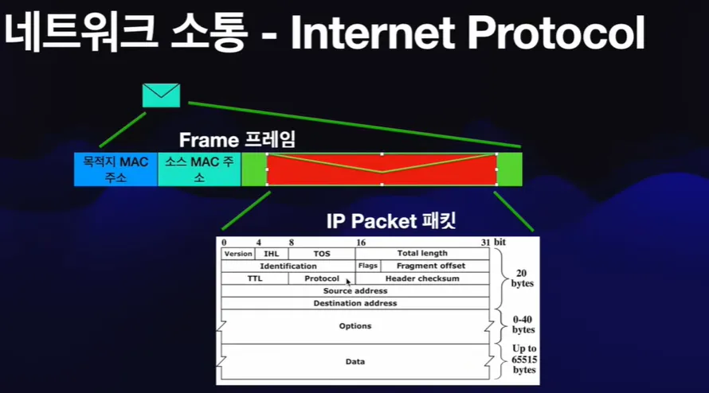
    
    이곳에는 문제가있다
    
    ⇒ 정확성이 문제가 된다.
    
    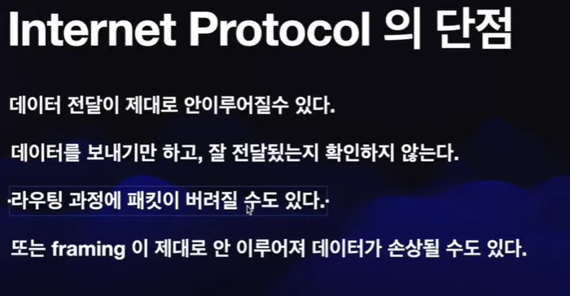
    
    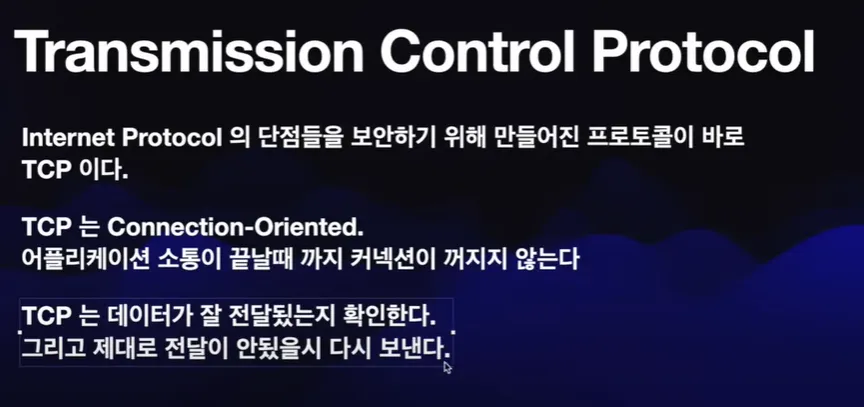

    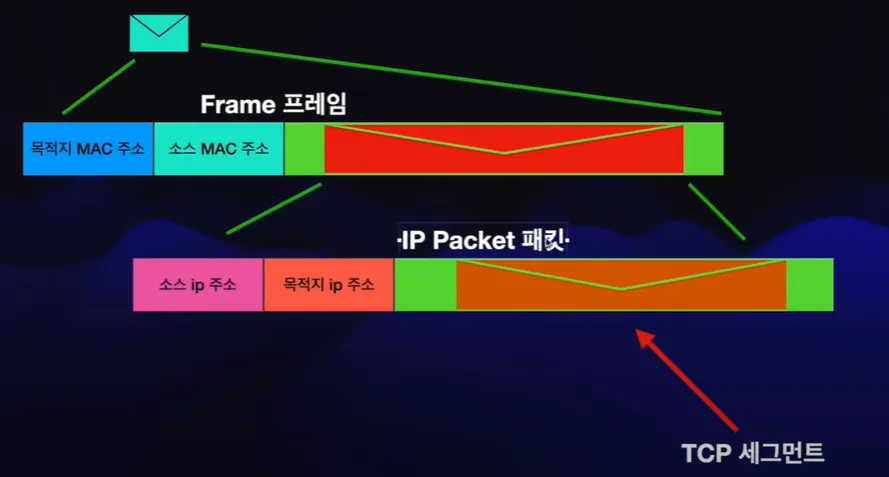
    
    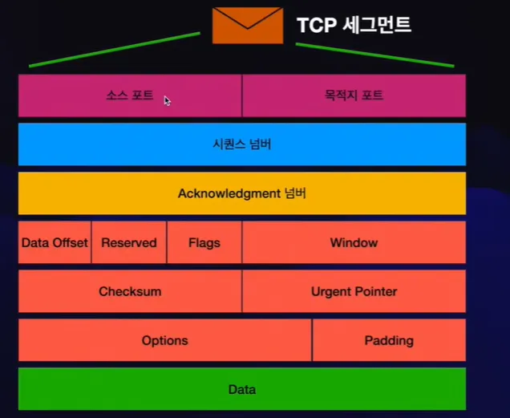
    
    **TCP 세그먼트**는 TCP (Transmission Control Protocol)에서 데이터 통신을 위한 기본 단위입니다. TCP는 신뢰성 있는 데이터 전송을 제공하는 연결 지향 프로토콜로, 데이터 전송의 순서와 오류를 보장합니다. TCP 세그먼트는 이러한 데이터를 패킷화하여 네트워크를 통해 전송합니다.
    
    ### TCP 세그먼트의 구조
    
    TCP 세그먼트는 여러 가지 필드를 포함하고 있으며, 각 필드는 TCP 세션의 상태를 관리하고 데이터 전송을 제어하는 데 사용됩니다. TCP 세그먼트의 주요 구성 요소는 다음과 같습니다:
    
    1. **출발지 포트 (Source Port)**: 데이터를 전송하는 호스트의 포트 번호입니다. 이 포트 번호는 송신 애플리케이션을 식별합니다.
    2. **목적지 포트 (Destination Port)**: 데이터를 수신하는 호스트의 포트 번호입니다. 이 포트 번호는 수신 애플리케이션을 식별합니다.
    3. **순서 번호 (Sequence Number)**: 전송된 데이터의 순서를 추적하기 위해 사용됩니다. 데이터 스트림에서 세그먼트의 첫 번째 바이트의 순서 번호가 여기에 포함됩니다. 이 번호는 데이터의 올바른 순서를 보장합니다.
    4. **확인 응답 번호 (Acknowledgment Number)**: 수신된 데이터에 대한 응답 번호입니다. 이 필드는 수신자가 다음에 받을 데이터의 순서 번호를 나타냅니다. 이는 데이터의 성공적인 수신을 확인하는 데 사용됩니다.
    5. **데이터 오프셋 (Data Offset)**: TCP 헤더의 길이를 나타내며, TCP 세그먼트의 데이터가 시작되는 위치를 알려줍니다. 이 값은 TCP 헤더의 길이를 32비트 워드로 표시합니다.
    6. **플래그 (Flags)**: 여러 가지 제어 플래그가 포함됩니다. 주요 플래그는 다음과 같습니다:
        - **URG (Urgent)**: 긴급 데이터의 존재를 나타냅니다.
        - **ACK (Acknowledgment)**: 확인 응답이 포함된 세그먼트임을 나타냅니다.
        - **PSH (Push)**: 데이터를 수신 애플리케이션에 즉시 전달하도록 요청합니다.
        - **RST (Reset)**: 연결을 재설정하거나 종료합니다.
        - **SYN (Synchronize)**: 연결을 설정하는 과정에서 사용됩니다.
        - **FIN (Finish)**: 연결을 종료하는 과정에서 사용됩니다.
    7. **윈도우 크기 (Window Size)**: 수신 측에서 수신할 수 있는 데이터의 양을 나타냅니다. 이 값은 흐름 제어를 위해 사용됩니다.
    8. **체크섬 (Checksum)**: TCP 세그먼트의 데이터와 헤더의 오류를 검출하기 위해 사용됩니다. 이 필드는 데이터가 전송 중에 손상되지 않았는지 확인하는 데 도움을 줍니다.
    9. **긴급 포인터 (Urgent Pointer)**: URG 플래그가 설정된 경우, 긴급 데이터의 끝을 나타냅니다. 긴급 데이터는 일반 데이터 스트림과 별도로 처리됩니다.
    10. **옵션 (Options)**: TCP 옵션은 추가적인 기능을 제공합니다. 예를 들어, 최대 세그먼트 크기(MSS), 창 확대, 타임스탬프 등이 포함될 수 있습니다.
    11. **데이터 (Data)**: 실제 애플리케이션 데이터가 포함되는 부분입니다. 데이터 오프셋 필드에 따라 이 부분의 시작 위치가 결정됩니다.
    
    ### TCP 세그먼트의 전송 과정
    
    1. **연결 설정 (Three-Way Handshake)**: TCP 연결을 설정하기 위해 다음의 세 단계를 거칩니다:
        - **SYN**: 클라이언트가 서버에게 연결 요청을 보냅니다.
        - **SYN-ACK**: 서버가 클라이언트의 요청을 수락하고, 응답을 보냅니다.
        - **ACK**: 클라이언트가 서버의 응답을 확인합니다.
    2. **데이터 전송**: 연결이 설정된 후, 클라이언트와 서버 간에 데이터가 TCP 세그먼트로 전송됩니다. 각 세그먼트는 데이터와 함께 순서 번호와 확인 응답 번호를 포함하여 데이터 전송의 신뢰성을 보장합니다.
    3. **연결 종료**: 데이터 전송이 완료된 후, 연결 종료를 위한 프로세스가 수행됩니다. 이 과정은 일반적으로 FIN 플래그를 사용하여 세그먼트를 교환하며, 연결 종료를 확인합니다.
    
    ### 요약
    
    - **TCP 세그먼트**는 TCP에서 데이터를 전송하기 위한 패킷 단위입니다.
    - **헤더**와 **데이터**로 구성되며, 헤더는 데이터 전송의 제어와 관리를 담당합니다.
    - **순서 번호**와 **확인 응답 번호**를 사용하여 데이터의 순서와 신뢰성을 보장합니다.
    - **플래그**는 연결 설정, 데이터 전송, 연결 종료 등을 제어하는 데 사용됩니다.
    - **윈도우 크기**와 **체크섬**은 데이터 흐름 제어와 오류 검출을 돕습니다.
- TCP detail
    
    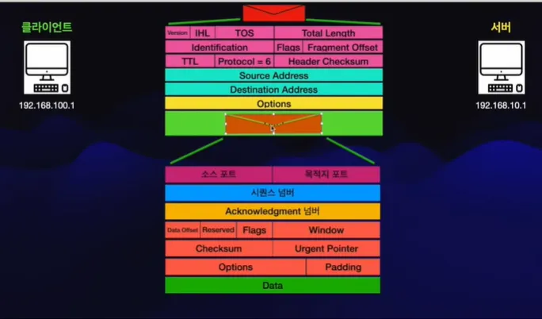
    
    IP 헤더의 Protocol 필드 값이 6이면 해당 패킷이 TCP임을 의미
    
    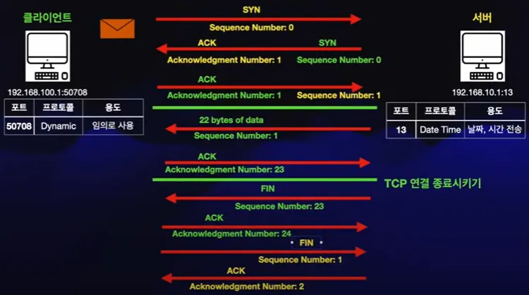
    
- UDP
    
    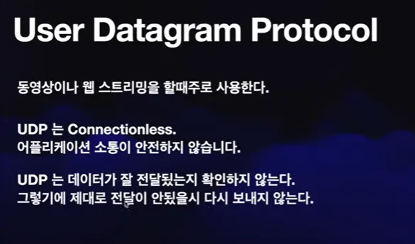
    
    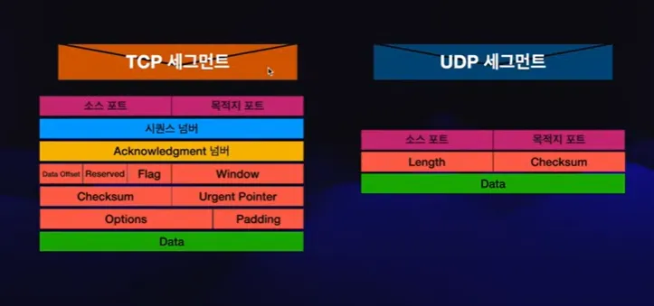
    
- application layer protocol
    
    TCP/UDP를 기반으로 application layer protocol이 존재한다.
    
    1. DHCP
        
        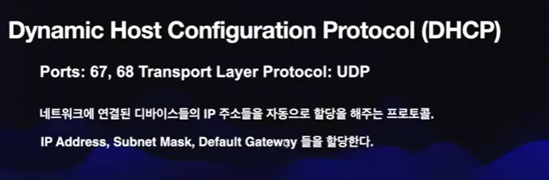
        
    2. DNS
        
        
        
    3. Daytime
        
        
        
    4. Secure Shell (SSH)
        
        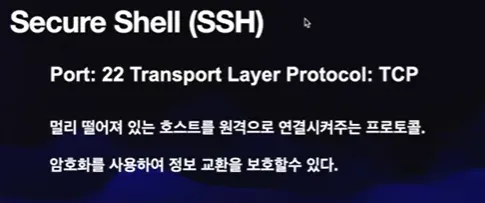
        
- HTTP Protocol
    
    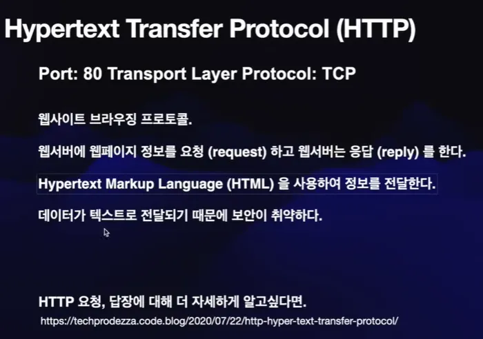
    
    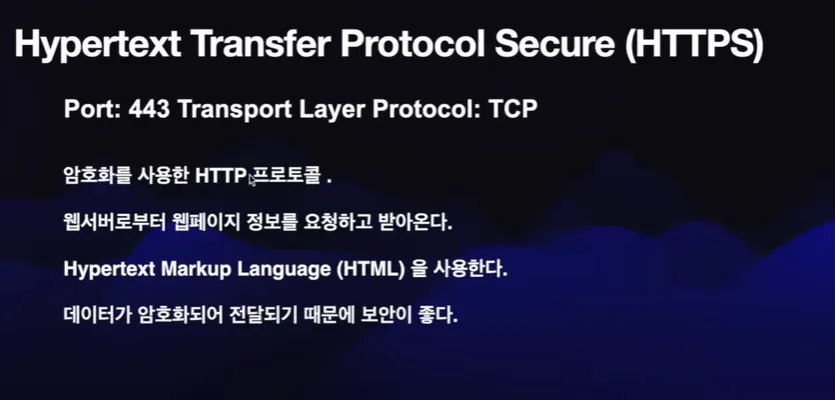
    
