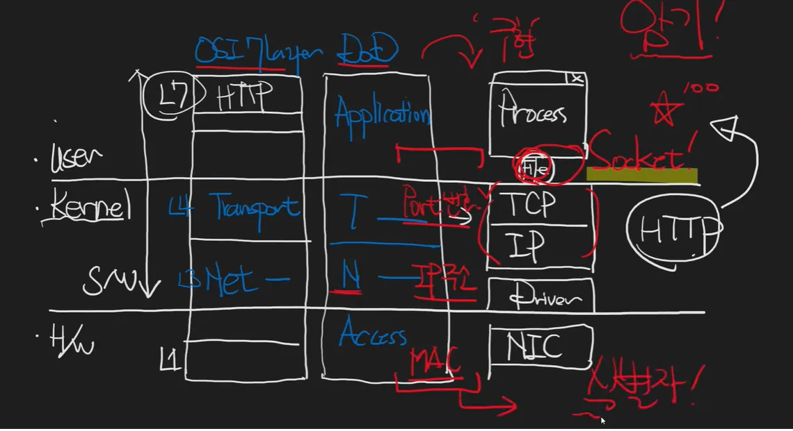

# Socket

> 네트워크에서 통신을 수행하는 두 개체 간의 연결 지점을 제공하는 소프트웨어 구조체다. 소켓은 주로 TCP/IP 프로토콜을 사용하여 데이터 전송을 수행하며 IP 주소와 포트 번호로 구성된 엔드포인트로, 두 프로세스 간의 데이터 통신을 가능하게 한다.

> 소켓은 UDP와 TCP 연결을 추상화한 개념이다. 이를 통해 개발자는 복잡한 네트워크 프로그래밍을 더 쉽게 할 수 있도록 돕는다. 소켓을 사용하면 저수준의 네트워크 프로토콜과의 직접적인 상호작용 없이도 데이터 송수신을 구현할 수 있다.

> USER모드와 KERNER모드를 연결시키는 것이 file인데, file을 추상화 한 것이 socket이다. process와 tcp를 연결시키는 것이 file을 추상화한 인터페이스인데 이것이 바로 socket이다.

## socket type

- TCP 소켓: 신뢰성 있는 연결 지향형 통신을 제공한다. 데이터가 순서대로 전달되며, 오류 검출과 재전송 기능을 갖추고 있다.
- UDP 소켓: 비연결형 통신을 제공하며, 빠른 전송이 필요한 경우에 사용된다. 데이터가 순서대로 도착하는 것이 보장되지 않으며, 오류 검출 기능이 없다.
