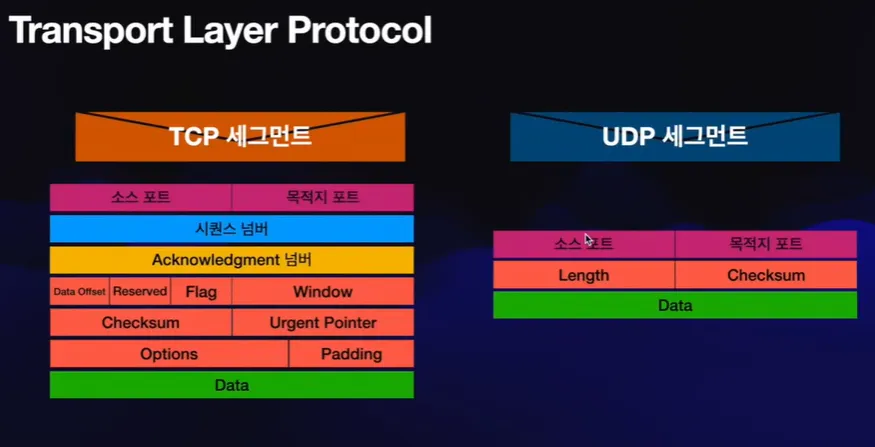

## TCP 프로토콜(Transmission Control Protocol)

> OSI 계층모델의 관점에서 전송 계층(4계층)에 해당

> 양종단 호스트 내 프로세스 상호 간에 신뢰적인 연결지향성 서비스를 제공

### 특징

1. 신뢰성 있음 (Reliable)

- 패킷 손실, 중복, 순서바뀜 등이 없도록 보장

- TCP 하위계층인 IP 계층의 신뢰성 없는 서비스에 대해 다방면으로 신뢰성을 제공

2. 연결지향적 (Connection-oriented) 

- TCP는 연결을 설정한 후 데이터를 전송하며, 연결 설정과 해제 과정을 거친다.

- 전송 시작 전에 TCP 3-Way Handshake를 통해 연결을 설정하고, 데이터 전송 후 TCP 연결 종료 절차를 통해 연결을 해제한다.

- 강한 연결 대신 느슨한 연결(Loosely Connected)을 유지하므로, 이를 연결 지향적 프로토콜이라고 한다.

## UDP 프로토콜(User Datagram Protocol)

> TCP와 같은 전송 계층 프로토콜이지만, 비연결형 프로토콜로, 신뢰성보다 효율성을 중시한다. 실시간 데이터 전송이 필요한 응용이나 다중 수신자 전송에 적합하다.

### 주요 특징

1. 비연결형 서비스

- 연결 설정 없이 데이터를 전송하며, 순서 보장 없음, 데이터 검증 없음, 흐름 제어 없음과 같은 특성이 있다.
- 데이터가 제대로 도착했는지 확인하지 않으며, 프로그램에서 오류 제어는 별도로 처리해야 한다.

2. 실시간 응용 및 멀티캐스트에 적합

- 빠른 응답이 필요한 실시간 응용에서 사용된다.
- 멀티캐스트(1:多 전송)가 가능하여, 동일 데이터를 다수에게 효율적으로 전달할 수 있다.

3. 간단한 헤더 구조

- 8바이트 고정 헤더만 사용하여 헤더가 간단하며, TCP의 20바이트 헤더보다 적은 자원을 소모한다.
- 포트 번호만 사용하므로 헤더 처리 속도가 빠르다.

## 결론 

> 이와 같이 TCP는 신뢰성 있는 연결 기반 통신에 적합하고, UDP는 속도와 효율이 중요한 비연결형 통신에 적합하다.
