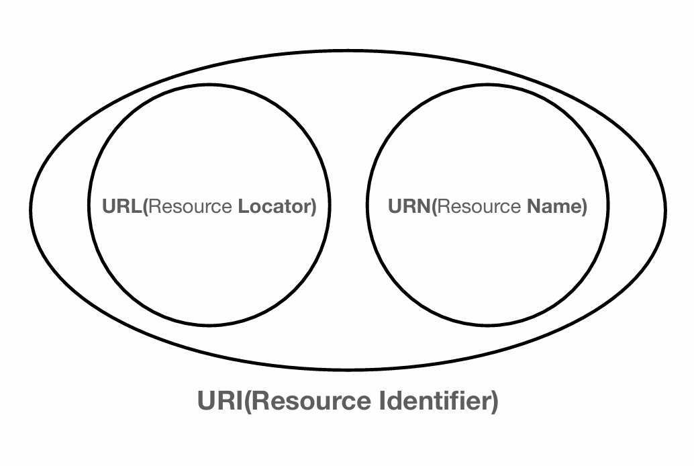
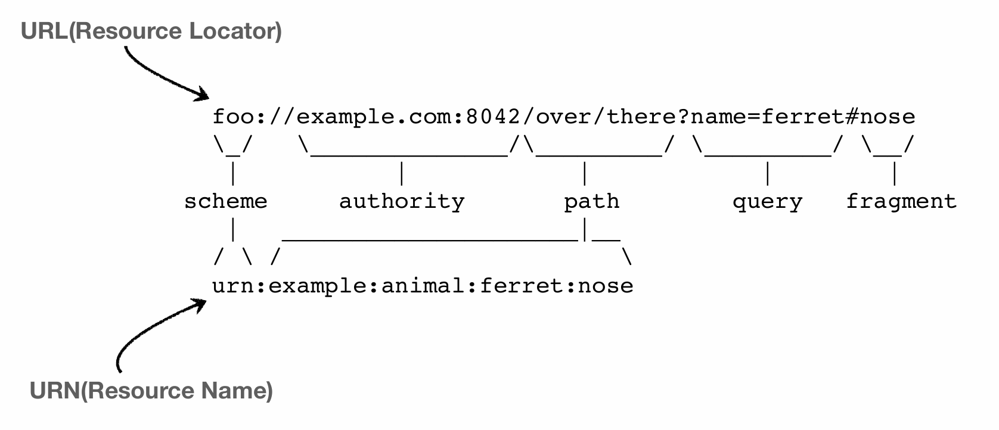

# URI

> URL은 URI 이지만, 모든 URI는 URL이 아니다

> "URI는 로케이터(locator) , 이름(name) 또는 둘 다 추가로 분류될 수 있다."

- Uniform : 리소스를 식별하는 통일된 방식
- Resource : 자원, URI로 식별할 수 있는 모든 것(제한 없음)
- Identifier : 다른 항목과 구분하는데 필요한 정보

## URL(Uniform Resource Locator)

> 리소스가 있는 위치를 지정

> URI를 URL과 같은 의미로 봐도 무방할 정도의 차이이다.

- scheme://[userinfo@]host[:port][/path][?query][#fragment]
- https :// www.google.com :443  /search ?q=hello&hl=ko # getting-started-introducing-spring

### scheme
- 주로 프로토콜로 사용 된다

### host 
- 호스트명

- 도메인명 또는 IP주소를 직접 사용가능

### userinfo

- 거의 안쓴다

- URL에 사용자 정보를 포함해서 인증

### PORT

- 접속 포트

- 일반적으로 생략, 생략시 http는 80, https는 443

### path

- 리소스 경로, 계층적 구조
    - /homefile1.jpg
    - /members
    - /members/100, /items/iphone12

### query

- key=value 형태

- ?로 시작, &로 추가 가능

- querystring, query parameter 등으로 불린다. 웹서버에서 제공하는 파라미터, 문자 형태

### fragment

- html 내부 북마크 등에 사용

- 서버에 전송하는 정보는 아님

## URN(Uniform Resource Name)

> 리소스에 이름을 부여

> ex) urn:isbn:8960666331(어떤 책의 isbn URN)

> 자주 사용되지 않는다.