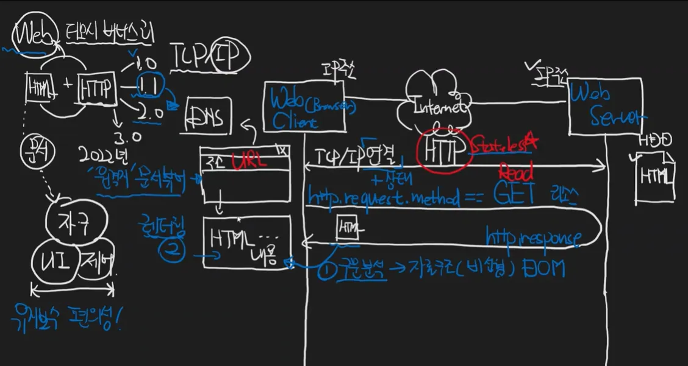

# 웹 서비스의 구조

- 웹 서비스를 누가 만들었는가?
    - 티모시 버너스 리
        
        논문을 읽다가 바로 참고문헌을 연결시키고 싶어함
        
        TEXT + LINK로 만들고 싶어함
        
        HTML(TEXT) 전달 → HTTP프로토콜
        
        여러개의 링크를 묶어놓으니 거미줄과 같다(WEB)
        
        그래서 WEB service가 됬음
        
    
- 서비스에 필요한 것
    
    인터페이스 , 제어체계, 데이터가 필요하다
    
- 서비스의 흐름
    
    
    
    초기웹(HTTP 1.0)의 구조
    
    URL을 치면 DNS에서 URL의 ip를 반환하고, 그곳으로 http req요청을 보내서 html문서를 가져온다.
    
- STATELESS
    
    서버 측에서 극복하기 위해서 만들어진것 (DATABASE)