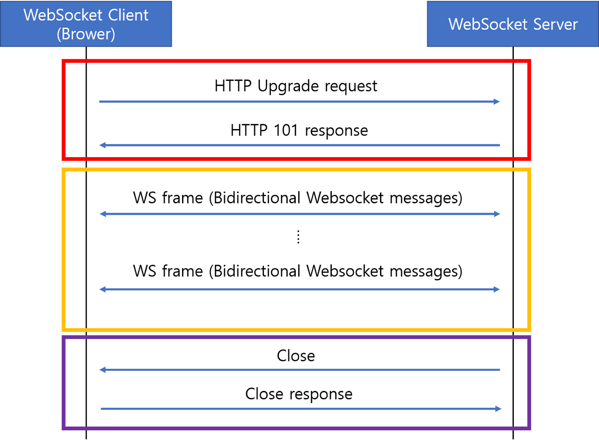

# Websocket 




> 웹 소켓 동작 과정은 크게 세가지로 나눌 수 있다.

> 위 이미지의 빨간 색 박스에 해당하는 Opening Handshake

> 위 이미지의 노란 색 박스에 해당하는 Data transfer

> 위 이미지의 보라 색 박스에 해당하는 Closing Handshake


## Opening Handshake

> Opening Handshake 과정은 클라이언트와 서버 간의 WebSocket 연결을 설정하는 초기 단계이다. 이 과정은 다음과 같은 단계로 진행된다:

### 클라이언트 요청

클라이언트는 HTTP 요청을 통해 WebSocket 연결을 요청한다. 이 요청에는 Upgrade 헤더가 포함되어 있어, HTTP 프로토콜에서 WebSocket 프로토콜로 전환하고자 함을 명시한다.

``` makefile
GET /chat HTTP/1.1
Host: example.com
Upgrade: websocket
Connection: Upgrade
Sec-WebSocket-Key: dGhlIHNhbXBsZSBub25jZQ==
Sec-WebSocket-Version: 13
Origin: http://localhost:8080
```

#### 서버 응답

서버가 클라이언트의 요청을 수락하면, WebSocket 연결을 설정하기 위해 적절한 응답을 반환한다. 이 응답에도 Upgrade 헤더가 포함되어 있으며, Sec-WebSocket-Accept 헤더를 통해 클라이언트의 요청을 확인하는 키가 포함된다.

```makefile
HTTP/1.1 101 Switching Protocols
Upgrade: websocket
Connection: Upgrade
Sec-WebSocket-Accept: dGhlIHNhbXBsZSBub25jZQ==
```

#### 연결 설정 완료

클라이언트와 서버 간의 핸드셰이크가 완료되면, WebSocket 연결이 성공적으로 설정되며, 양측 간의 데이터 전송이 가능해진다.


## Data Transfer

> Opening HandShake에서 승인이 나고나면, 웹 소켓 프로토콜로 노란색 박스 부분인 Data transfer 이 진행된다. 여기서 데이터는 메시지라는 단위로 전달된다.

 

### 메시지
여러 프레임(frame)이 모여서 구성되는 하나의 논리적인 메시지 단위

 

### 프레임
통신에서 가장 작은 단위의 데이터. 헤더 + payload 로 구성되어 있다.

