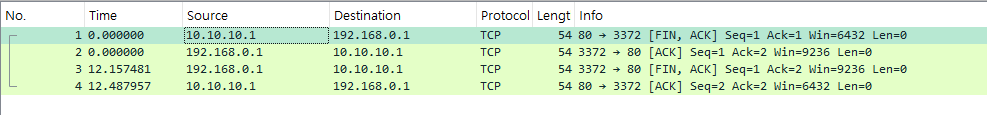
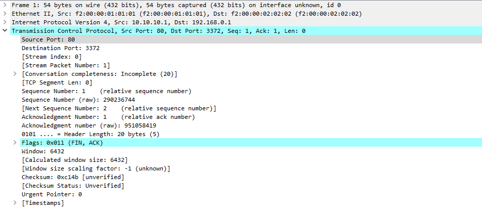

# 4-way-handshake(TCP connection close)

- 첫 번째 요청에서 FIN,ACK flag를 활성화 시켜 요청을 보낸다
- 두 번째 요청에서 ACK(인지) flag를 보내준다
- 요청을 받은 쪽은 close동작을 수행하고, 이 동작이 끝나면 FIN,ACK flag 활성화된 정보를 보낸다
- FIN,ACK flag 가 켜진 정보를 수신하면, ACK flag가 활성화된 정보를 전송한다
