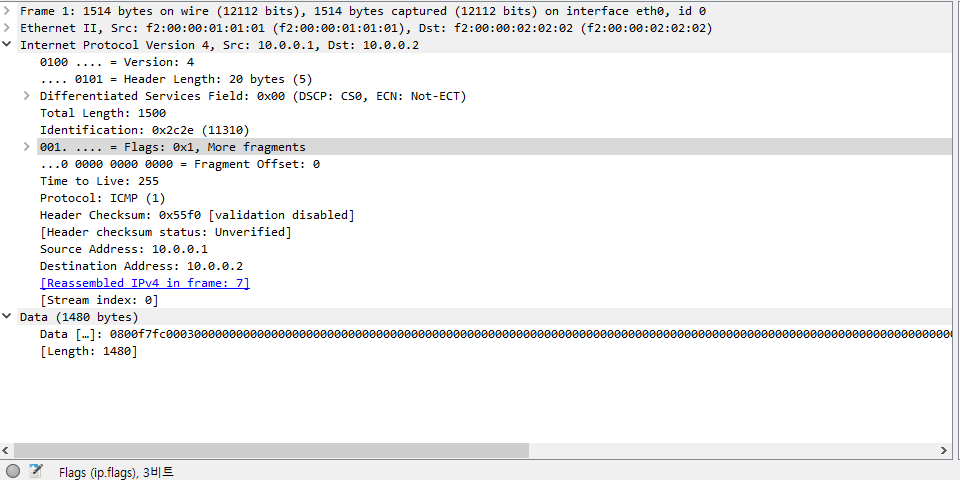
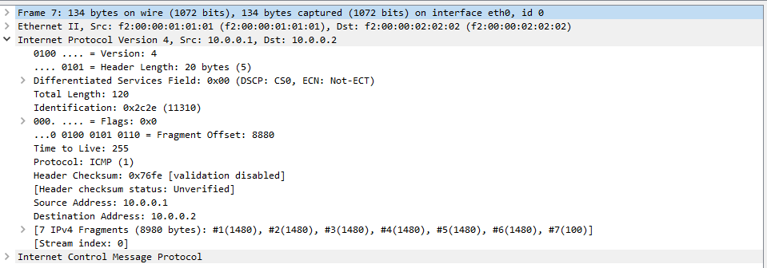
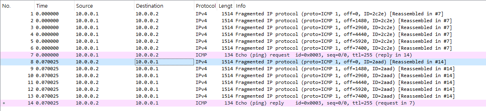

## IPv4 단편화

- 통신을 위해서 OS는 원하는 정보(data)를 캡슐화시켜서 송신지로 보내게 된다.
- OS의 추상화 된 인터페이스를 사용하면서 data가 packet의 허용량(MTU, 최대 허용 단위, 보통 1500byte) 보다 크다면 정보를 나눠서 전송해서 받은 시점에서 합쳐 상위계층(TCP,UDP)로 전달 되는데, 이것이 IPv4 단편화이다.
- 이곳에서 조립하는 데이터는 TCP의 세그먼트 같은 정보들이며, 이 정보들을 합쳐 상위 계층에서 처리 가능한 데이터로 만드는 것이다
- IP프로토콜의 주된 2가지 역할은 IP단편화, IP주소 지정이다.

- IPv4 헤더를 확인하면 Source Address와 Destination Address를 통해 IP주소 지정이 이루어지는 것을 알 수 있다.
- IPv4 단편화는 MF(more fragment) flag를 통해 판단한다 (0이면 없음, 1이면 있음)
- 따라서 Flags = 0x0이면, 해당 단편이 마지막 단편임을 나타내며, 나머지 단편들이 모두 수신되었으면 IP 계층에서 재조합을 완료한다.
- offset을 통해 총 데이터의 크기를 알 수 있다
- Identification 을 통해 식별할 수 있다(같은 단편화라면 같은 id를 사용한다)
- 단편화의 마지막 프로토콜은 ipv4가 아닌 ICMP프로토콜로 보내진다
    - ICMP(Internet Control Messsage Protocol)는 주로 에러 메시지를 전달하는 프로토콜이지만, 네트워크가 정상적으로 작동하고 있을 때도 상태 확인 또는 추가적인 정보 전송을 위해 사용된다