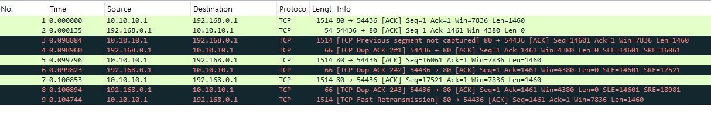

# TCP 재전송

> 이 예제는 예제의 요청은 연속적으로 14600 을 보내려고했는데, 요청이 중간에 끊겨서 꼬인 상황을 나타낸다
> TCP 패킷이 1460 바이트씩 연속적으로 전송되다가, 중간에 패킷 손실이 발생하여 순서가 꼬이고 재전송이 발생한 상황을 보여주고 있다

- 1:	0.000000	10.10.10.1	192.168.0.1	TCP	1514	80 → 54436 [ACK] Seq=1 Ack=1 Win=7836 Len=1460
- 2:	0.000135	192.168.0.1	10.10.10.1	TCP	54	54436 → 80 [ACK] Seq=1 Ack=1461 Win=4380 Len=0
- 3:	0.098884	10.10.10.1	192.168.0.1	TCP	1514	[TCP Previous segment not captured] 80 → 54436 [ACK] Seq=14601 Ack=1 Win=7836 Len=1460
- 4:	0.098960	192.168.0.1	10.10.10.1	TCP	66	[TCP Dup ACK 2#1] 54436 → 80 [ACK] Seq=1 Ack=1461 Win=4380 Len=0 SLE=14601 SRE=16061
- 5:	0.099796	10.10.10.1	192.168.0.1	TCP	1514	80 → 54436 [ACK] Seq=16061 Ack=1 Win=7836 Len=1460
- 6:	0.099823	192.168.0.1	10.10.10.1	TCP	66	[TCP Dup ACK 2#2] 54436 → 80 [ACK] Seq=1 Ack=1461 Win=4380 Len=0 SLE=14601 SRE=17521
- 7:	0.100853	10.10.10.1	192.168.0.1	TCP	1514	80 → 54436 [ACK] Seq=17521 Ack=1 Win=7836 Len=1460
- 8:	0.100894	192.168.0.1	10.10.10.1	TCP	66	[TCP Dup ACK 2#3] 54436 → 80 [ACK] Seq=1 Ack=1461 Win=4380 Len=0 SLE=14601 SRE=18981
- 9:	0.104744	10.10.10.1	192.168.0.1	TCP	1514	[TCP Fast Retransmission] 80 → 54436 [ACK] Seq=1461 Ack=1 Win=7836 Len=1460

- 해당 정보의 len은 tcp segment의 크기를 말하는 것이다
- 세 번째 전송에서 seq가 14601인 이유는 해당 와이어샤크 예제에서는 생략 되었지만 여러번의 segmnet 송신이 더 있었을 것이고, 그 값을 합치면 길이기 14600일 것이다
- win(window)의 값은 TCP 헤더에는 Window Size 필드가 존재하며, 이는 수신 측에서 받을 수 있는 남은 버퍼 크기를 나타낸다(보낸 사람의 버퍼 크기)
- 패킷4에서 패킷이 유실되었다고 판단해 재전송 한다
- SLE=14601와 SRE=16061은 손실된 데이터를 나타낸다
- TCP는 세번의 중복된 ACK segment를 수신하면 빠른 회복 알고리즘이 수행된다(패킷9, TCP Fast Retransmission)
- Dup ACK (중복 ACK)는 수신자가 이미 받았다고 확인한 데이터에 대한 응답을 여러 번 보내는 것입니다. 주된 목적은 재전송 요청이다

## 흐름

- 192.168.0.1 → 10.10.10.1 : ACK (Seq=1, Ack=1461)
- 10.10.10.1 → 192.168.0.1 : 1460 바이트 (Seq=14601, Ack=1)
- 192.168.0.1 → 10.10.10.1 : 중복 ACK (SLE=14601, SRE=16061)
- 10.10.10.1 → 192.168.0.1 : 1460 바이트 (Seq=16061, Ack=1)
- 192.168.0.1 → 10.10.10.1 : 중복 ACK (SLE=14601, SRE=17521)
- 10.10.10.1 → 192.168.0.1 : 1460 바이트 (Seq=17521, Ack=1)
- 192.168.0.1 → 10.10.10.1 : 중복 ACK (SLE=14601, SRE=18981)
- 10.10.10.1 → 192.168.0.1 : 빠른 재전송 (Seq=1461, Ack=1)

## SLE(Selective Acknowledgment Left Edge) & SRE(Selective Acknowledgment Right Edge)
- SLE와 SRE는 SACK(Selective Acknowledgment, 선택적 확인 응답) 옵션에서 사용되는 개념
- SACK 옵션은 수신자가 "부분적으로 받은 데이터"를 송신자에게 알리는 기능을 제공
- 송신자가 `Seq=1`부터 `Seq=20001`까지 보냄
- 하지만 `Seq=1461 ~ Seq=14600` 구간에서 손실 발생! (중간 일부 패킷 유실)
- 수신자가 `Seq=1~1460`, `Seq=14601~20001`을 정상 수신했다고 가정하면:

| 받은 데이터 | 손실된 데이터 |
|---------------|-----------------|
| 1 ~ 1460 ✅ | 1461 ~ 14600 ❌ |
| 14601 ~ 20001 ✅ | |

- 이때, 수신자는 "나는 1461~14600을 못 받았고, 14601부터는 정상 수신함"을 송신자에게 알리기 위해 다음과 같이 SACK 옵션을 포함한 ACK을 보낸다.

`ACK=1 SLE=14601 SRE=20001`

### 해석:
- **ACK=1** → 정상적으로 받은 패킷의 마지막 순서 번호
- **SLE=14601, SRE=20001** → `14601~20001` 구간은 받았음
- 송신자는 `1461~14600`을 재전송함

###  전체적인 동작 방식
1. 송신자가 데이터를 전송한다.
2. 일부 데이터가 유실된다.
3. 수신자는 받은 데이터의 범위를 SACK 옵션을 통해 송신자에게 알린다.
4. 송신자는 유실된 부분만 재전송한다.
5. 효율적으로 손실된 데이터만 재전송하여 네트워크 성능을 최적화할 수 있다.

---

##  정리
- SLE (Left Edge): 수신자가 받은 데이터 블록의 시작 지점
- SRE (Right Edge): 수신자가 받은 데이터 블록의 끝 지점
- SACK 옵션을 사용하면 TCP는 손실된 부분만 재전송하여 불필요한 데이터 전송을 줄일 수 있음