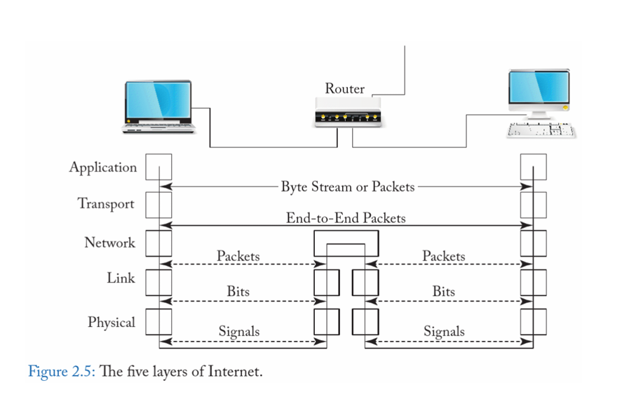

# Network Overview

1. 송신 측에서 HTTP 메시지가 전송될 때는 Application Layer에서 하위 계층의 프로토콜 정보가 한 번에 만들어지는 것이 아니라, 각 계층이 단계적으로 캡슐화를 수행한다. Application Layer는 단순히 HTTP 요청 메시지를 생성하며, 하위 계층의 세부 정보는 생성하지 않는다. 이후 OS의 TCP/IP 스택이 이 데이터를 전달받아 전송에 필요한 헤더를 붙인다.
 

2. 먼저 Application Layer에서는 브라우저나 서버 애플리케이션이 HTTP 요청 메시지를 만든다. 이 메시지는 예를 들어 “GET /index.html HTTP/1.1”과 같은 순수한 텍스트이며, 아직 IP나 TCP 정보는 포함되지 않는다.
 

3. Transport Layer에서는 OS의 TCP 모듈이 데이터를 세그먼트 단위로 나누고, 출발지와 목적지 포트, 시퀀스 번호, ACK 번호, 체크섬 등을 붙인다. TCP는 이 과정에서 신뢰성을 보장하기 위한 재전송, 순서 보장, 오류 검출 기능을 수행한다.
 

4. Network Layer에서는 TCP 세그먼트를 받아 IP 헤더를 붙인다. 이 IP 헤더에는 출발지 IP, 목적지 IP, TTL, 프로토콜 번호 등이 포함되며, 이로써 데이터는 IP 패킷 형태로 만들어진다.
 

5. Data Link Layer는 바로 이더넷(Ethernet) 이 작동하는 계층이다. 이더넷은 IP 패킷을 프레임(Frame) 형태로 감싸고, 출발지 MAC 주소와 목적지 MAC 주소, 프레임 체크 시퀀스(FCS) 를 추가한다. 이 계층은 네트워크 인터페이스 카드(NIC, Network Interface Card)가 담당하며, 같은 로컬 네트워크(LAN) 내에서 장치 간의 전송을 관리한다. 즉, 이더넷은 한 네트워크 세그먼트 내에서 “누구에게 보내야 하는가”를 결정하고, 충돌 감지(CSMA/CD)나 오류 검출 기능을 수행한다.
 

6. 마지막으로 Physical Layer에서는 이더넷 프레임이 0과 1의 비트스트림으로 변환되어 전기 신호나 광 신호, 무선파 형태로 전송 매체(케이블, 광섬유, 무선 등)를 통해 송출된다.
 

7. 수신 측에서는 이 과정을 역순으로 수행한다. Physical Layer가 신호를 수신하면 Data Link Layer의 이더넷이 프레임을 해석하고 MAC 주소를 검사한다. Network Layer가 IP 주소를 확인한 뒤 Transport Layer의 TCP가 세그먼트를 재조립하고 순서를 복원한다. 마지막으로 Application Layer에서 완성된 HTTP 메시지를 받아 웹서버나 브라우저가 이를 처리한다.
 

8. 결론적으로, 이더넷은 Data Link Layer의 대표적인 구현체로, IP 패킷을 프레임 단위로 묶어 로컬 네트워크 내에서 안전하게 전달하는 역할을 담당한다.
   송신 과정은 Application Layer에서 생성된 HTTP 메시지가 TCP, IP, Ethernet을 거치며 점진적으로 헤더가 덧붙여지고, 결국 비트스트림 형태로 물리 매체를 통해 전송되는 구조이다. 수신 측에서는 이 과정을 반대로 수행해 TCP 소켓을 통해 원래의 HTTP 메시지가 복원된다.

## OSI 7(5) Layer

- OSI 7 Layer(Open Systems Interconnection 7 Layer) 모델은 1980년대 초 국제표준화기구(ISO) 가 서로 다른 시스템과 네트워크 장비들이 “표준화된 인터페이스” 를 통해 통신할 수 있도록 만든 개념적 모델
- OSI 7 Layer의 인터페이스는 다양한 벤더들이 프로토콜을 개발해 인터넷을 상용화 시키기에 만들어졌다
  - Layer의 input, output이 정해졌기에 내부 구현은 많은 벤더들이 여러가지 방식으로 개발하여 시간이 지날수록 효율적인 통신(인터넷)이 만들어지게 된 것이다
- link layer에는 switch(내부 네트워크 내부 통신)
- network layer에서는 router(다른 네트워크 간 연결)