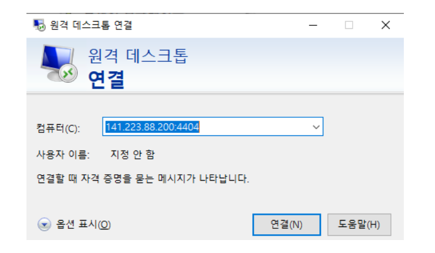
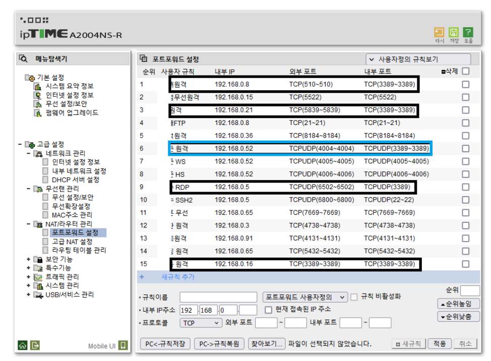
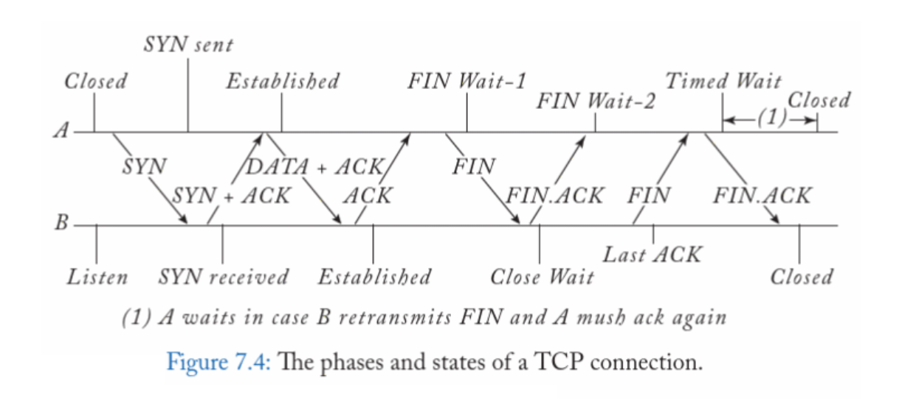

# Transport layer

- trans + port를 위한 layer이다(port routing)
  1. the end-to-end delivery of information across the Internet
  2. the delivery between an application process in a source and a process in a
destination through ports.
  3. delivery of a packet from a source port to a destination port by using IP
addresses and port numbers
- Key phrase: handshake between ports
  - 3-way handshake to establish a connection
  - 4-way handskake to close a connection
- Two protocols for transport services
  1. User Datagram Protocol (UDP): connectionless delivery of a datagram. not
reliable.
  2. Transmission Control Protocol (TCP): connection-oriented delivery of a
sequence of segments/packets. reliable.

## TCP

- the Transmission Control Protocol: delivery of TCP segments by possibly
multiplexing, error control, congestion control, flow control, etc.
- A TCP segment contains the information on the source port number, the
destination port number, etc.
- A TCP segment is encapsulated into an IP packet.
- much more reliable
- TCP/IP connections work in a manner similar to a telephone call where someone
has to initiate the connection by dialing the phone. At the other end of the
connection, someone has to be listening for calls and then pick up the line when
a call comes in.
- The Client in a TCP/IP connection is the computer or device that dials the
phone and the Server is the computer that is listening for calls to come in.
  - In other words, the Client needs to know the IP Address of whatever Server it
wants to connect to and it also needs to know the port number that it 
- TCP Connection이 된 상태를 session이 생겼다고 칭한다
  - TCP Connection도 session이라고 표현하지만, osi 7 layer의 session layer는 논리적인 연결을 칭하며 tcp의 session은 실제 session의 구현체로 사용된다

### port forwarding

- NAT(Network Address Translation)과는 구분되는 개념이다(internetwork)
- def) DNAT(Destination NAT, 외부에서 내부로 들어올 때 목적지 IP를 내부 서버로 바꿔줌)의 한 형태로, 특정 공인 IP:Port → 내부 IP:Port로 고정 연결을 지정
  - why? 외부에서 내부 서버(예: 192.168.0.10:8080)에 접근 가능하게 하기 위해
    - 외부 요청을 특정 내부 IP:Port로 전달
    - `외부 사용자가 203.0.113.5:5000으로 접속 → NAT 라우터가 192.168.0.10:8080으로 전달`

#### case study

- Q. You want your computer in the lab(141.223.88.200:4004) to be accessible from your room in the POSTECH dormitory. However, your lab runs out of the public IP address, so that your computer has a private IP address only. What do you need to do? how to access private to public network?

  

- 그림 오타 4404-> 4004
- The figure shows an example of how to enter the IP address and port number in Remote Deskop App of your dorm PC.
- In 141.223.88.200:4404, 141.223.88.200 is the public IP address of the router in your lab, while 4404 is the external port number assigned to your lab PC.
- Port is a logical connection not a physical connection. So, to do this, the router needs to be configured

  

- The figure shows an example of how to configure a Wi-Fi router.
- Suppose that the computer to be remotely logged in is assigned the internal IP address 192.168.0.52.
- This computer has the external port number 4004.
- It has 3389 as the internal port number for Remote Desktop App, which is fixed for all windows machines.
- 외부에서 요청을 보내면(router의 public ip, 이곳에서는 141.223.88.200:4004), 라우터가 설정해놓은 private ip 192.168.0.52:3389로 요청을 보낸다

### handshake

- transport layer handshake
  - 3-way handshake to establish a connection
  - 4-way handskake to close a connection
- TCP is connection-oriented, and a connection between client and server is established before data can be sent.

- 3-way handshake는 syn -> syn + ack -> ack로 이루어 진다
  - 그림이 햇갈리게 되어있지만, 저 과정이 establish된 후 data를 전송하는 것이다
  - syn/ack는 모두 tcp header에 들어있고, payload는 규약상으로 금지되어 있다
- 4-way handshake는 fin(A) -> ack(B)-> fin(B) -> ack(A)응답으로 종료된다
  
  - TCP는 단순한 "메시지 전송" 프로토콜이 아니라 A → B 데이터 스트림, B → A 데이터 스트림 두 개의 독립된 방향을 가진 두 개의 파이프로 설계됬기 떄문이다
  - 또한 현재는 통신이 발전되어 문제없지만, 이전에는 종료신호를 명확하게 전달해서 통신이 종료되야 과금이 종료되었기에, 그 때부터 존재했던 규칙이기도 하다(TCP 설계의 근본적인 원인이 되지는 않지만, 해당 방식을 이전부터 사용해왔다)