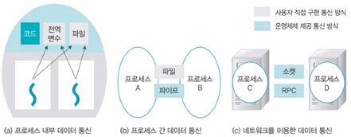

# 프로세스

- 프로세스의 현재 활동 상태는 프로그램 카운터 값과 프로세서 레지스터 내용으로 나타낸다
- 프로그램은 프로세스가 아니다
- 프로세스는 다른 개체를 위한 실행 환경으로 동작할 수 있다(JVM)

## 프로세스 제어 블록
- 각 프로세스는 운영체제에서 프로세스 제어 블록(PCB)로 관리된다
- PCB는 다음과 같은 것을들 포함한다
    - 프로세스 상태(new, ready, running, waiting, halted)
    - 프로그램 카운터 : 다음에 실행할 명령어의 주소
    - CPU 레지스터들 : 레지스터의 상태 정보를 저장한다(인터럽트 발생시, 다시 사용하기 위해서)
    - CPU-스케쥴링 정보 : 프로세스 우선순위, 포인터와 다른 스케쥴 메개변수를 포함한다
    - 메모리 관리 정보 : 메모리 시스템에 따라 페이지 테이블, 세그먼트 테이블 등과 같은 정보를 포함
    - 회계(accounting) 정보 : CPU 사용 시간과 경과된 시간, 시간제한, 계정 정보, 프로세스 정보를 포함한다
    - 입출력 상태 정보 : 프로세스에 할당된 입출력 장치들과 열린 파일의 목록을 포함한다

## 프로세스 생성

- fork() 시스템 콜로 프로세스가 생성된다
- fork()의 반환값은 부모 프로세스와 자식 프로세스에서 다르다
    - 부모 프로세스에서는 fork()가 자식 프로세스의 프로세스 ID(PID)를 반환한다. 이 값은 0보다 큰 정수이며, 부모는 이 값을 통해 자식 프로세스가 성공적으로 생성되었는지를 확인할 수 있다.
    - 자식 프로세스에서는 fork()가 0을 반환한다. 자식 프로세스는 부모 프로세스와 동일한 코드 경로를 실행하므로, 이를 통해 자식 프로세스임을 구분할 수 있다.
```C
#include <stdio.h>
#include <unistd.h>

int main() {
    pid_t pid = fork();  // fork() 호출

    if (pid > 0) {
        // 부모 프로세스
        printf("부모 프로세스: 자식 프로세스의 PID는 %d\n", pid);
    } else if (pid == 0) {
        // 자식 프로세스
        printf("자식 프로세스: PID는 0\n");
    } else {
        // fork() 실패 시
        printf("fork() 실패\n");
    }

    return 0;
}
// 출력
부모 프로세스: 자식 프로세스의 PID는 1234
자식 프로세스: PID는 0
```
- fork() 이후 exec() 시스템 콜을 사용하여 메모리 공간을 새로운 프로그램으로 교체한다

## 프로세스 간 통신(IPC, Inter-Process Communication)

> 프로세스 간 통신(IPC)은 서로 다른 프로세스들이 데이터를 교환하거나 서로 상호작용하는 방법이다. IPC는 동일한 시스템 내에서 실행 중인 프로세스들 간에 이루어지며, 멀티태스킹 환경에서 중요한 역할을 한다.



### 1. 파이프 (Pipe)
   - 유형: 익명 파이프(Anonymous Pipe)와 명명된 파이프(Named Pipe)
   - 설명: 한 프로세스의 출력을 다른 프로세스의 입력으로 연결하는 방식이다. 익명 파이프는 부모-자식 프로세스 간 통신에 사용되고, 명명된 파이프는 두 프로세스 간의 통신을 위해 이름을 부여하여 사용할 수 있다.
   
### 2. 메세지 큐 (Message Queue)
   - 설명: 메세지를 큐에 넣고, 다른 프로세스가 이 큐에서 메세지를 읽어들이는 방식이다. 메시지는 특정 프로세스에게 전달되며, 여러 프로세스 간의 비동기적인 통신이 가능하다.
   
### 3. 공유 메모리 (Shared Memory)
   - 설명: 두 개 이상의 프로세스가 동일한 메모리 공간을 공유하여 데이터를 읽고 쓸 수 있는 방식이다. 빠른 데이터 전달이 가능하지만, 동기화 문제를 해결하기 위한 추가적인 처리(세마포어 등)가 필요하다.
   
### 4. 소켓 (Socket)
   - 설명: 네트워크를 통한 통신 방법으로, 클라이언트-서버 방식으로 데이터를 전송한다. 로컬 시스템 내에서도 사용할 수 있으며, 분산 시스템 간의 통신에도 사용된다.

### 5. 시그널 (Signal)
   - 설명: 프로세스에 이벤트나 알림을 보내는 방식이다. 예를 들어, 프로세스를 종료시키거나 중단시키는 등의 작업을 시그널을 통해 처리할 수 있다.

### 6. 세마포어 (Semaphore)
   - 설명: 여러 프로세스가 공유 자원을 안전하게 사용하기 위한 동기화 기법으로, 특정 조건이 만족될 때까지 프로세스를 대기시키거나 자원을 잠금 처리한다.

### 7. 메모리 맵 파일 (Memory-Mapped File)
   - 설명: 파일을 메모리 영역에 매핑하여 여러 프로세스가 동일한 메모리 공간을 공유하는 방식이다. 성능이 뛰어나지만 파일을 매핑할 수 있는 권한과 동기화가 필요하다.


## IPC의 주요 특징

- 동기화: 여러 프로세스가 동시에 공유 자원을 사용할 때, 충돌을 방지하기 위한 동기화 메커니즘이 필요하다.
- 속도: 파이프나 공유 메모리와 같은 메커니즘은 빠른 속도를 제공한다. 반면, 메시지 큐와 소켓은 상대적으로 느릴 수 있다.
- 보안: 서로 다른 프로세스들이 데이터를 공유할 때, 보안 문제를 고려해야 할 수 있다. 예를 들어, 공유 메모리나 소켓은 적절한 권한 설정이 필요하다.

## 결론

IPC는 멀티프로세스 시스템에서 필수적인 통신 방법을 제공한다. 각 통신 방법은 사용 상황에 따라 장단점이 있으며, 성능, 보안, 동기화 등을 고려하여 적합한 방법을 선택하는 것이 중요하다.

