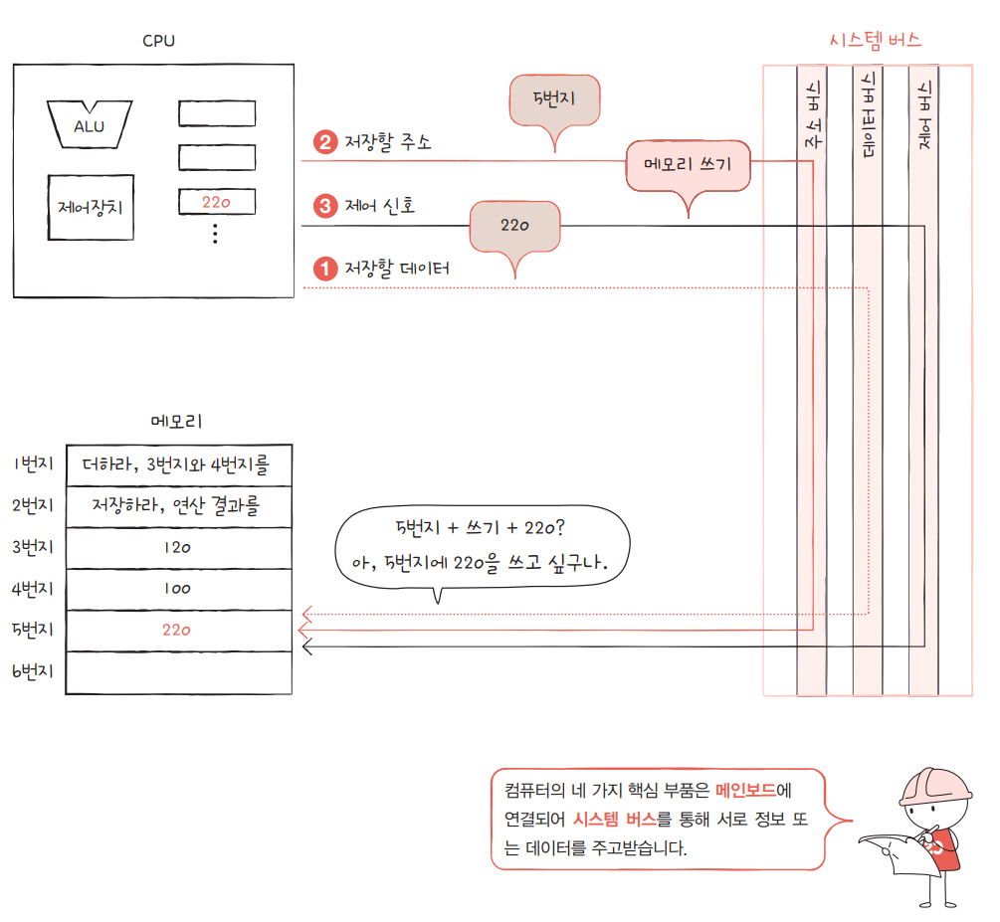

# 컴퓨터의 기본 구조

- CPU(Central Processing Unit)
- Mainboard(MotherBoard)
- RAM(Random Access Memory)
- Power Supply(PSU)
- Harddisk(HDD/SSD)
- Monitor 
- Graphics card(GPU)
- Cooling System
- Peripheral Devices 
- Network Interface Card(NIC)

## 1. CPU

> CPU(중앙 처리 장치, Central Processing Unit)는 컴퓨터의 핵심 부품으로, 프로그램 명령어를 해석하고 실행하는 역할을 한다. CPU는 컴퓨터의 "두뇌"라고도 불리며, 다음과 같은 주요 구성 요소와 기능이 있다.

### ALU (Arithmetic Logic Unit)

기능: 산술 연산(덧셈, 뺄셈 등)과 논리 연산(AND, OR, NOT 등)을 수행. 
역할: CPU 내에서 데이터 처리를 담당.

### CU (Control Unit)

기능: CPU 내부의 모든 작업을 조정하고 명령어 실행의 순서를 제어. 
역할: 명령어를 해석하여 ALU와 메모리, I/O 장치 간의 통신을 관리.

### 레지스터 (Register)

정의: CPU 내부의 고속 메모리로, CPU가 즉시 사용할 수 있는 데이터를 저장. 
종류: 일반 레지스터, 특별 레지스터(프로그램 카운터, 스택 포인터 등).

- 메모리에 저장안하고 레지스터에 저장하는 이유는, 메모리보다 훨씬 더 빠르고 중요한 작업을 빠르게 처리해야 할 때 사용한다.

### 캐시 메모리 (Cache Memory)

정의: CPU와 메인 메모리(RAM) 간의 속도 차이를 줄이기 위해 사용되는 고속 메모리. 
특징: 자주 사용되는 데이터나 명령어를 저장하여 CPU의 처리 속도를 향상.

### 클럭 

정의 : CPU 클럭은 초당 실행할 수 있는 진동(클럭 주기)의 수를 의미하며, 단위는 **Hz(헤르츠)**를 사용한다.

- 1 GHz = 10억 회/초
- 3.5 GHz = 35억 회/초
    - 클럭이 높을수록 CPU가 더 많은 명령어를 처리할 수 있는 가능성이 커진다. 하지만, 클럭만으로 CPU의 전체 성능을 평가할 수는 없다(아키텍처와 명령어 집합도 중요).
- 연산의 종류에 따라 클럭의 필요량이 다르다(예를 들어 +는 1클럭, x는 3~10클럭/ x는 +를 여러번 사용하는 경우이다.)

## Intel VS AMD CPU 아키텍쳐 차이 

#### Intel
- CISC 아키텍처: Intel은 전통적으로 CISC(Complex Instruction Set Computing) 아키텍처를 채택하고 있다. 이는 더 복잡한 명령어 세트를 제공하여 여러 작업을 한 번의 명령어로 수행할 수 있게 한다.
- 하이퍼스레딩(HT): 인텔의 프로세서는 하이퍼스레딩 기술을 통해 각 코어에서 두 개의 스레드를 동시에 실행할 수 있도록 설계되어, 멀티태스킹 성능이 향상된다.
- Turbo Boost: Intel의 Turbo Boost 기술은 CPU가 필요에 따라 클럭 속도를 자동으로 조절하여 성능을 극대화할 수 있도록 한다.
#### AMD
- RISC와 CISC의 혼합: AMD는 기본적으로 CISC 아키텍처를 사용하지만, 효율성과 성능을 높이기 위해 RISC(Reduced Instruction Set Computing)의 요소를 일부 도입했다.
- 스레드 리퍼(THREADRIPPER): AMD의 스레드 리퍼 프로세서는 다수의 코어와 스레드를 제공하여 멀티코어 성능을 극대화하였다. 이는 주로 고사양 작업이나 콘텐츠 제작에서 높은 성능을 발휘한다.
Infinity Fabric: AMD는 Infinity Fabric 아키텍처를 통해 여러 프로세서 및 GPU 간의 통신을 최적화하여 높은 대역폭을 제공한다.
#### 성능 차이
- 싱글 스레드 성능: 인텔 프로세서는 일반적으로 싱글 스레드 성능이 우수하여 게이밍과 같은 특정 작업에서 높은 성능을 발휘한다.
- 멀티 스레드 성능: AMD는 멀티코어 및 멀티스레드 성능에서 뛰어난 성능을 제공하며, 특히 생산성 작업이나 영상 편집, 3D 렌더링에 유리하다.

## 2. Mainboard

> 메인보드는 컴퓨터의 주요 부품들이 연결되는 중심 기판으로, 모든 하드웨어가 상호작용할 수 있도록 하는 중요한 역할을 한다. 메인보드는 다양한 컴포넌트와 연결되어 시스템의 성능과 기능을 결정한다. 아래는 메인보드에 대한 주요 요소 및 기능을 정리한 것이다.

#### 1. 구성 요소
- 소켓: CPU(중앙 처리 장치)를 장착하는 소켓이 있다. CPU 소켓의 종류에 따라 호환되는 프로세서가 달라지므로, 메인보드를 선택할 때 주의해야 한다.

- 메모리 슬롯: RAM(주기억장치)을 설치하는 슬롯이다. 일반적으로 DDR4, DDR5와 같은 메모리 유형을 지원하며, 슬롯의 개수에 따라 설치할 수 있는 메모리 용량이 결정된다.

- 확장 슬롯: GPU(그래픽 카드)와 같은 추가 하드웨어를 설치하는 PCIe(Peripheral Component Interconnect Express) 슬롯이 있다. 이 슬롯은 다양한 카드(사운드 카드, 네트워크 카드 등)를 추가할 수 있는 유연성을 제공한다.

- 저장 장치 인터페이스: HDD(하드 드라이브)와 SSD(솔리드 스테이트 드라이브)와 같은 저장 장치를 연결하는 SATA(Serial ATA) 포트와 M.2 슬롯이 있다.

- 전원 커넥터: 메인보드에 전력을 공급하기 위한 24핀 ATX 전원 커넥터와 추가 전원을 공급하는 4핀 또는 8핀 커넥터가 있다.

- 입출력 포트: USB 포트, 오디오 잭, LAN 포트 등 다양한 입출력 포트가 있으며, 이를 통해 외부 장치와의 연결이 가능하다.

#### 2. 기능
- 하드웨어 통합: 메인보드는 모든 컴퓨터 구성 요소를 연결하고 데이터가 상호작용할 수 있도록 하여 시스템의 통합성을 유지한다.

- 신호 관리: 메인보드는 CPU, 메모리, 저장 장치 등 간의 데이터 전송을 관리하며, 이를 통해 성능을 최적화한다.

- BIOS/UEFI: 메인보드는 기본 입출력 시스템(BIOS) 또는 통합 확장 펌웨어 인터페이스(UEFI)를 포함하고 있어 하드웨어 초기화 및 운영 체제 로딩을 담당한다.

- 온도 및 전압 모니터링: 메인보드는 CPU 및 시스템의 온도와 전압을 모니터링하여 안정성을 유지하고 과열을 방지하는 기능을 가진다.

# 3. RAM(Random Access Memory)

> RAM은 컴퓨터에서 데이터와 프로그램을 임시로 저장하는 메모리 장치로, CPU가 빠르게 접근할 수 있는 특성을 가지고 있다. RAM은 컴퓨터의 성능에 큰 영향을 미치며, 작업의 효율성을 높이는 데 중요한 역할을 한다.

## 특징

- 임시 저장소: RAM은 휘발성 메모리로, 전원이 꺼지면 저장된 데이터가 사라진다. 따라서 운영 체제, 애플리케이션, 열린 파일 등의 데이터를 임시로 저장하는 데 사용된다.

- 랜덤 접근: RAM의 데이터는 임의의 주소를 통해 접근할 수 있으며, 특정 데이터에 빠르게 접근할 수 있다. 이는 HDD나 SSD와 같은 저장 장치보다 훨씬 빠르다.

### 랜덤 접근이라는게 말이 됨?

"랜덤 접근"이라는 용어에서 "랜덤"은 실제로 무작위로 선택된 주소를 의미하는 것이 아니라, 특정 주소를 지정하여 그 주소에 있는 데이터를 빠르게 접근할 수 있다는 것을 나타낸다. 

# 4. Power Supply(PSU)

> 전원 공급 장치(Power Supply Unit, PSU)는 컴퓨터와 같은 전자 기기에 전력을 공급하는 장치다.

# 5. Harddisk(HDD/SSD)

> 하드 디스크 드라이브(HDD)는 회전하는 디스크에 데이터를 자기적으로 저장하는 기계적 저장 장치다. 솔리드 스테이트 드라이브(SSD)는 NAND 플래시 메모리를 이용해 데이터를 전자적으로 저장하며, 기계적 부품이 없어 빠른 속도와 높은 내구성을 제공한다. HDD는 대용량 저장에 경제적이지만, 속도가 느리고 충격에 취약하다. 반면 SSD는 속도가 빠르고 내구성이 높지만, 가격이 비싸고 상대적으로 용량이 제한적이다.

# 6. Monitor 
> 모니터는 컴퓨터의 출력 장치로, 사용자가 데이터와 정보를 시각적으로 확인할 수 있게 해준다. 다양한 인터페이스(예: HDMI, DisplayPort, VGA, DVI 등)를 통해 컴퓨터와 연결되며, 이는 데이터 전송 속도와 화질에 영향을 미친다. 

# 7. Graphics card(GPU)

> 그래픽 카드(GPU)는 컴퓨터의 그래픽 처리 장치로, 이미지와 비디오를 렌더링하는 역할을 한다. CPU와는 달리 대량의 데이터 처리를 병렬로 수행할 수 있어 복잡한 3D 그래픽, 게임, 비디오 편집 및 인공지능 연산에 적합하다.

### CPU와 GPU의 차이

CPU는 복잡한 작업을 순차적으로 처리하는 데 적합하여, 주로 제어 논리, 데이터 입출력, 복잡한 연산 등을 담당한다. 반면, GPU는 수많은 간단한 연산을 동시에 수행할 수 있어, 그래픽 작업이나 대량의 데이터 연산에서 강점을 보인다.

# 8. Cooling System

> 냉각 시스템(Cooling System)은 컴퓨터의 구성 요소, 특히 CPU와 GPU의 온도를 관리하여 과열을 방지하는 역할을 한다. 과열이 발생하면 성능 저하, 시스템 불안정성, 심지어 하드웨어 손상으로 이어질 수 있기 때문에 적절한 냉각이 필수적이다.
# 9. Peripheral Devices(주변장치)

> 컴퓨터와 연결되어 입력, 출력, 또는 저장 기능을 수행하는 장치다. 입력 장치에는 키보드, 마우스, 스캐너 등이 있어 사용자가 데이터를 컴퓨터에 전달하는 역할을 한다. 출력 장치로는 모니터, 프린터, 스피커가 있으며, 컴퓨터의 처리 결과를 사용자에게 시각적 또는 음향적으로 전달한다.

# 10. Network Interface Card(NIC)

> 네트워크 인터페이스 카드(Network Interface Card, NIC)는 컴퓨터와 네트워크 간의 통신을 가능하게 하는 하드웨어 장치다. NIC는 유선 LAN, 무선 LAN 등 다양한 네트워크 유형에 따라 설계되며, 데이터 패킷을 전송하고 수신하는 기능을 담당한다.

### 중요 특징
- 모든 NIC는 고유한 MAC주소를 가지며, 이를 통해 네트워크에서 장치를 식별한다.