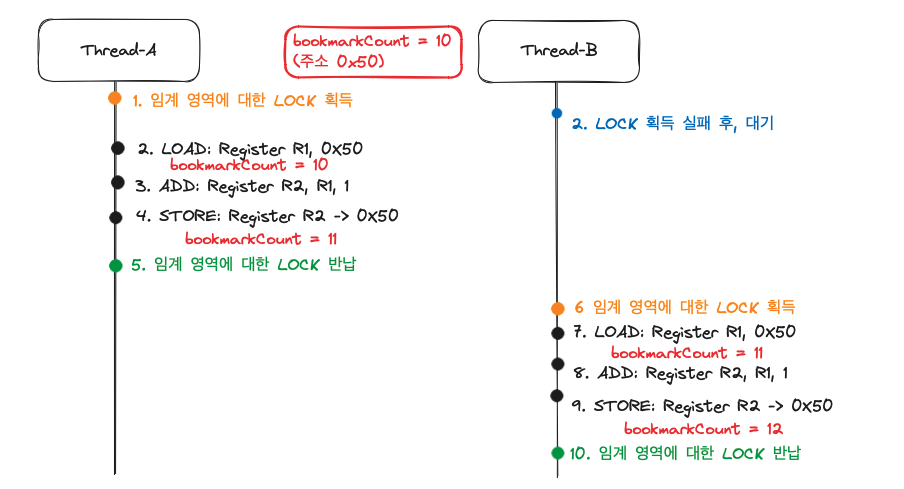

# 동시성?

> 동시성은 컴퓨터 과학에서 여러 작업들이 동시에 실행되는 것처럼 보이는 현상을 의미한다. 실제로 여러 작업이 동시에 실행되는 병렬성과는 구분되며, 싱글 코어 환경에서도 여러 작업을 번갈아 가며 빠르게 처리하여 동시에 실행되는 것처럼 보이게 하는 것을 말한다.

> 주로 쓰레드가 공유자원을 사용하기 때문에 발생하는 문제이다. 여러 쓰레드가 동시에 동일한 자원을 접근하고 수정하려고 할 때, 데이터의 일관성이나 무결성이 손상될 수 있다.

## 발생하는 원인

1. 경쟁 조건 (Race Condition): 두 개 이상의 스레드가 동시에 공유 자원에 접근하여 서로의 작업을 덮어쓰거나 예상치 못한 결과를 초래하는 상황이다. 예를 들어, 두 스레드가 동시에 변수를 증가시키려 할 때 최종 결과가 기대한 것과 다르게 될 수 있다.
2. 데드락 (Deadlock): 두 개 이상의 스레드가 서로가 보유한 자원을 기다리면서 무한 대기 상태에 빠지는 현상이다. 이를 통해 시스템 자원이 비효율적으로 사용되거나 전혀 사용되지 않게 된다.
3. 라이브락 (Livelock): 스레드가 서로의 행동에 따라 지속적으로 상태를 변경하면서 실행되지 않는 상태다. 스레드가 서로를 피하려고 노력하지만 결과적으로 아무것도 진행되지 않는다.
4. 자원 고갈 (Resource Starvation):특정 스레드가 자원에 접근하지 못하는 상황으로, 시스템의 특정 자원을 한 스레드가 지속적으로 차지하게 되는 경우 발생한다.

## 해결전략 

### 뮤텍스

> 뮤텍스는 "Mutual Exclusion"의 약자로, 한 번에 하나의 스레드만 특정 자원에 접근할 수 있도록 보장하는 
동기화 메커니즘이다.

#### 사용 예제1(Redis를 이용한 동시성 제어)

#### 사용 예제2(JAVA ConcurrentHashmap을 이용한 동시성 제어)

ConcurrentHashMap은 각각의 Bucket 별로 동기화를 진행하기에 다른 Bucket에 속해있을 경우엔 별도의 lock없이 운용한다.
> 즉, 필요한 부분만 lock을 걸고 나머지는 다른 쓰레드의 접근을 허용한다

### 세마포어

>세마포어는 특정 자원에 접근할 수 있는 스레드의 수를 제한하는 동기화 메커니즘이다. 세마포어는 일반적으로 두 가지 형태가 있다: 바이너리 세마포어(0 또는 1의 값만 가짐)와 계수 세마포어(0 이상의 정수 값을 가짐)

> 스레드는 세마포어의 값을 감소시키고 자원에 접근한다. 만약 세마포어의 값이 0이면, 더 이상 접근할 수 없고 대기 상태로 들어간다.
작업이 끝나면 스레드는 세마포어의 값을 증가시켜 다른 스레드가 자원에 접근할 수 있도록 한다.
