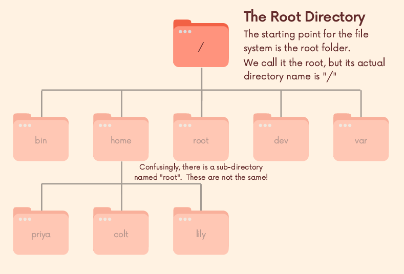

# 파일 탐색

## WSL2 윈도우에서 root 탐색

- `/mnt/c/Program\ Files/Google/Chrome/Application/chrome.exe file:///C:/` GUI를 크롬을 통해서 연다고 명시해야 하기 때문에 다음과 같이 입력해야한다.

- root 사용자의 경우 , home에 해당 계정이 존재하지않고 root라는 폴더가 존재한다.

## WSL2 기본 폴더 탐색

- `/mnt/c/Program\ Files/Google/Chrome/Application/chrome.exe "file://wsl$/Ubuntu/home"` 로 입력해야 크롬을 통해 기본 폴더에 접근할 수 있다.

## mnt란 무엇인가?
> /mnt는 리눅스 시스템에서 마운트 포인트(Mount Point)를 위한 디렉토리다. 외부 저장장치나 파일 시스템(예: USB, 다른 디스크, 네트워크 드라이브 등)을 리눅스 파일 시스템에 연결(마운트)하기 위해 사용하는 위치다.

### WSL에서 /mnt의 역할
- WSL(Windows Subsystem for Linux)에서는 Windows의 디스크 드라이브(C, D 등)를 리눅스 파일 시스템에 연결하기 위해 /mnt 디렉토리를 사용한다.
    - Windows의 C:\ 드라이브는 WSL에서 /mnt/c로 접근할 수 있다.
    - Windows의 D:\ 드라이브는 WSL에서 /mnt/d로 접근할 수 있다.
    - 이렇게 하면 리눅스 환경에서도 Windows 파일과 폴더를 읽고 쓸 수 있다.

## / 과 ~

> /는 linux에서 root를 의미한다.

> ~는 linux에서 home을 의미한다.

## pwd(print working directory)

> 해당 명령어는 현재 나의 디렉토리를 표시한다.

## ls(list)

> 현재 작업 디렉토리의 파일리스트가 나타난다.

- .으로 시작하는 파일은 출력하지 못한다(-a 옵션 필요)
    - 설정 파일들로, 보통 프로그램이 사용하는 파일들이다.
- -l 옵션을 통해 자세한 정보를 알 수 있다.
- -h 옵션을 통해 보기 쉽게 할 수 있다.

## cd(change directory)

- 폴더를 변경 할 수 있다.(tab키를 통한 자동완성 기능 존재)

### . & ..

- Unix-like에서 .은 현재 디렉토리의 참조 값을 가르킨다.
- ..은 부모 디렉토리 참조값을 가르킨다(cd .. 은 부모 디렉토리로 이동)

## 사용자 계정 생성

- 루트 상태에서 새로운 사용자 계정을 생성한다.
    - `adduser <사용자 이름>`
    - 위 명령어를 입력하면, 비밀번호 설정과 몇 가지 추가 정보를 입력하라는 메시지가 나타난다. 비밀번호는 반드시 입력해야 하며, 기타 정보(이름, 전화번호 등)는 비워 두어도 된다.
- 사용자 계정으로 전환
    - `su - <사용자 이름>`

## 상대경로와 절대경로

- 상대경로는 지금의 내 경로를 기준으로 이동하는 것이다.(폴더명으로 시작)
- 절대경로는 /로 시작해서 절대적인 위치를 표현하는 것이다.(/로 시작)
    - `gunha@oracle:~$ cd /home/gunha/mydoc/dogs` 방식으로 사용한다.
    - 결과 : `gunha@oracle:~/mydoc/dogs$`