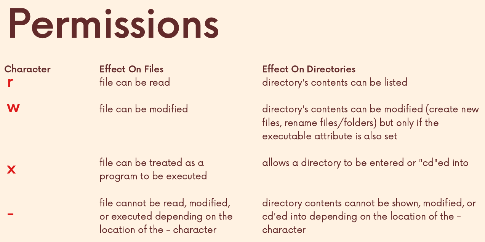

# 권한

- Unix와 Unix-like 시스템은 multiuser operating system이다.

- 사용자 계정도 여러개고, 이러한 사용자들이 동시에 로그인 할 수도 있다.

## 파일 소유자와 그룹 소유자

### 파일 소유자 (Owner)
- 파일을 생성한 사용자로 기본적으로 소유자가 된다.
    - 파일 또는 디렉터리에 대한 권한(읽기, 쓰기, 실행)을 독립적으로 가질 수 있다.
    - 다른 사용자와 비교해 더 높은 권한을 가질 수 있다.
    - 소유자는 필요에 따라 다른 사용자로 변경 가능하다. (chown 명령 사용)
### 그룹 소유자 (Group Owner)
- 파일이 속한 그룹을 의미한다.
    - 그룹은 개인 사용자일수도 있다.
    - 그룹에 속한 모든 사용자에게 권한이 적용된다.
    - 그룹 멤버는 그룹 소유자 권한에 따라 파일에 접근할 수 있다.
    - 그룹 소유자는 변경 가능하다. (chgrp 명령 사용)
### 예시
```bash
gunha@oracle:~$ ls -l
-rw-r--r--  1 alice  developers  1024 Dec 26 12:00 example.txt

...
```
- alice: 파일 소유자
- developers: 그룹 소유자

### File Attributes


#### 예시
```bash
-rwxr-xr--
```
- 파일 권한은 세 가지로 구분된다
    - 소유자 (Owner)
    - 그룹 (Group)
    - 기타 사용자 (Others)
- 첫 번째 세트(rwx): 소유자 권한
- 두 번째 세트(r-x): 그룹 소유자 권한
- 세 번째 세트(r--): 기타 사용자 권한



- rwx(read, write, execute)는 순서대로 읽기,쓰기,실행권한을 의미한다.
- 첫번째 글자는 file type을 의미한다.
    - `-` : regular file
    - `d` : directory
    - `c` : character special file
    - `l` : symbolic link
    - `b` : block 디바이스, block 특수파일
- `x` 의 의미는 파일이 실행 가능한 파일이고, 프로그램으로 실행이 가능하다는 뜻이다.
    - `date` 명령어는 사실 `/bin` 에 있는 date라는 이름의 파일(스크립트)를 실행시키는 것이다.
    - `x` 권한을 제거한다면 다른 사용자들이 해당 명령어를 사용할 수 없게 된다.

## 권한 부여 (chmod)

- `chmod`는 리눅스 및 유닉스 시스템에서 파일이나 디렉터리의 권한을 변경하는 명령어이다. `chmod`는 "change mode"의 약자로, 파일에 대한 읽기(read), 쓰기(write), 실행(execute) 권한을 설정하는 데 사용된다.

### 권한 종류
- **r (읽기)**: 파일을 읽을 수 있는 권한
- **w (쓰기)**: 파일을 수정할 수 있는 권한
- **x (실행)**: 파일을 실행할 수 있는 권한

### 권한 설정 대상
권한을 설정할 때, 네 가지 카테고리로 나누어 설정할 수 있다
- u (user): 파일을 만든 사람 (소유자)
- g (group): 파일 소유자와 같은 그룹에 속한 사용자
- o (others): 소유자와 그룹 외의 모든 사용자
- a (all): 3가지 청크의 권한을 모두 바꾼다.

### 사용법

#### 기호 방법
권한을 설정할 때 기호를 사용하여 다음과 같은 방식으로 권한을 추가, 제거, 변경할 수 있다:
- +: 권한을 추가
- -: 권한을 삭제
- =: 권한을 정확히 설정

#### 예시
- `chmod u+x myfile`: 소유자에게 실행 권한 추가
- `chmod g-w myfile`: 그룹에서 쓰기 권한 제거
- `chmod o=r myfile`: 기타 사용자에게 읽기 권한만 부여

### 8진수 방법
각 권한은 8진수 값으로 설정할 수 있다. 권한의 숫자 값은 다음과 같다:
- 읽기(r) = 4
- 쓰기(w) = 2
- 실행(x) = 1

따라서 권한은 세 가지 카테고리별로 세 자리 숫자 값으로 표현된다.

#### 예시
- `7` = 읽기(4) + 쓰기(2) + 실행(1)
- `6` = 읽기(4) + 쓰기(2)
- `5` = 읽기(4) + 실행(1)
- `4` = 읽기(4)

#### 예시 사용
- `chmod 755 myfile`: 소유자에게 읽기, 쓰기, 실행 권한을 주고, 그룹과 기타 사용자에게 읽기 및 실행 권한만 부여
- `chmod 644 myfile`: 소유자에게 읽기 및 쓰기 권한을 주고, 그룹과 기타 사용자에게 읽기 권한만 부여

## #권한 변경 예시

1. 소유자에게 모든 권한을 부여하고, 그룹과 기타 사용자에게 읽기 권한만 부여
```bash
chmod 744 myfile
```

2. 사용자에게 모든 권한을 부여
```bash
chmod 777 myfile
```

## sudo

- 일반적인 ubuntu는 루트 사용자로 로그인 할 수 없기 때문에 `sudo` 명령어를 사용한다.
- 해당 명령어를 사용하기 위해서는 자신의 비밀번호가 필요하다
    - `gunha` 계정에서 `sudo apt update` 를 실행하면 비밀번호를 입력하는 것이 나오는데, 여기서 필요한 비밀번호는 root의 비밀번호가 아닌 `gunha` 계정의 비밀번호이다.

## 소유자 변경 chown

> `chown USER[:GROUP] FILE(s)`

> `sudo chown gunha file.txt`

- 그룹에 대한 설정은 그냥 :Group를 사용하면 된다.
    - `sudo chown :gunhaGroup file.txt`
- change ownership 의 줄임말로 사용된다.
- 디렉터리나 파일의 소유자를 변경 할 수 있다.
- 일반사용자가 사용하기 위해선 `sudo` 가 필요하다.
