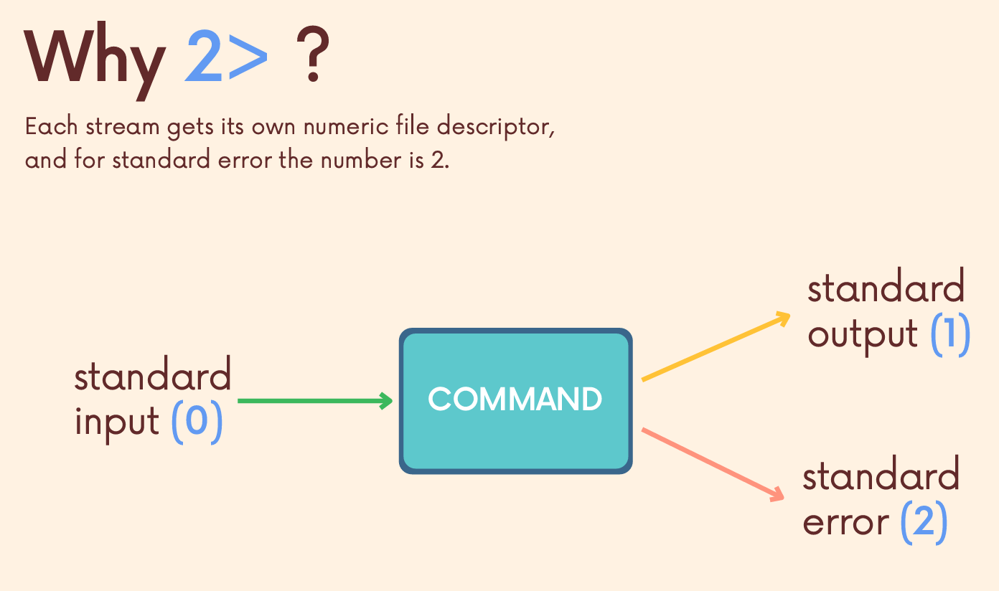

# 리다이렉션

- 여태까지 우리가 명령어(stdin)를 통해 출력한 것은 표준출력(stdout)/ 표준에러(stderr)이다.
- 이렇게 출력된 것을 다른 명령어를 통해 다른 행동을 할 수 있다.

## >

> command > filename

- `>` 는 덮어쓰는 것이다

- `date > today.txt` 는 date가 들어간 파일이 생성되게 된다.
- `sort -k5n list.txt > sorted_list.txt` 리스트 파일을 정렬한 후 sorted_list에 저장한다.

## >> (appending)

- `>>` 는 추가시키는 것이다.
- 파일의 끝에 결과를 추가적으로 저장할 수 있다.
- `list.txt >> sorted_list.txt` 리스트가 sorted_list 밑쪽에 추가되어 저장된다.
- `echo purrrrr >> cat.txt` cat.txt안에 purrrrrr 이 추가된다. 

## command < (file)

- 파일을 받아서 표준입력으로 전달한다.

## 같이 사용하기

- `cat < original.txt > output.txt` 
- original.txt 의 내용을 리다이렉트 시킨후 output.txt에 전달한다.

## error 넘기기

- `2>` , `2>>` 를 통해 할 수 있다.
- 덮어쓰기, appending 기능은 `>` 의 숫자에 따라 동작
- 표준출력은 사실 `1>` 이고 `1` 이 생략된 것이다.

## 한번에 리다이렉션 하기

- `cat bees.txt ants.txt > insects.txt 2> error.txt` 해당 커맨드는 bees와 ants를 합쳐 insects를 만들고, 에러가 있다면 error.txt에 입력된다
- `>` 이 먼저 실행된 후 `2>` 이 실행된다.
- `&>` , `&>>` Bash의 최신 구문으로, 표준 출력 혹은 표준 에러를 파일로 리다이렉트 한다.
