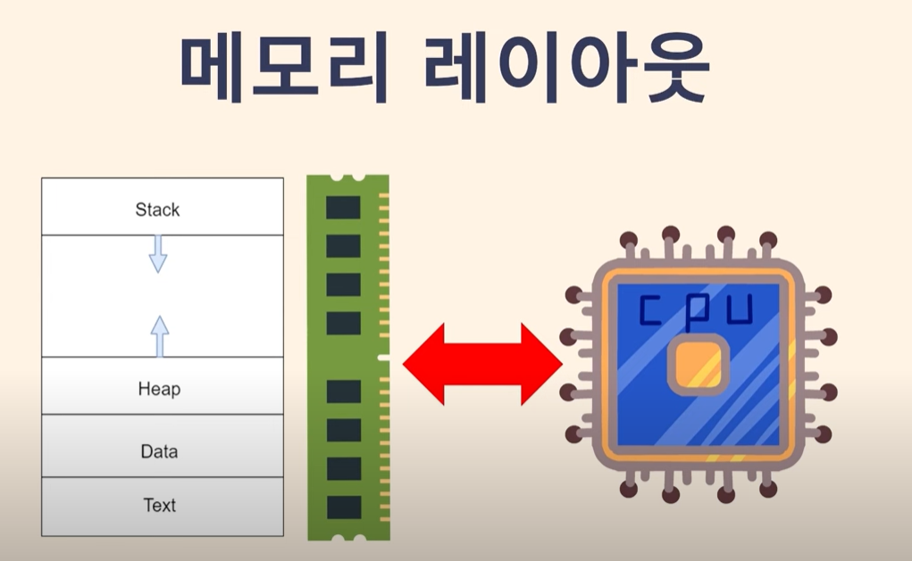

# 메모리의 구조

> 여기서 메모리는 RAM을 의미한다.



- 메모리의 영역을 프로그램이 사용할 논리적인 공간으로 나눴을때 영역의 구성은 stack heal data text 로 되어있다.

1. Text 영역
- 프로그램의 코드(명령어)가 저장되는 영역이다.
- 실행 파일에서 읽기 전용 코드가 로드된다.
- 보통 읽기 전용(Read-Only)으로 설정되어 있어 코드의 수정이 불가능하다.
- 함수나 전역 변수의 초기화된 값 등을 포함하지 않는다.
    - 예: main(), 사용자 정의 함수, 라이브러리 코드.

2. Data 영역
- 초기화된 전역 변수와 **정적 변수(static 변수)**가 저장되는 영역이다.
- 프로그램 실행 중에도 값이 유지된다.
- 전역 변수와 정적 변수는 프로그램이 시작될 때 메모리에 로드되고 종료 시까지 유지된다.
- 이 영역은 다시 두 부분으로 나뉜다:
    - Initialized Data Segment: 초기값이 있는 변수.
    - Uninitialized Data Segment (BSS): 초기값이 없는 변수.

```c
int globalVar = 5;  // Data 영역 (초기화된 전역 변수)
static int staticVar = 10;  // Data 영역
```

3. Heap 영역
- 동적인 메모리를 관리하는 영역이다.
- 미리 크기를 알 수 없는 영역이다.
- 컴퓨터 사양에 따라서 거의 무제한으로 사용할 수 있다.
- 가상으로 커다란 메모리가 있는 것 처럼 관리해준다.
- 동적 메모리 할당에 사용되는 영역이다.
- 런타임에 malloc(), new 등으로 메모리를 할당받을 때 사용된다.
- 사용한 메모리는 반드시 명시적으로 해제해야 한다(free(), delete).
- 메모리 크기가 유연하지만, 관리를 잘못하면 메모리 누수(Memory Leak)가 발생할 수 있다.

```c
int* ptr = (int*)malloc(sizeof(int));  // Heap 영역
```

4. Stack 영역
- 정적인 메모리를 관리하는 영역이다.
- 사용할 수 있는 최대치가 정해져있다. 재귀호출을 잘 못할 경우 에러가 반환된다.(stackoverflow)
- 함수 호출과 관련된 지역 변수 및 **함수 호출 정보(스택 프레임)**가 저장되는 영역이다.
- 함수가 호출될 때마다 스택 프레임이 생성되고, 함수가 종료되면 스택 프레임이 해제된다.
- LIFO(Last In, First Out) 방식으로 작동한다.
- 크기가 제한적이어서 스택 오버플로우(Stack Overflow)가 발생할 수 있다.
```c
void foo() {
    int localVar = 10;  // Stack 영역
}
```

