# CPU란?

- 논리게이트
    
    반도체는 전기가 흐르는 도체와 흐르지 않는 부도체 성격을 조건에 따라 선택할 수 있다
    
    - 예시
        
        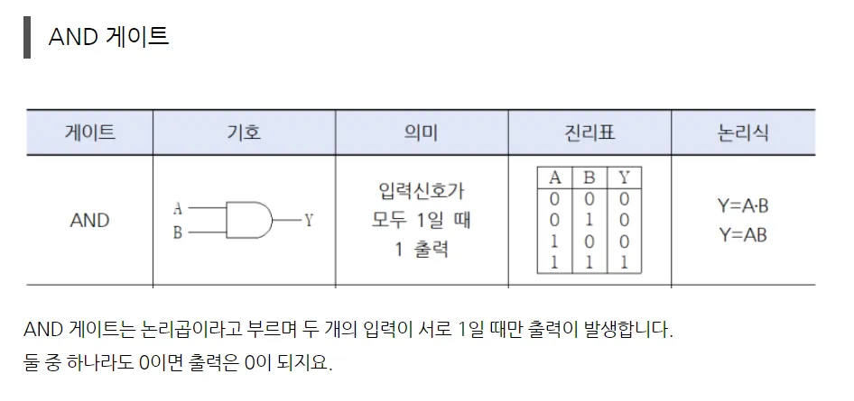
        
        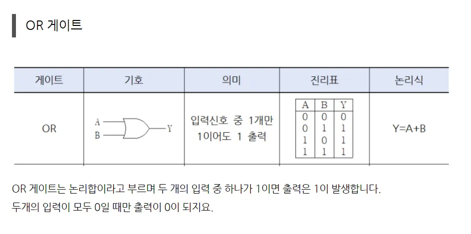
        
        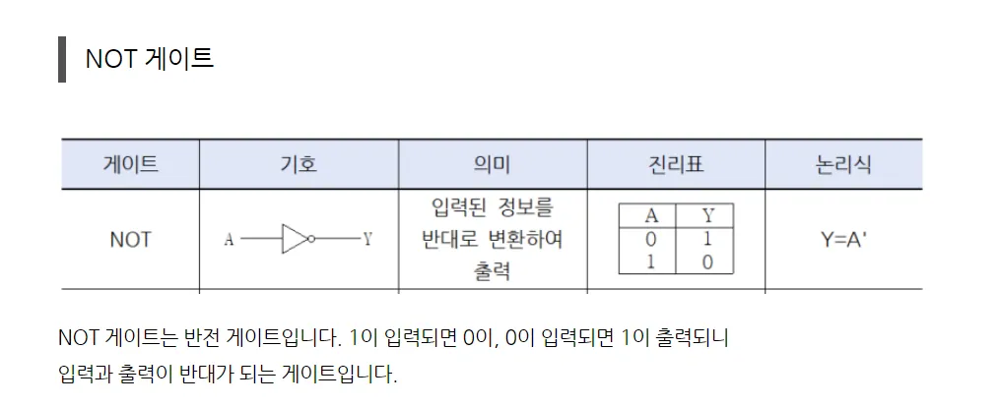
        
        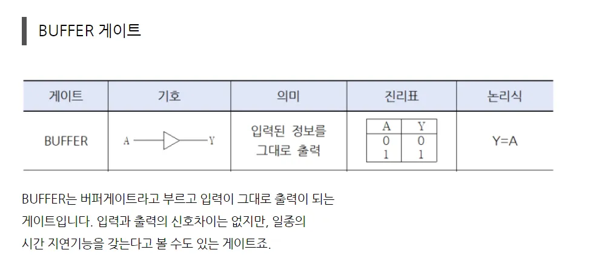
        
        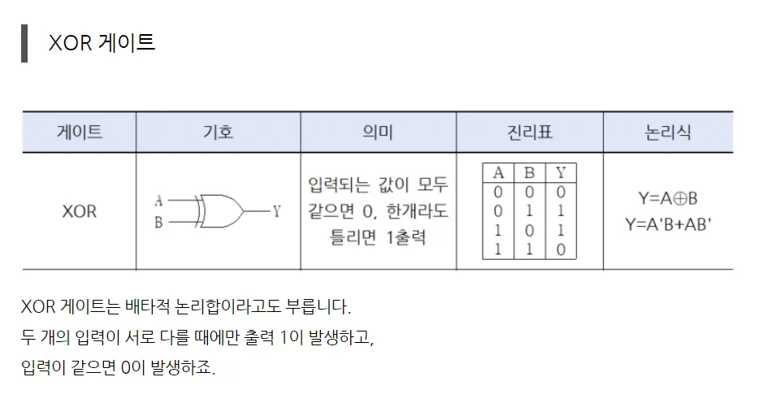
        
    
    이 것들이 램, cpu등 모든 것을 만들 수 있는 기본이된다.
    
    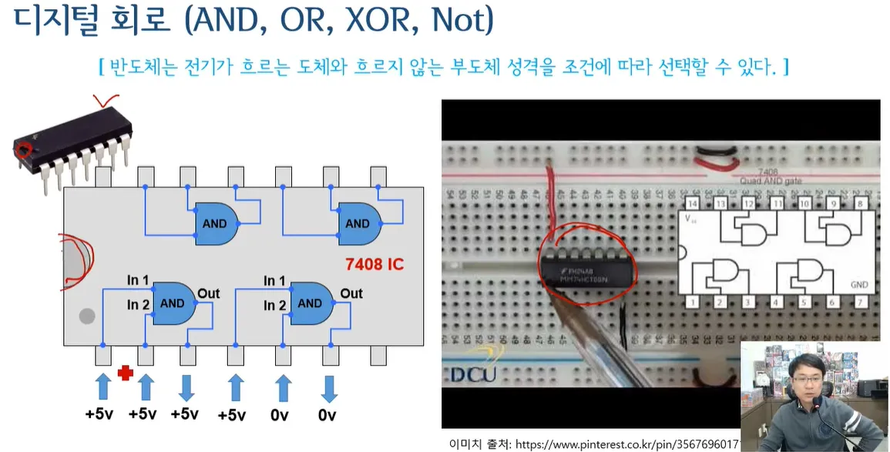
    
    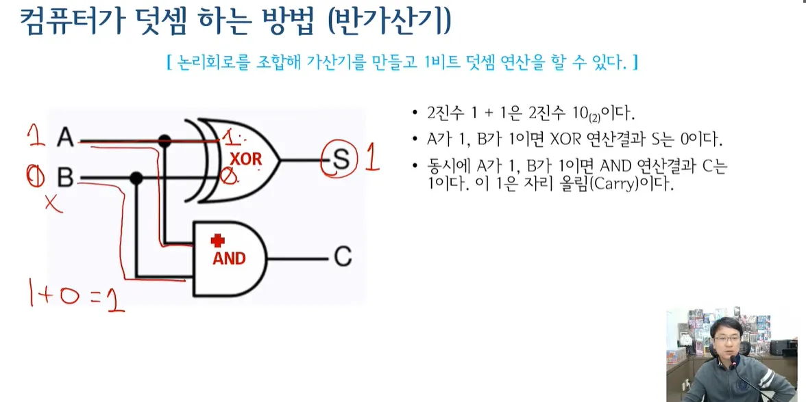
    
- 컴퓨터의 덧셈 뺄셈
    - 덧셈
        
        컴퓨터는 자리를 논리게이트를 이용해 자리를 올려서 덧셈을 구현한다
        
    - 뺄셈
        
        컴퓨터는 더하시는 방식으로 빼기를 구현한다(보수 사용)
        
        2의 보수는 0 ↔ 1을 바꿔주고 그것을 더하면 뺄셈을 구현 한 것이다 ( 4bit를 넘어간다면 제거)
        
    - 덧셈과 뺄셈 추가 설명
        
        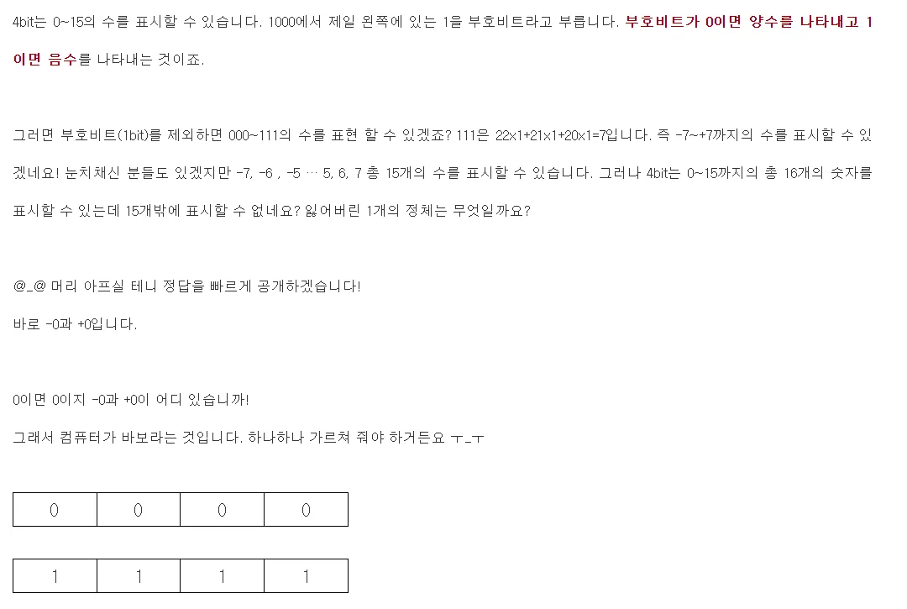
        
        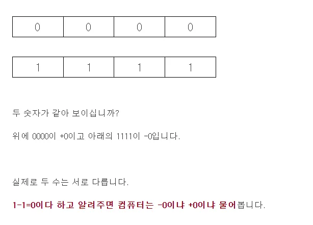
        
        
        
        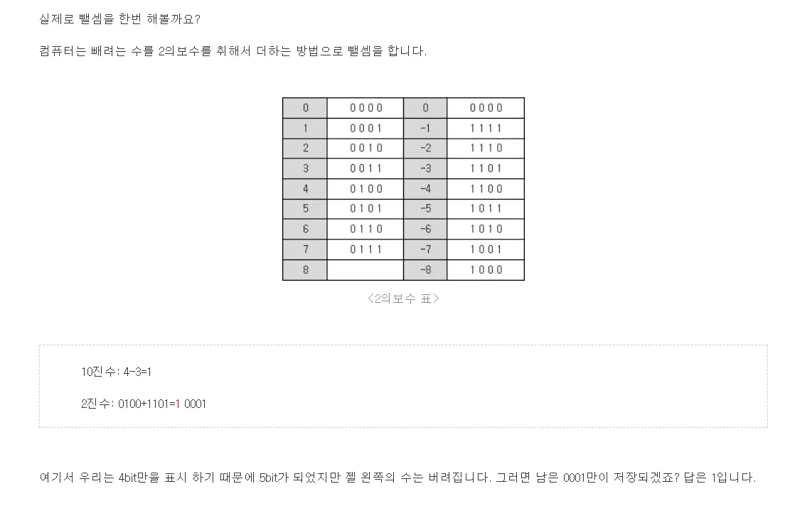
        
    - 곱셈
        
        여러번 더하면 곱셈이 된다.
        
        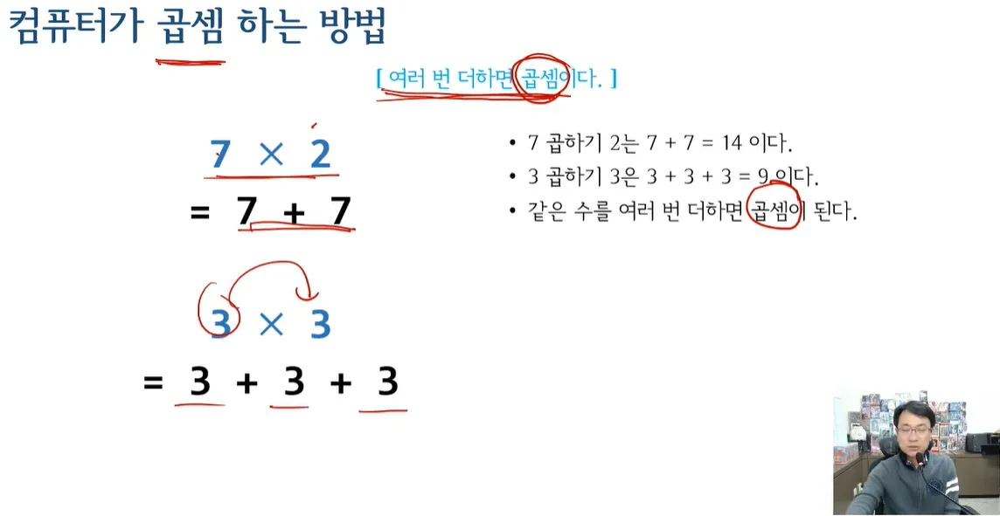
        
        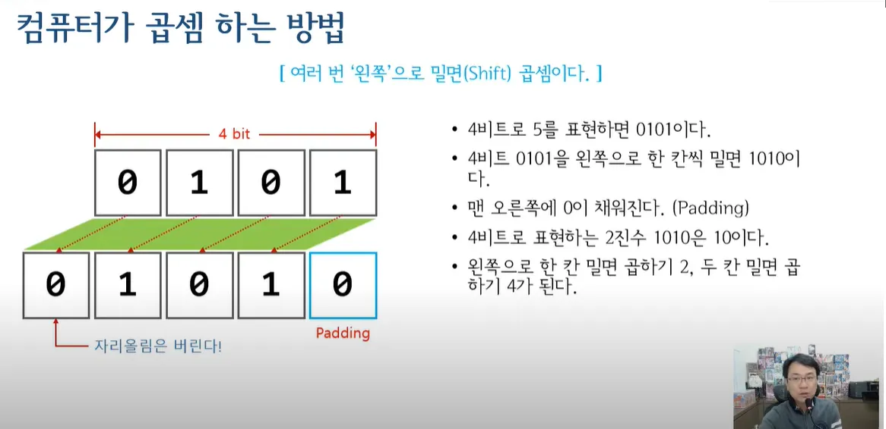
        
    - 나눗셈
        
        여러번 빼면 나눗셈이다.
        
        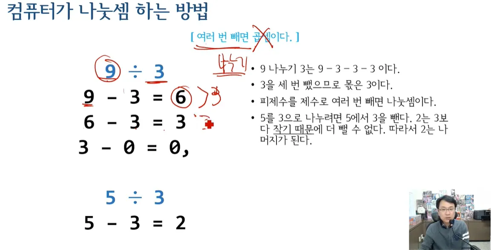
        
        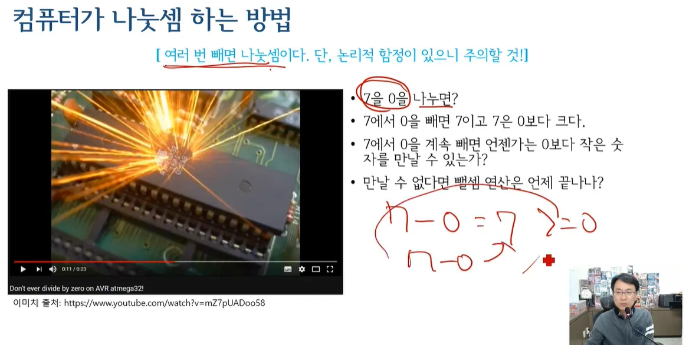
        
        이 경우
        
        **1. 예외(Exception) 발생**
        
        - **트랩(Trap):** CPU는 0으로 나누기 연산을 수행하려고 할 때, **트랩(trap)**이라는 특수한 인터럽트를 발생시킵니다.
        - **인터럽트 처리:** 트랩 발생 시 CPU는 현재 실행 중인 명령어를 중단하고, 운영 체제에게 제어권을 넘깁니다.
        - **예외 핸들러 실행:** 운영 체제는 해당 트랩에 대한 **예외 핸들러(exception handler)**를 실행합니다. 예외 핸들러는 일반적으로 다음과 같은 작업을 수행합니다.
            - 오류 코드 설정: CPU의 특정 레지스터에 0으로 나누기 오류를 나타내는 코드를 설정합니다.
            - 프로세스 종료 또는 예외 처리: 현재 실행 중인 프로세스를 종료시키거나, 해당 프로세스에 예외 정보를 전달하여 프로그램이 직접 예외를 처리할 수 있도록 합니다.
        
        **2. 하드웨어적인 처리**
        
        - **무한 루프 방지:** 일부 CPU 아키텍처에서는 0으로 나누기 연산을 수행할 때 무한 루프에 빠지지 않도록 특별한 처리를 합니다. 예를 들어, 몫 레지스터에 특정 값(예: 0 또는 최댓값)을 설정하거나, 플래그 레지스터에 오버플로우 플래그를 설정하는 등의 방법을 사용할 수 있습니다.
        
        **3. 성능 저하**
        
        - **파이프라인 플러시:** 0으로 나누기 예외 발생 시 CPU는 현재 실행 중인 명령어 파이프라인을 비우고(flush), 예외 처리 루틴으로 이동해야 합니다. 이는 성능 저하를 초래할 수 있습니다.
        - **분기 예측 실패:** 0으로 나누기 연산은 일반적으로 분기 예측(branch prediction) 실패를 유발하여 CPU의 명령어 처리 효율을 떨어뜨릴 수 있습니다.
        
        **결론**
        
        CPU는 0으로 나누기 연산을 직접 처리할 수 없으며, 예외 발생 또는 하드웨어적인 처리를 통해 이를 해결합니다. 0으로 나누기는 프로그램의 비정상 종료나 성능 저하를 유발할 수 있으므로, 개발자는 예외 처리 또는 사전 검증을 통해 0으로 나누기 오류를 방지해야 합니다.
        

→ 결국 컴퓨터는 거대한 계산기/가산기다

- 가산기
    
    가산기(加算器, 영어: adder)란 **덧셈 연산을 수행하는 논리 회로**이며 디지털 회로, 조합 회로의 하나이다. 가산기는 산술 논리 장치뿐만 아니라 주소값, 테이블 색인 등을 더하는 프로세서의 한 부분으로 사용되고 있다.