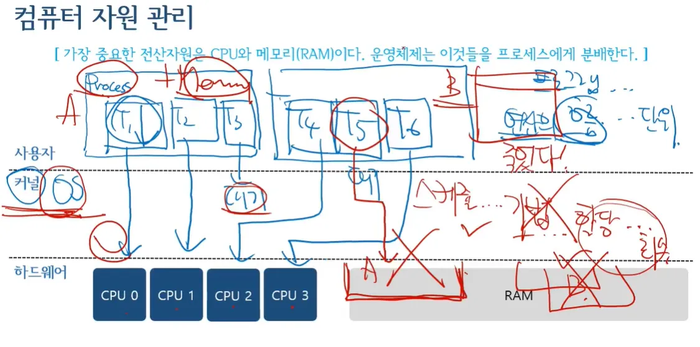
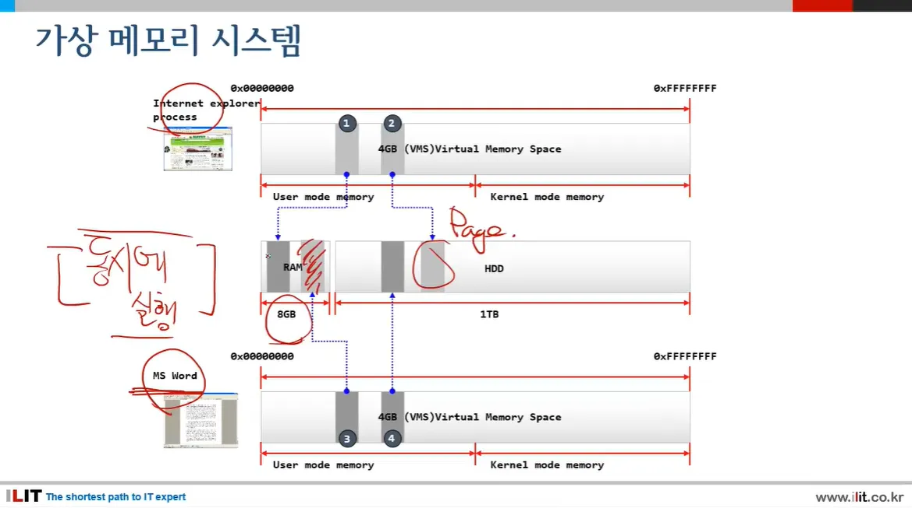
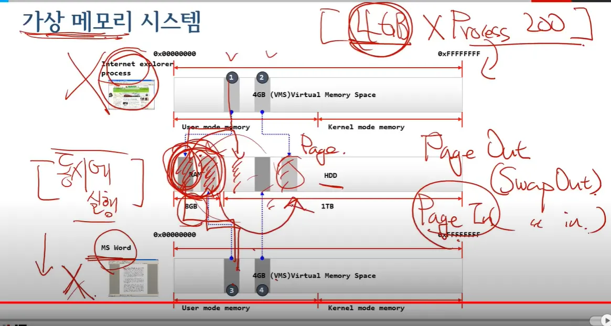

# OS란?

- 용어정리
    - 동시성
        
        여러 일을 여러 사람이 각자 동시에 하는 것
        
        ## 동시성(Concurrency)에 대해서
        
        동시성은 컴퓨터 과학에서 **여러 작업들이 동시에 실행되는 것처럼 보이는 현상**을 의미합니다. 실제로 여러 작업이 동시에 실행되는 병렬성(Parallelism)과는 구분되며, **싱글 코어 환경에서도 여러 작업을 번갈아 가며 빠르게 처리하여 동시에 실행되는 것처럼 보이게 하는 것**을 말합니다.
        
        **동시성의 필요성**
        
        - **응답성 향상:** 사용자 입력, 네트워크 요청 등 여러 작업을 동시에 처리하여 프로그램의 응답성을 높입니다.
        - **자원 활용 효율성 증대:** CPU, I/O 장치 등 시스템 자원을 효율적으로 활용하여 작업 처리량을 늘립니다.
        - **복잡한 문제 해결:** 여러 작업을 동시에 처리하여 복잡한 문제를 해결하고, 프로그램의 구조를 단순화합니다.
        
        **동시성 구현 방법**
        
        - **멀티프로세싱:** 여러 개의 프로세스를 생성하여 각 프로세스가 독립적으로 작업을 수행합니다. 운영체제가 프로세스 간 전환(context switching)을 통해 동시성을 구현합니다.
        - **멀티스레딩:** 하나의 프로세스 내에서 여러 개의 스레드를 생성하여 각 스레드가 작업을 수행합니다. 스레드는 프로세스 내의 자원을 공유하며, 운영체제 또는 JVM(Java Virtual Machine)이 스레드 간 전환을 통해 동시성을 구현합니다.
        - **비동기 프로그래밍:** 콜백 함수, Promise, async/await 등을 사용하여 특정 작업이 완료될 때까지 기다리지 않고 다른 작업을 수행할 수 있도록 합니다. 주로 I/O 작업이나 네트워크 요청 처리에 사용됩니다.
        
        **동시성의 문제점**
        
        - **경쟁 상태(Race Condition):** 여러 스레드가 공유 자원에 동시에 접근하여 데이터 불일치나 예측 불가능한 결과를 초래할 수 있습니다.
        - **교착 상태(Deadlock):** 두 개 이상의 스레드가 서로 다른 자원을 점유하고, 상대방이 점유한 자원을 기다리면서 무한 대기 상태에 빠지는 현상입니다.
        - **기아 상태(Starvation):** 특정 스레드가 다른 스레드에 의해 계속해서 실행 기회를 얻지 못하는 현상입니다.
        - **복잡성 증가:** 동시성 프로그래밍은 코드의 복잡성을 증가시키고, 디버깅 및 테스트를 어렵게 만듭니다.
        
        **동시성 문제 해결 방법**
        
        - **동기화(Synchronization):** 뮤텍스(Mutex), 세마포어(Semaphore), 모니터(Monitor) 등의 동기화 도구를 사용하여 공유 자원에 대한 접근을 제어하고 경쟁 상태를 방지합니다.
        - **락(Lock):** 공유 자원에 대한 접근을 제어하기 위해 락을 사용합니다. 락을 획득한 스레드만 해당 자원에 접근할 수 있으며, 다른 스레드는 락이 해제될 때까지 대기해야 합니다.
        - **데드락 방지:** 자원 할당 순서를 정하거나, 타임아웃(timeout)을 설정하여 데드락을 방지합니다.
        - **기아 방지:** 우선순위(priority)를 설정하거나, 공정한 스케줄링 알고리즘을 사용하여 기아를 방지합니다.
        
        **결론**
        
        동시성은 현대 컴퓨터 시스템에서 필수적인 개념이며, 다양한 방법으로 구현될 수 있습니다. 하지만, 동시성 프로그래밍은 주의 깊게 설계하고 구현해야 하며, 경쟁 상태, 교착 상태, 기아 상태 등의 문제를 해결하기 위한 적절한 동기화 및 락 메커니즘을 사용해야 합니다.
        
    - 병렬성
        
        같은 공간에서, 여러사람이 같이 인형 눈 붙이기를 한다면 이것은 동시성+병렬성을 표현 한 것이다.
        
        동기화가 가장 중요하다.
        
        ## 병렬성(Parallelism)에 대해서
        
        병렬성은 컴퓨터 과학에서 **여러 작업이 실제로 동시에 실행되는 것**을 의미합니다. 즉, 각 작업이 서로 다른 CPU 코어나 프로세서에서 동시에 처리되는 것을 말합니다.
        
        **병렬성의 필요성**
        
        - **성능 향상:** 여러 작업을 동시에 실행하여 전체 처리 시간을 단축하고 시스템의 성능을 향상시킵니다. 특히 계산량이 많은 작업이나 대용량 데이터 처리에 효과적입니다.
        - **자원 활용 극대화:** 멀티 코어 프로세서나 분산 시스템의 자원을 최대한 활용하여 효율성을 높입니다.
        
        **병렬성 구현 방법**
        
        - **멀티프로세싱:** 여러 개의 프로세스를 생성하여 각 프로세스가 독립적으로 작업을 수행합니다. 각 프로세스는 별도의 메모리 공간을 가지며, 운영체제가 프로세스 간 통신 및 동기화를 관리합니다.
        - **멀티스레딩:** 하나의 프로세스 내에서 여러 개의 스레드를 생성하여 각 스레드가 작업을 수행합니다. 스레드는 프로세스 내의 자원을 공유하며, 운영체제 또는 런타임 환경이 스레드 간 전환(context switching) 및 동기화를 관리합니다.
        - **GPU 활용:** GPU(Graphics Processing Unit)는 많은 수의 코어를 가지고 있어 병렬 연산에 특화되어 있습니다. 딥러닝, 이미지 처리, 과학 계산 등 대규모 병렬 처리가 필요한 작업에 활용됩니다.
        - **분산 시스템:** 여러 대의 컴퓨터를 네트워크로 연결하여 하나의 작업을 분담하여 처리합니다. 대용량 데이터 처리나 복잡한 계산 작업에 효과적입니다.
        
        **병렬성의 문제점**
        
        - **경쟁 상태(Race Condition):** 여러 스레드 또는 프로세스가 공유 자원에 동시에 접근하여 데이터 불일치나 예측 불가능한 결과를 초래할 수 있습니다.
        - **교착 상태(Deadlock):** 두 개 이상의 스레드 또는 프로세스가 서로 다른 자원을 점유하고, 상대방이 점유한 자원을 기다리면서 무한 대기 상태에 빠지는 현상입니다.
        - **통신 오버헤드:** 멀티프로세싱이나 분산 시스템에서는 프로세스 또는 컴퓨터 간 통신에 추가적인 시간과 자원이 소요됩니다.
        - **복잡성 증가:** 병렬 프로그래밍은 코드의 복잡성을 증가시키고, 디버깅 및 테스트를 어렵게 만듭니다.
        
        **병렬성 문제 해결 방법**
        
        - **동기화(Synchronization):** 뮤텍스(Mutex), 세마포어(Semaphore), 모니터(Monitor) 등의 동기화 도구를 사용하여 공유 자원에 대한 접근을 제어하고 경쟁 상태를 방지합니다.
        - **락(Lock):** 공유 자원에 대한 접근을 제어하기 위해 락을 사용합니다. 락을 획득한 스레드 또는 프로세스만 해당 자원에 접근할 수 있으며, 다른 스레드 또는 프로세스는 락이 해제될 때까지 대기해야 합니다.
        - **데드락 방지:** 자원 할당 순서를 정하거나, 타임아웃(timeout)을 설정하여 데드락을 방지합니다.
        - **통신 최적화:** 효율적인 통신 방식을 사용하고, 데이터 전송량을 최소화하여 통신 오버헤드를 줄입니다.
        
        **병렬성과 동시성의 비교**
        
        - **병렬성(Parallelism):** 여러 작업이 실제로 동시에 실행되는 것을 의미합니다. 멀티 코어 프로세서나 분산 시스템에서 가능합니다.
        - **동시성(Concurrency):** 여러 작업이 동시에 실행되는 것처럼 보이는 현상을 의미합니다. 싱글 코어 환경에서도 운영체제 또는 런타임 환경의 작업 전환을 통해 구현될 수 있습니다.
        
        **결론**
        
        병렬성은 현대 컴퓨터 시스템에서 성능 향상과 자원 활용 극대화를 위해 중요한 개념입니다. 하지만, 병렬 프로그래밍은 복잡하고 어려운 작업이며, 경쟁 상태, 교착 상태, 통신 오버헤드 등 다양한 문제를 해결해야 합니다. 따라서, 병렬 프로그래밍을 할 때는 신중하게 설계하고 구현해야 하며, 적절한 동기화 및 락 메커니즘을 사용하여 문제 발생을 방지해야 합니다.
        
    - 원자성
        
        더 이상 쪼개서 나눌 수 없는 연속 된 일
        
        ## 원자성(Atomicity)은 컴퓨터 과학에서 **여러 단계로 이루어진 작업 또는 연산이 마치 하나의 단위로 실행되는 것처럼 보장되는 특성**을 의미합니다. 즉, 원자성을 가진 작업은 중간에 다른 작업에 의해 방해받거나 변경되지 않고, 완전히 실행되거나 전혀 실행되지 않도록 보장됩니다.
        
        **원자성의 중요성**
        
        - **데이터 일관성 유지:** 동시성 환경에서 여러 스레드나 프로세스가 공유 데이터에 접근할 때, 원자성을 보장하지 않으면 데이터 불일치(race condition)가 발생할 수 있습니다. 원자성을 통해 데이터의 일관성을 유지하고 예측 가능한 결과를 얻을 수 있습니다.
        - **동기화 문제 해결:** 원자성은 멀티스레드 프로그래밍에서 발생하는 동기화 문제(경쟁 상태, 교착 상태 등)를 해결하는 데 중요한 역할을 합니다.
        
        **원자성 구현 방법**
        
        - **하드웨어 지원:** CPU는 특정 명령어(예: `test-and-set`, `compare-and-swap`)를 통해 원자적인 연산을 지원합니다. 이러한 명령어는 하드웨어 레벨에서 다른 스레드나 프로세스의 간섭을 막고, 연산의 원자성을 보장합니다.
        - **소프트웨어 락(Lock):** 뮤텍스(Mutex), 세마포어(Semaphore) 등의 락 메커니즘을 사용하여 공유 자원에 대한 접근을 제어하고, 한 번에 하나의 스레드 또는 프로세스만 해당 자원에 접근할 수 있도록 합니다.
        - **트랜잭션(Transaction):** 데이터베이스에서 여러 SQL 문을 하나의 논리적인 단위로 묶어 처리하는 것을 트랜잭션이라고 합니다. 트랜잭션은 ACID(Atomicity, Consistency, Isolation, Durability) 특성을 가지며, 원자성을 통해 트랜잭션 내의 모든 작업이 성공적으로 완료되거나, 실패 시 모든 변경 사항을 롤백하여 데이터베이스의 일관성을 유지합니다.
        
        **원자성 관련 용어**
        
        - **Atomic Operation (원자적 연산):** 더 이상 쪼갤 수 없는, 한 번에 실행되는 연산입니다.
        - **Critical Section (임계 영역):** 여러 스레드 또는 프로세스가 공유 자원에 접근하는 코드 영역입니다. 경쟁 상태를 방지하기 위해 임계 영역에 대한 접근은 반드시 동기화되어야 합니다.
        - **Race Condition (경쟁 상태):** 여러 스레드 또는 프로세스가 공유 자원에 동시에 접근하여 데이터 불일치나 예측 불가능한 결과를 초래하는 상황입니다.
        
        **결론**
        
        원자성은 동시성 환경에서 데이터 일관성을 유지하고 동기화 문제를 해결하는 데 중요한 특성입니다. 하드웨어 지원, 소프트웨어 락, 트랜잭션 등 다양한 방법을 통해 원자성을 구현할 수 있으며, 이를 통해 안정적이고 예측 가능한 프로그램을 개발할 수 있습니다.
        
    - 의존성
        
        자동차를 예시로 들면, 자동차의 수 많은 부품(바퀴, 핸들 등)
        
        부품들은 차에 의존적이다.
        
        차가 폐기되면, 부품들도 폐기되기 때문에
        
        - *의존성(Dependency)**은 소프트웨어 개발에서 **한 구성 요소(모듈, 클래스, 함수 등)가 다른 구성 요소의 기능이나 존재에 의존하는 관계**를 의미합니다. 즉, 한 구성 요소가 제대로 작동하기 위해 다른 구성 요소가 필요한 상황을 말합니다.
        
        **의존성의 종류**
        
        - **컴파일 타임 의존성:** 코드를 컴파일할 때 필요한 의존성입니다. 다른 클래스나 라이브러리를 import하거나 include하는 경우가 해당됩니다.
        - **런타임 의존성:** 프로그램 실행 시점에 필요한 의존성입니다. 객체 생성, 메서드 호출 등을 통해 다른 객체나 서비스를 사용하는 경우가 해당됩니다.
        
        **의존성의 문제점**
        
        - **결합도(Coupling) 증가:** 의존성이 많아지면 구성 요소 간의 결합도가 높아져, 한 구성 요소의 변경이 다른 구성 요소에 영향을 미치기 쉽습니다. 이는 유지 보수 및 확장을 어렵게 만듭니다.
        - **테스트 어려움:** 의존성이 있는 구성 요소를 독립적으로 테스트하기 어려워집니다. 의존하는 다른 구성 요소를 함께 설정하거나 목(mock) 객체를 사용해야 하는 등 추가적인 작업이 필요합니다.
        - **재사용성 저하:** 특정 구현에 강하게 의존하는 코드는 다른 환경이나 상황에서 재사용하기 어렵습니다.
        
        **의존성 관리 방법**
        
        - **의존성 주입(Dependency Injection, DI):** 객체가 필요로 하는 다른 객체를 외부에서 주입받는 방식입니다. 이를 통해 객체 간의 결합도를 낮추고, 유연성과 테스트 용이성을 높일 수 있습니다.
        - **인터페이스 활용:** 추상적인 인터페이스를 정의하고, 구체적인 구현 클래스는 인터페이스를 구현하도록 합니다. 이를 통해 의존성을 인터페이스에 대한 것으로 제한하고, 구현 변경에 대한 영향을 최소화할 수 있습니다.
        - **모듈화:** 시스템을 독립적인 모듈로 분리하고, 모듈 간의 의존성을 최소화합니다. 이를 통해 각 모듈을 독립적으로 개발, 테스트, 배포할 수 있으며, 변경에 대한 영향을 제한할 수 있습니다.
        
        **결론**
        
        의존성은 소프트웨어 개발에서 불가피하게 발생하지만, 과도한 의존성은 유지 보수 및 확장을 어렵게 만듭니다. 따라서 의존성 주입, 인터페이스 활용, 모듈화 등의 방법을 통해 의존성을 효과적으로 관리하고, 유연하고 확장 가능한 소프트웨어를 개발해야 합니다.
        
    - 동기화
        
        충돌을 막기 위해서 존재하는것 (ex. 신호등, 문 잠그기) / 규칙에 따라 충돌을 막는 것
        
        - **동기화(Synchronization)** 란 컴퓨터 과학에서 **여러 개의 프로세스나 스레드가 공유 자원에 접근할 때, 순서를 조정하고 충돌을 방지하여 데이터의 일관성을 유지하는 것**을 의미합니다.
        
        **동기화가 필요한 이유**
        
        - **경쟁 상태(Race Condition) 방지:** 여러 스레드나 프로세스가 동시에 공유 자원에 접근하여 데이터를 변경하려고 할 때, 예상치 못한 결과나 데이터 손상이 발생할 수 있습니다. 동기화는 이러한 경쟁 상태를 방지하여 데이터의 일관성을 유지합니다.
        - **데드락(Deadlock) 방지:** 여러 스레드나 프로세스가 서로 다른 자원을 점유하고, 상대방이 점유한 자원을 기다리면서 무한 대기 상태에 빠지는 현상을 데드락이라고 합니다. 동기화는 데드락을 방지하여 시스템의 안정적인 동작을 보장합니다.
        
        **동기화 기법**
        
        - **뮤텍스(Mutex):** 공유 자원에 대한 접근을 한 번에 하나의 스레드 또는 프로세스만 허용하는 잠금 메커니즘입니다.
        - **세마포어(Semaphore):** 특정 개수의 스레드 또는 프로세스만 동시에 공유 자원에 접근할 수 있도록 제한하는 동기화 도구입니다.
        - **모니터(Monitor):** 공유 자원과 해당 자원에 접근하기 위한 메서드를 하나로 묶어 캡슐화하고, 상호 배제(mutual exclusion) 및 조건 변수(condition variable)를 통해 동기화를 제공하는 객체입니다.
        - **락(Lock):** 뮤텍스, 세마포어, 모니터 등 동기화 기법을 구현하기 위한 추상적인 개념입니다. 락을 획득한 스레드 또는 프로세스만 공유 자원에 접근할 수 있으며, 다른 스레드 또는 프로세스는 락이 해제될 때까지 대기해야 합니다.
        
        **동기화의 중요성**
        
        - **멀티스레드 프로그래밍:** 여러 스레드가 동시에 실행되는 환경에서 데이터 일관성을 유지하고, 경쟁 상태 및 데드락과 같은 문제를 방지하기 위해 동기화는 필수적입니다.
        - **데이터베이스:** 데이터베이스는 여러 사용자 또는 애플리케이션이 동시에 접근하는 공유 자원입니다. 트랜잭션(transaction)과 같은 동기화 메커니즘을 통해 데이터베이스의 일관성을 유지하고, 동시성 문제를 해결합니다.
        - **운영 체제:** 운영 체제는 CPU, 메모리, 입출력 장치 등 다양한 자원을 관리하며, 여러 프로세스가 이러한 자원을 공유하여 사용합니다. 동기화는 프로세스 간의 충돌을 방지하고 시스템의 안정적인 동작을 보장합니다.
        
        **결론**
        
        동기화는 컴퓨터 시스템에서 여러 프로세스나 스레드가 공유 자원에 안전하게 접근하고 데이터 일관성을 유지하기 위한 필수적인 기술입니다. 다양한 동기화 기법을 이해하고 적절하게 활용하여 안정적이고 효율적인 프로그램을 개발해야 합니다.
        
    - 교착상태
        
        ## 교착 상태 (Deadlock)
        
        교착 상태 또는 데드락(deadlock)은 컴퓨터 시스템에서 **둘 이상의 프로세스 또는 스레드가 서로 다른 자원을 점유한 상태에서, 상대방이 점유한 자원을 기다리면서 무한정 대기하는 상태**를 말합니다. 이러한 상황에서는 어떤 프로세스나 스레드도 작업을 진행할 수 없어 시스템 전체가 멈추거나 성능이 심각하게 저하될 수 있습니다.
        
        **교착 상태 발생 조건**
        
        교착 상태가 발생하기 위해서는 다음 네 가지 조건이 모두 만족되어야 합니다.
        
        1. **상호 배제 (Mutual Exclusion):** 한 번에 하나의 프로세스 또는 스레드만 특정 자원을 사용할 수 있습니다.
        2. **점유 대기 (Hold and Wait):** 최소한 하나의 자원을 점유하고 있는 프로세스 또는 스레드가 다른 프로세스 또는 스레드가 점유하고 있는 자원을 추가로 요청하며 대기하는 상태입니다.
        3. **비선점 (No Preemption):** 다른 프로세스 또는 스레드가 점유하고 있는 자원을 강제로 빼앗을 수 없습니다. 자원은 점유하고 있는 프로세스 또는 스레드가 자발적으로 해제해야 합니다.
        4. **순환 대기 (Circular Wait):** 두 개 이상의 프로세스 또는 스레드가 서로 다른 자원을 점유하고, 순환적으로 다른 프로세스 또는 스레드가 점유한 자원을 기다리는 상태입니다.
        
        **교착 상태 해결 방법**
        
        교착 상태를 해결하는 방법은 크게 다음 네 가지로 나눌 수 있습니다.
        
        1. **예방 (Prevention):** 교착 상태 발생 조건 중 하나 이상을 제거하여 교착 상태가 발생하지 않도록 미리 방지합니다.
        2. **회피 (Avoidance):** 자원 할당 요청을 신중하게 검토하여 교착 상태가 발생할 가능성이 있는 경우 자원 할당을 거부하거나 연기합니다.
        3. **탐지 및 회복 (Detection and Recovery):** 주기적으로 시스템 상태를 검사하여 교착 상태 발생 여부를 탐지하고, 교착 상태가 발생한 경우 프로세스 종료, 자원 선점 등의 방법으로 시스템을 회복시킵니다.
        4. **무시 (Ignore):** 교착 상태가 발생할 가능성이 매우 낮거나, 발생하더라도 시스템에 미치는 영향이 크지 않은 경우에는 교착 상태 해결을 위한 별도의 조치를 취하지 않고 무시할 수도 있습니다.
        
        **결론**
        
        교착 상태는 멀티스레드 또는 멀티프로세스 환경에서 발생할 수 있는 심각한 문제입니다. 따라서 개발자는 교착 상태 발생 가능성을 인지하고, 적절한 동기화 기법과 자원 관리 전략을 통해 교착 상태를 예방하거나 해결해야 합니다.
        
    - 과부하/서비스 거부
        
        동시에 많은 요청이 와서 서버가 처리하지 못하는 상황은 **교착 상태(deadlock)**가 아닙니다. 이러한 상황은 일반적으로 **과부하(overload)** 또는 **서비스 거부(denial of service, DoS)** 상태라고 합니다.
        
        **교착 상태와 과부하/DoS의 차이**
        
        - **교착 상태:** 둘 이상의 프로세스 또는 스레드가 서로 다른 자원을 점유한 상태에서, 상대방이 점유한 자원을 기다리면서 무한정 대기하는 상태입니다. 이는 자원 경쟁으로 인해 발생하며, 시스템이 완전히 멈추거나 심각한 성능 저하를 초래합니다.
        - **과부하/DoS:** 시스템이 처리할 수 있는 용량을 초과하는 요청이 몰려, 응답 시간이 느려지거나 일부 요청이 처리되지 못하는 상태입니다. 이는 시스템 자원 부족으로 인해 발생하며, 시스템의 처리 능력을 향상시키거나 요청량을 조절하여 해결할 수 있습니다.
        
        **서버 과부하/DoS 상태의 특징**
        
        - **응답 지연:** 서버가 요청 처리에 시간이 오래 걸려 클라이언트의 응답 대기 시간이 길어집니다.
        - **요청 실패:** 서버가 처리 용량을 초과하여 일부 요청을 처리하지 못하고 실패합니다.
        - **시스템 자원 고갈:** CPU 사용량, 메모리 사용량, 네트워크 대역폭 등 시스템 자원이 부족해집니다.
        - **서비스 중단:** 심각한 과부하 상태에서는 서버가 다운되거나 서비스가 중단될 수 있습니다.
        
        **결론**
        
        동시에 많은 요청이 와서 서버가 처리하지 못하는 상황은 교착 상태가 아니라 과부하 또는 DoS 상태입니다. 이러한 상황은 시스템 자원 부족으로 인해 발생하며, 시스템 확장, 로드 밸런싱, 요청 제한 등의 방법으로 해결할 수 있습니다.
        
- 운영체제
    
    대표적으로 Window가 있다.
    
    - 하는 일
        
        전산 자원 관리(프로세스 관리)
        
- 프로세스
    
    하나의 프로세스에는 여러 쓰레드가 있다.
    
- 쓰레드
    
    쓰레드들은 프로세스 안에 있고, 프로세스의 **자원을 공유**한다
    
- 예시
    
    컴퓨터가 ‘국가’ 라면 운영체제는 ‘정부’
    
    스레드는 ‘국민’ 이고 프로세스는 ‘가족’ 이다.
    
    민간(USER)/ 정부(KERNER) - OS
    
    영토(Hardware/ CPU)
    
- 컴퓨터 자원 관리
    
    
    
    OS는 CPU와 RAM에게 할 일을 분배한다(프로세스(태스크)/쓰레드)
    
    여러개의 프로세스가 진행되는 것 → 멀티태스킹
    
    멀티태스킹 상황에서는 동기화가 가장 중요하다.
    
- 기억 공간
    
    스레드마다 stack, 프로세스마다 heap과 실행코드 영역을 갖는다.
    
    - 스레드와 stack
        
        ## 스레드와 스택 (Stack)
        
        **스택이란?**
        
        스택은 컴퓨터 과학에서 중요한 자료 구조 중 하나로, 데이터를 순차적으로 저장하고 접근하는 방식을 제공합니다. 스택은 다음과 같은 특징을 가지고 있습니다.
        
        - **후입선출 (LIFO, Last-In-First-Out):** 가장 마지막에 추가된 데이터가 가장 먼저 제거됩니다. 접시를 쌓아 올리는 것과 비슷한 방식으로 생각할 수 있습니다.
        - **제한된 접근:** 데이터의 추가 및 제거는 스택의 맨 위(top)에서만 이루어집니다.
        
        **스레드와 스택의 관계**
        
        운영체제는 각 스레드에게 독립적인 실행 환경을 제공해야 합니다. 이를 위해 각 스레드는 자신만의 스택을 할당받습니다. 스레드의 스택은 다음과 같은 정보를 저장하는 데 사용됩니다.
        
        - **지역 변수:** 함수 내에서 선언된 변수들은 스택에 저장됩니다. 함수 호출이 끝나면 해당 함수의 지역 변수들은 스택에서 제거됩니다.
        - **함수 호출 정보:** 함수 호출 시, 함수의 매개변수, 반환 주소 등의 정보가 스택에 저장됩니다. 함수 실행이 끝나면 이 정보들은 스택에서 제거되어 이전 함수의 실행 컨텍스트로 돌아갑니다.
        - **임시 데이터:** 연산 중에 발생하는 임시 데이터를 저장하는 데 사용됩니다.
        
        **스택의 중요성**
        
        스레드마다 독립적인 스택을 갖는 것은 다음과 같은 이점을 제공합니다.
        
        - **스레드 간 독립성 보장:** 각 스레드는 자신의 스택을 사용하므로 다른 스레드의 실행에 영향을 받지 않습니다. 이는 스레드 간 데이터 충돌을 방지하고 안정적인 동시 실행을 가능하게 합니다.
        - **함수 호출 및 재귀 처리:** 스택은 함수 호출 시 필요한 정보를 저장하고 함수 실행이 끝나면 이전 상태로 복원하는 데 사용됩니다. 이는 재귀 함수 호출과 같은 복잡한 실행 흐름을 처리하는 데 필수적입니다.
        
        **요약**
        
        스레드는 독립적인 실행 단위이며, 각 스레드는 자신만의 스택을 갖습니다. 스택은 스레드의 지역 변수, 함수 호출 정보, 임시 데이터 등을 저장하는 데 사용되며, 스레드 간 독립성을 보장하고 함수 호출 및 재귀 처리를 가능하게 합니다.
        
        **참고**
        
        - 스택은 메모리의 특정 영역에 할당되며, 일반적으로 스택의 크기는 제한되어 있습니다. 스택 오버플로우는 스택이 할당된 메모리 영역을 초과하여 사용할 때 발생하는 오류입니다. 재귀 호출이 너무 깊거나, 매우 큰 지역 변수를 선언하는 경우 스택 오버플로우가 발생할 수 있습니다.
    - 프로세스와 heap
        
        ## 프로세스와 힙 (Heap)
        
        **힙이란?**
        
        힙은 프로세스가 실행되는 동안 동적으로 메모리를 할당하고 해제하는 데 사용되는 메모리 영역입니다. 힙은 다음과 같은 특징을 가지고 있습니다.
        
        - **동적 할당:** 프로그램 실행 중에 필요한 만큼 메모리를 할당하고 해제할 수 있습니다.
        - **유연한 크기:** 힙의 크기는 프로그램 실행 중에 동적으로 변경될 수 있습니다.
        - **비순차적 접근:** 힙에 저장된 데이터는 특정 순서 없이 접근할 수 있습니다.
        - **수동 관리:** 힙 메모리 할당 및 해제는 프로그래머가 직접 관리해야 합니다. (C/C++의 `malloc`, `free` 또는 Java의 `new`, 가비지 컬렉션 등)
        
        **프로세스와 힙의 관계**
        
        각 프로세스는 운영체제로부터 독립된 메모리 공간을 할당받습니다. 이 메모리 공간에는 프로세스가 실행되는 데 필요한 코드, 데이터, 스택, 힙 영역이 포함됩니다. 힙은 프로세스가 실행되는 동안 동적으로 메모리를 할당하고 해제하는 데 사용됩니다.
        
        **힙의 용도**
        
        힙은 다음과 같은 경우에 사용됩니다.
        
        - **크기가 가변적인 데이터 저장:** 실행 시간에 크기가 결정되는 배열, 연결 리스트, 트리 등의 자료 구조를 저장하는 데 사용됩니다.
        - **객체 생성:** 객체 지향 프로그래밍에서 객체를 생성할 때 힙에 메모리를 할당합니다.
        - **동적 메모리 할당:** 프로그램 실행 중에 필요한 만큼 메모리를 할당해야 하는 경우 힙을 사용합니다.
        
        **힙 관리의 중요성**
        
        힙 메모리는 프로그래머가 직접 관리해야 하므로 메모리 누수(memory leak)나 메모리 조각화(memory fragmentation)와 같은 문제가 발생할 수 있습니다.
        
        - **메모리 누수:** 할당된 메모리를 해제하지 않으면 메모리 누수가 발생하여 사용 가능한 메모리가 줄어들고 시스템 성능이 저하될 수 있습니다.
        - **메모리 조각화:** 메모리 할당 및 해제가 반복되면 힙 메모리가 조각화되어 연속된 큰 메모리 공간을 할당하기 어려워질 수 있습니다.
        
        따라서 힙 메모리를 효율적으로 관리하는 것은 안정적인 프로그램 실행을 위해 매우 중요합니다.
        
        **요약**
        
        힙은 프로세스가 실행되는 동안 동적으로 메모리를 할당하고 해제하는 데 사용되는 메모리 영역입니다. 힙은 크기가 가변적인 데이터 저장, 객체 생성, 동적 메모리 할당 등에 사용되며, 프로그래머가 직접 관리해야 합니다. 힙 메모리를 효율적으로 관리하는 것은 안정적인 프로그램 실행을 위해 중요합니다.
        
        **참고**
        
        - 힙은 스택과 달리 메모리 관리를 프로그래머가 직접 해야 하기 때문에 더욱 주의가 필요합니다.
        - 최신 프로그래밍 언어들은 가비지 컬렉션(garbage collection) 기능을 제공하여 힙 메모리 관리를 자동화하고 메모리 누수 문제를 줄여줍니다. 하지만 가비지 컬렉션이 모든 메모리 문제를 해결해주는 것은 아니므로 여전히 힙 메모리 관리에 대한 이해가 필요합니다.
- 가상 메모리
    
    RAM과 HDD를 하나의 논리적 메모리로 추상황 시킨 메모리 관리 방법
    
    결국 가상 메모리는 RAM + HDD 이다.
    
    관리 단위는 page이다.
    
    10명이 있는 곳에서 외근나가는 사람을 위해 2개의 노트북이 필요한 것 처럼, 많은 가상 메모리를 할당 시켜 놓지만 실제로는 얼마 쓰지 않는다.
    
    사용하는 이유? 효율 때문이다.
    
    
    
    
    
    **가상 메모리란?**
    
    가상 메모리는 컴퓨터 시스템에서 실제 물리 메모리(RAM)보다 더 큰 메모리 공간을 제공하는 메모리 관리 기법입니다. 각 프로세스에게 독립적인 가상 주소 공간을 할당하여 실제 물리 메모리의 제약 없이 프로그램을 실행할 수 있도록 합니다.
    
    **가상 메모리의 핵심 개념**
    
    - **가상 주소 공간:** 각 프로세스는 자신만의 가상 주소 공간을 갖습니다. 이 공간은 실제 물리 메모리보다 훨씬 클 수 있습니다.
    - **페이지:** 가상 주소 공간과 물리 메모리는 페이지(page)라는 고정 크기의 블록으로 나뉩니다.
    - **페이지 테이블:** 페이지 테이블은 가상 주소와 물리 주소 간의 매핑 정보를 저장하는 자료 구조입니다.
    - **요구 페이징(Demand Paging):** 필요한 페이지만 물리 메모리에 로드하고, 사용하지 않는 페이지는 보조 기억 장치(일반적으로 하드 디스크)에 저장합니다.
    
    **가상 메모리의 장점**
    
    - **메모리 효율성 증대:** 실제로 필요한 페이지만 물리 메모리에 로드하므로 메모리 사용량을 줄일 수 있습니다.
    - **프로그램 크기 제한 완화:** 가상 주소 공간을 통해 실제 물리 메모리보다 큰 프로그램을 실행할 수 있습니다.
    - **프로세스 격리:** 각 프로세스는 독립적인 가상 주소 공간을 갖기 때문에 다른 프로세스의 메모리에 접근할 수 없습니다. 이는 시스템 안정성을 높입니다.
    
    **가상 메모리의 단점**
    
    - **성능 저하:** 페이지 부재(page fault) 발생 시, 보조 기억 장치에서 페이지를 로드해야 하므로 성능이 저하될 수 있습니다.
    - **복잡성 증가:** 페이지 테이블 관리, 페이지 교체 알고리즘 등 복잡한 메모리 관리 기법이 필요합니다.
    
    **가상 메모리의 활용**
    
    가상 메모리는 현대 운영체제에서 필수적인 메모리 관리 기법으로 널리 사용됩니다. 멀티태스킹 환경에서 여러 프로세스를 동시에 실행하고, 메모리 부족 문제를 해결하는 데 중요한 역할을 합니다.
    
    **요약**
    
    가상 메모리는 실제 물리 메모리보다 더 큰 메모리 공간을 제공하여 메모리 효율성을 높이고 프로그램 크기 제한을 완화하는 메모리 관리 기법입니다. 가상 주소 공간, 페이지, 페이지 테이블, 요구 페이징 등의 핵심 개념을 통해 프로세스 격리 및 메모리 관리를 효율적으로 수행합니다.
    
    **참고**
    
    - 가상 메모리는 운영체제의 핵심 기능 중 하나이며, 컴퓨터 시스템의 성능과 안정성에 큰 영향을 미칩니다.
    - 가상 메모리의 효율성은 페이지 교체 알고리즘에 따라 달라질 수 있습니다. LRU(Least Recently Used), FIFO(First-In-First-Out) 등 다양한 페이지 교체 알고리즘이 사용됩니다.
    - 가상 메모리와 관련된 용어로 스왑(swap), 페이징 파일(paging file) 등이 있습니다.