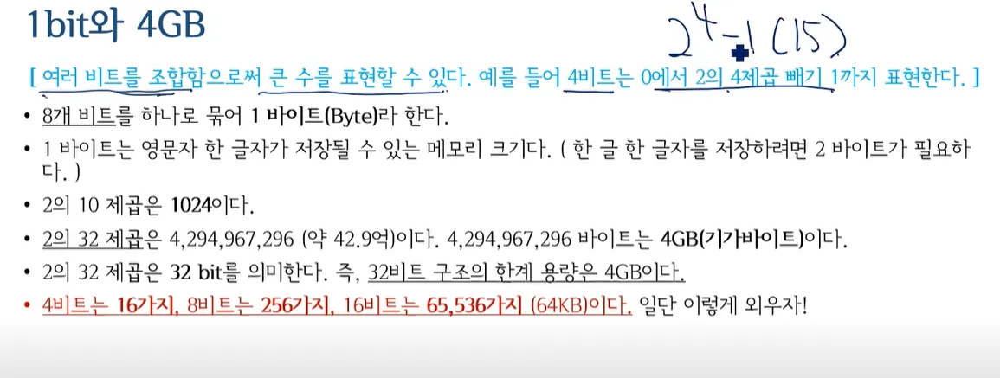
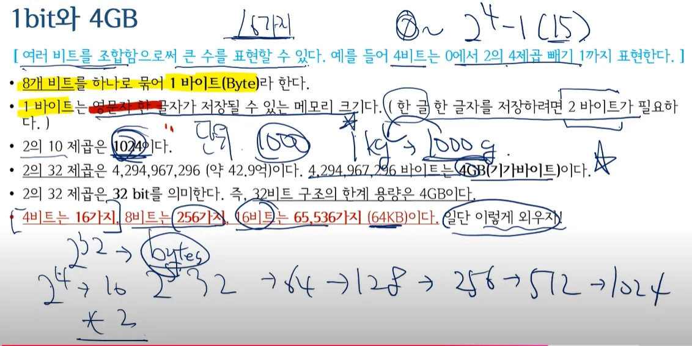
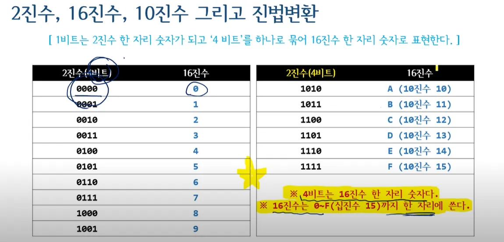

# bit와 base란?

우리가 말하는 Computer 는 사실 CPU 이다.

즉 Computer를 이해하기 위해서는 CPU의 구조를 이해해야한다.

- 1비트란?
    
    전기 스위치 1개를 의미한다.
    
    전기가 흐르는 ON 상태는 1이다.
    
    전기가 흐르지 않는 OFF 상태는 0 이다.
    
    8개의 비트를 하나로 묶어 1바이트가 된다.
    
- 외워야 할 것
    
    
    
    
    
    
    
- 진법 변환
    
    
    
- 11000011 진법 변환 예제
    
    2^7+2^6+2^1+2^0 = 195
    
    C3 = 12*16^1 + 3*16^0
    
- 11111111 진법 변환 예제
    
    2진법 = 255
    
    16진법 = FF ( 15x16 + 15)