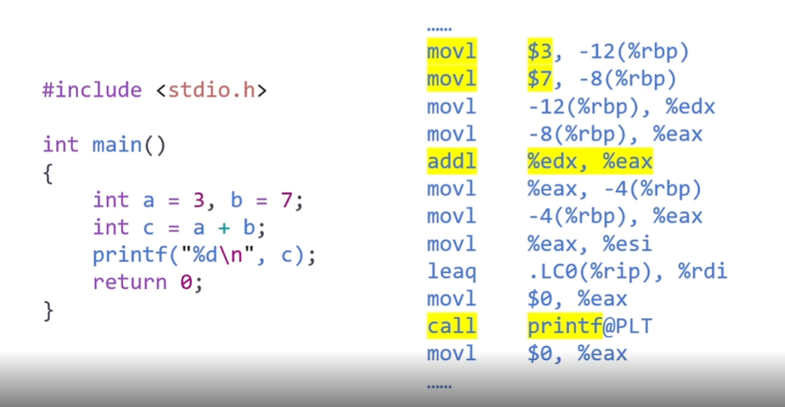

# 운영체제(OS)란?

> 운영 체제(OS)는 컴퓨터 하드웨어와 사용자 소프트웨어 간의 인터페이스를 제공하는 소프트웨어로, 다양한 작업을 관리하고 수행하는 역할을 한다. OS는 사용자가 프로그램이나 서비스를 실행할 수 있도록 여러 가지 자원을 관리하며, 이 과정에서 파일과 소켓을 통해 데이터를 처리한다. 

> 운영 체제는 커널 모드를 통해 사용자에게 파일과 소켓이라는 인터페이스를 제공하여, 데이터를 효율적으로 관리하고, 프로그램 간의 통신을 가능하게 한다. 이러한 구조는 하드웨어 자원의 보호와 효율적인 관리를 보장하며, 사용자에게는 안전하고 일관된 환경을 제공한다.

## 공룡책에서 정의한 운영체제

- opertaion 이란?
    - An operation system is a software that operates a computer system
    - 운영체제는 컴퓨터 시스템을 작동하는 소프트웨어이다
- computer란 무엇인가?
    - A Computer is a machine that processes the information
    - 정보를 처리하는 기계가 컴퓨터이다
- information이란 무엇인가?
    - a quantitive representaion that measures the uncertainty  
    - 정보란 불확실성을 측정해서 수치적으로 표현한 것이다.
- 클로드 섀넌의 information: 사건x가 있다면, 정보량은 이 사건이 발생할 확률의 -log를 붙인것이다.
    - $ I(x) = -\log_2 P(x)$
    - ex) A가 B에게 coin toss에 대한 정보를 주었을 경우, 1/2 를 전달한 것은 $2^{-1}$ 의 정보를 전달한 것과 같아, 이 경우 공식에 대입해보면 정보의 양은 1이 된다.
- 컴퓨터가 정보를 처리하는 방법
    - 정보의 최소단위 : bit (binary digit)를 이용해서 정보를 처리한다.
        - 정보 이론에서 정보의 최소 단위는 "비트(bit)"로 정의된다. 비트는 정보의 양을 측정하는 가장 작은 단위로, 두 가지 가능한 상태를 나타낼 수 있다.
        - 정보 이론에서의 최소 단위는 흔히 "1 비트"라고 불리며, 이는 두 개의 서로 다른 상태를 구별할 수 있는 정보의 양을 의미한다.
    - 정보의 처리: 정보의 상태 변환(0에서 1로, 1에서 0으로)
        - how? 불대수-> 논리 게이트-> 논리 회로-> 데이터 버스
- 컴퓨터의 정의
    - 범용성: universality
        - NOT,AND,OR 게이트로 모든 계산을 할 수 있음
        - NAND 게이트만으로 모든 계산을 할 수 있음
        - software가 하고싶은 모든 것을 hardware가 지원해준다.
        - 이를 범용 컴퓨터(general-purpose computer)라고 부른다.
    - 계산가능성: computability
        - Turing-computable: 튜링 머신으로 계산 가능한 것
        - 그러나 정지 문제(Halting probile)는 튜링 머신으로 풀 수 없다
- 컴퓨터는 프로그램을 실행하여 계산을 수행하는 기계이다.
- Program이란?
    - A program is a set of instructions that tells a computer's hardware to perform a task
    - 프로그램이란 컴퓨터 하드웨어의 태스크를 실행시키는 명령어들의 집합이다.

- 언어를 Compile 시키면, 어셈블리어가 되고, 이를 다시 기계어(binary code)로 변환시킨다.
    - 여기서 생기는 기계어란 010111.. 로 구성되어있고 사실 정보에 불과하다.
### C언어 컴파일 세부 과정
1. 소스 코드 작성 (C 언어, `.c` 파일)
   - 사용자가 작성한 C 언어로 된 프로그램이다.

2. 컴파일 (Compiler)
   - C 컴파일러는 C 언어 소스 코드를 어셈블리어로 변환한다. 이 과정에서 코드의 문법을 분석하여 해당하는 어셈블리 언어 코드로 번역한다.
   - 결과물: 어셈블리어 파일 (.s 또는 .asm) 

3. 어셈블리어 어셈블 (Assembler)
   - 어셈블러는 어셈블리어 코드 파일을 기계어로 변환한다. 기계어는 CPU가 이해하고 실행할 수 있는 binary code이다(01010110...).
   - 결과물: 오브젝트 파일 (.o)

4. 링킹 (Linker)
   - 링커는 여러 개의 오브젝트 파일을 결합하여 실행 가능한 파일을 만든다. 외부 라이브러리나 시스템 호출 등을 연결하여 최종 실행 파일을 생성한다.
   - 결과물: 실행 파일 (.out 또는 .exe) 

5. 실행 (Execution)
   - 최종적으로 생성된 실행 파일은 운영 체제에 의해 로드되어 CPU에서 실행된다.

6. 결론
    - C 언어 (.c) → 컴파일러 → 어셈블리어 (.s, .asm) → 어셈블러 → 기계어 (.o) → 링커 → 실행 파일 (.out, .exe)
    - 실행 파일은 CPU에서 실행된다.

## 운영체제의 목적

운영체제를 사용하는 가장 주된 목적은 컴퓨터의 하드웨어를 관리하는 것이다. 컴퓨터에는 수 많은 하드웨어가 존재한다. CPU, 메모리, 디스크, 키보드, 마우스, 모니터, 네트워크 등이 있으며 이를 잘 관리해주어야 컴퓨터를 효율적으로 사용할 수 있다. 운영체제의 성능이 좋을수록 컴퓨터의 성능 역시 좋아진다고 할 수 있다.

운영체제는 사용자에게 편의를 제공하는 목적도 가지고 있다. 운영체제가 없다면 위에서 말한 하드웨어에 관한 모든 관리를 사용자가 해야한다는 점과 같이 컴퓨터를 사용하는데 매우 불편함을 겪을 것이다. 하지만 현재 많은 발전을 거쳐온 운영체제가 설치된 컴퓨터는 사용하기에 매우 편리하다는 것을 느낄 수 있다. 대표적으로 스마트폰이 있다. 스마트폰 역시 컴퓨터의 일종이고 운영체제가 설치되어 있다. 그리고 스마트폰은 남녀노소 누구나 할 것 없이 사용법을 빠르게 익힐 수 있다.

정리하면 운영체제는 컴퓨터의 성능을 높이고(performance), 사용자에게 편의성 제공(Convenience)을 목적으로 하는 컴퓨터 하드웨어 관리하는 프로그램이다.

## 운영체제의 위치

사용자 프로그램(Application)은 특정 운영체제에 맞춰서 만든다. 그러므로 한 애플리케이션은 서로 다른 운영체제에서 수행할 수 없다. (하드웨어가 같은 것은 전혀 상관이 없다.) 예를 들면 Windows에서 수행하는 프로그램을 그대로 Linux에 옮기면 수행되지 않는다.

애플리케이션은 위의 그림과 같이 운영체제 위에서 수행한다. 즉, 하드웨어 자원을 직접적으로 사용하지 않고 운영체제가 제공하는 자원만을 사용할 수 있다.

### SHELL

> 쉘(Shell)은 사용자가 운영 체제와 상호작용할 수 있도록 해주는 프로그램 또는 명령어 인터페이스이다. 쉘은 사용자가 입력한 명령을 해석하고 실행하여 시스템과 소통하는 역할을 한다. 

> CLI에서의 명령을 해석하고 실행시키는 것이 SHELL의 역할이다.