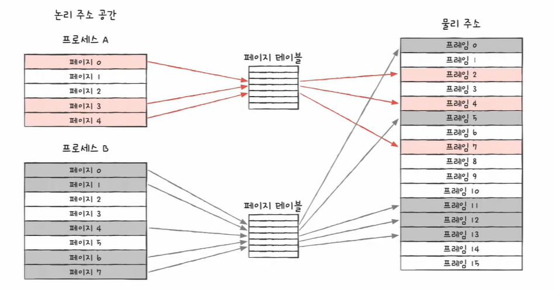

# 가상메모리/페이지 교체란?

> 가상 메모리: 시스템이 실제 물리적 메모리보다 더 큰 메모리 공간을 제공하는 기술. 프로세스가 사용하는 주소 공간을 가상적으로 확장하여 메모리 사용 효율을 높인다.

> 페이지 교체: 물리 메모리가 부족할 때, 운영 체제가 덜 사용되는 페이지를 제거하고 필요한 페이지를 메모리에 로드하는 과정.

## 프로세스의 가상메모리를 이용한 메모리할당 방법
- 프로세스는 자신이 사용할 수 있는 메모리를 표시할 수 있는 가상메모리를 운영체제로 부터 4GB를 할당받는다
- 32bit 시절부터 사용되온 관례(현대 프로그램, OS도 이에 최적화 되어있음)때문에 4gb를 할당(논리적)받는다, 그 이유는 32비트가 4gb의 메모리 밖에 표시할 수 없기 때문이다
    - 2^12(4kb, offset) , 2^20(address) 로 32비트로 4gb의 위치를 매핑할 수 있다

## 가상메모리 테이블에서 메모리 위치를 어떻게 빠르게 찾을 수 있음?
- TLB (Translation Lookaside Buffer)를 이용해서 빠르게 실제 메모리 위치를 찾을 수 있다
    - TLB는 페이지 테이블을 캐싱하는 고속 캐시 메모리이다. 현대 컴퓨터 시스템에서 메모리 접근 속도를 높이기 위해 사용된다. 이는 가상 메모리에서 물리 메모리로의 변환을 빠르게 처리하도록 도와준다.
- TLB의 역할
    - 가상 주소 -> 물리 주소 변환
    - 페이지 테이블
        - 페이지라는 고정 크기의 블록을 사용해 메모리를 관리한다. 페이지 테이블은 각 가상 페이지가 어떤 물리 페이지로 맵핑되는지를 기록한 자료구조
    - TLB는 페이지 테이블을 빠르게 조회할 수 있도록 해주는 캐시 역할을 한다. 운영체제에서 가상 주소를 물리 주소로 변환할 때마다, 페이지 테이블을 검색해야 하는데, TLB는 최근에 변환된 주소를 저장하여 변환을 더 빠르게 할 수 있게 해준다.

#### 장점 
1. 효율적인 메모리 사용: 페이지 기법을 사용하면 메모리 조각화를 줄이고, 필요한 페이지만을 로드하여 시스템의 효율성을 높인다.
2. 보호 및 격리: 각 프로세스는 독립적인 가상 주소 공간을 가지므로, 다른 프로세스의 메모리에 접근하지 못하게 하여 보안을 강화한다.

> 즉, 페이징 기술은 전화번호부처럼 데이터를 효율적으로 관리하고 접근할 수 있도록 주소를 체계적으로 정리하는 방법이다. 이를 통해 메모리 사용의 효율성을 높이고, 프로세스 간의 격리를 보장한다.





## 가상 메모리를 이해하기 위한 rust 예제 프로그램들

> https://github.com/gunhaa/memory/blob/main/examples/address.rs

```rust
fn main(){
    // 해당 코드는 컴파일 되지 않는다
    // 0x1이 가리키는 건 rust의 할당영역이 아니기에 유효하지 않다
    // error: process didn't exit successfully: `target\debug\examples\memory.exe` (exit code: 0xc0000005, STATUS_ACCESS_VIOLATION)
    let mut n_nonzero = 0;

    for i in 1..10000 {
        let ptr = i as *const u8;
        let byte_at_addr = unsafe { *ptr };
        if byte_at_addr != 0 {
            n_nonzero += 1;
        }
    }

    println!("non-zero bytes in memory: {}", n_nonzero);

}
```

```rust
static GLOBAL: i32 = 1000;

fn noop() -> *const i32 {
    let noop_local = 12345;
    &noop_local as *const i32
}

fn main(){

    let local_str = "a";
    let local_int = 123;
    let boxed_str = Box::new('b');
    let boxed_int = Box::new(789);
    let fn_int = noop();

    println!("GLOBAL:           {:p}", &GLOBAL as *const i32);
    println!("local_str:        {:p}", local_str as *const str);
    println!("local_int:        {:p}", &local_int as *const i32);
    println!("boxed_str:        {:p}", Box::into_raw(boxed_str) as *const i32);
    println!("boxed_int:        {:p}", Box::into_raw(boxed_int) as *const i32);
    println!("fn_int:           {:p}", fn_int);
}
```
- 결과
```shell
GLOBAL:           0x7ff6aa71a5f0  (Global)
local_str:        0x7ff6aa71a5f4  (Stack 상단)
local_int:        0x2e949ef554    (Stack 하단?)
boxed_str:        0x1e14e82bf60   (Heap)
boxed_int:        0x1e14e835f10   (Heap)
fn_int:           0x2e949ef4f4    (Stack 하단?)
```
- GLOBAL : 0x7ff6aa71a5f0 분석
    - 페이지 번호: 0x7ff6aa (10485050)
    - 오프셋: 0x7f0 (2032)
    - 해당 페이지 번호는 논리적인 번호이므로, 실제 메모리에서는 어디에 있을 지 알 수 없다
- 값들이 넓은 범위에 흩어져있다
- 프로그램이 단지 몇 KB가 필요하더라도, 몇몇 변수는 아주 먼 거리를 두고 위치해 있다
    - 이 것을 가상주소 라고 한다
    - 현재 결과로 표시되는 것은 실제 메모에서의 주소가아닌, Rust가 가지고 있는 가상 주소이다
    - 물리 주소는 고수준 언어에서 접근할 방법이 없으며, 운영체제와 하드웨어(MMU)가 관리한다
- "스택은 위쪽 주소, 힙은 아래쪽 주소에 위치한다"는 말은 전통적인 메모리 구조를 기준으로 설명한 것이고, 항상 그런 구조를 따르는 건 아니다.
    - 가상 메모리에서는 운영체제가 각 영역을 어디에 배치할지 자유롭게 정할 수 있다.
    - 스택과 힙의 "예상과 다른 위치"는 운영체제가 가상 주소 공간을 어떻게 구성했느냐에 따라 달라진다.
-  Rust가 전통적 메모리 모델을 "강요하지 않는다"
    - Rust는 C처럼 직접 주소를 지정하지 않음
    - "스택은 높은 주소, 힙은 낮은 주소"라고 고정하지 않음
    - 운영체제가 현대적 메모리 관리 방식 사용 (ASLR)
    - 보안상의 이유로 섹션별 위치는 매번 무작위로 할당됨
    - Rust는 안전성과 추상화를 중시
        - 주소가 어디 있는지 알 필요 없이, 그저 안전하게 메모리에 접근할 수 있도록 설계됨
- 가상 주소들은 물리 주소로 1:1 매핑되지 않는다.
    - 운영체제는 페이지 단위(보통 4KB)로 나누어 가상 주소 → 물리 주소로 연결시켜주는 페이지 테이블을 관리한다.

- 가상 메모리 레이아웃
> https://github.com/gunhaa/memory/blob/main/src/main.rs
```rust
use kernel32;
use winapi::{self, SYSTEM_INFO};

use winapi::{
    DWORD,
    HANDLE,
    LPVOID,
    PVOID,
    SIZE_T,
    LPSYSTEM_INFO,
    MEMORY_BASIC_INFORMATION as MEMINFO,
};
//  가상 메모리 레이아웃
fn main() {

    let this_pid: DWORD;
    let this_proc: HANDLE;
                      // 롱포인터
    let min_app_addr: LPVOID;
    let max_app_addr: LPVOID;
    let mut base_addr: PVOID;
    let mut proc_info: SYSTEM_INFO;
    let mut mem_info: MEMINFO;

    const MEMINFO_SIZE: usize = std::mem::size_of::<MEMINFO>();

    // memory initialize
    unsafe {
        base_addr = std::mem::zeroed();
        proc_info = std::mem::zeroed();
        mem_info = std::mem::zeroed();
    }

    // system call
    unsafe {
        this_pid = kernel32::GetCurrentProcessId();
        this_proc = kernel32::GetCurrentProcess();
        kernel32::GetSystemInfo(
            &mut proc_info as LPSYSTEM_INFO
        );
    }

    min_app_addr = proc_info.lpMinimumApplicationAddress;
    max_app_addr = proc_info.lpMaximumApplicationAddress;

    // 현재 실행 중인 프로세스의 ID와, 해당 프로세스를 참조하는 핸들의 메모리 주소를 확인
    println!("{:?} @ {:p}", this_pid, this_proc);

    // 시스템의 정보가 들어 있는 SYSTEM_INFO 구조체
    println!("{:?}", proc_info);

    // 현재 프로세스에서 접근 가능한 가상 메모리 주소 공간의 시작과 끝
    println!("min : {:p}, max: {:p}", min_app_addr, max_app_addr);

    loop {

        // 루프 안에서 mem_info는 VirtualQueryEx에 의해 계속 덮어씌워진다
        // rc가 0이면 메모리 탐색 종료된다
        let rc: SIZE_T = unsafe {
            kernel32::VirtualQueryEx(this_proc, base_addr, &mut mem_info, MEMINFO_SIZE as SIZE_T)
        };

        if rc == 0 {
            break;
        }
    
        base_addr = ((base_addr as u64) + mem_info.RegionSize) as PVOID;

    }

    // VirtualQueryEx로 조회한 메모리 블록의 상태(mem_info)
    println!("{:#?}" , mem_info);
}
```
- 결과
```shell
11428 @ 0xffffffffffffffff
SYSTEM_INFO { wProcessorArchitecture: 9, wReserved: 0, dwPageSize: 4096, lpMinimumApplicationAddress: 0x10000, lpMaximumApplicationAddress: 0x7ffffffeffff, dwActiveProcessorMask: 255, dwNumberOfProcessors: 8, dwProcessorType: 8664min : 0x10000, max: 0x7ffffffeffff
MEMORY_BASIC_INFORMATION {
    BaseAddress: 0x00007ffbe3928000,
    AllocationProtect: 0,
    RegionSize: 17656741888,
    State: 65536,
    Type: 0,
}
```