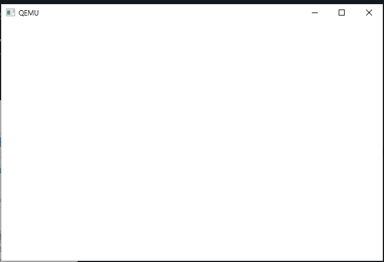
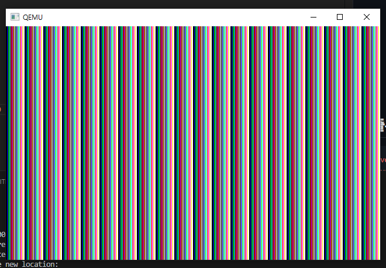
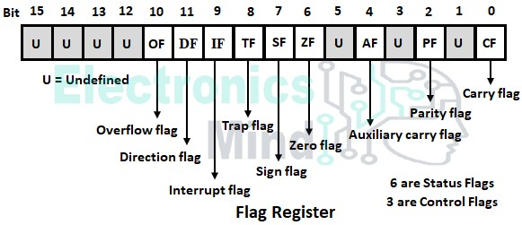
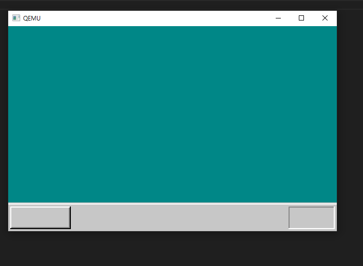

# day4

> C언어와 화면 표시의 연습

## C언어로 메모리에 쓰기
- 화면에 그리기 위해서는 VRAM(Video RAM)에 뭔가를 쓰면 된다
- C언어와 연계해서 어셈블리어를 사용할 경우 EAX, ECX, EDX 3개만 자유롭게 사용하는게 좋다
    - 다른 레지스터도 값은 사용할 수 있지만 값을 변경해서는 안된다(중요한 값 기억을 위해 사용)
```asm
_write_mem8:	; void write_mem8(int addr, int data);
		MOV		ECX,[ESP+4]		; [ESP+4]에 addr가 들어가 있으므로 그것을 ECX에 read한다
		MOV		AL,[ESP+8]		; [ESP+8]에 data가 들어가 있으므로 그것을 AL에 read한다
		MOV		[ECX],AL
		RET
```
- ESP레지스터는 stack top 주소를 가르킨다
- ESP 레지스터는 return 주소(4바이트)를 가르킨다
- 4바이트인 이유는 현재 32비트 시스템으로 개발중이라 그렇고, 현대 시스템에선 +8 바이트가 되어야한다
- ESP 레지스터+4byte는 param1을 가르킨다(addr)
- ESP 레지스터+8byte는 param2을 가르킨다(data) 
```C
void io_hlt(void);
void write_mem8(int addr, int data);

void HariMain(void)
{
	int i; /* 변수 선언.i라고 하는 변수는 32 비트의 정수형 */

	for (i = 0xa0000; i <= 0xaffff; i++) {
		write_mem8(i, 15); /* MOV BYTE [i], 15 */
	}

	for (;;) {
		io_hlt();
	}
}

```

```asm
; for문 해석
; for(A; B; C;){D;}
A;
label:
    if (B) {
        D;
        C;
        goto label;
    }
```

- 0xa0000 부터 0xaffff 영역이 vram의 영역이며, 해당 코드 실행시 다음 화면이 나타나게 된다
    - 모든 화소의 색을 15번째 색으로 함

## 줄무늬 만들기
```C
void io_hlt(void);
void write_mem8(int addr, int data);


void HariMain(void)
{
	int i; /* 변수 선언.i라고 하는 변수는 32비트 정수형 */

	for (i = 0xa0000; i <= 0xaffff; i++) {
		write_mem8(i, i & 0x0f);
	}

	for (;;) {
		io_hlt();
	}
}

```
- &를 이용한 and연산으로 구현한다
- 비트 연산 결과 각 메모리의 값은 `00 01 02 03 04 05 06 07 08 09 0A 0B 0C 0D 0E 0F 00 01 ..` 이 반복된다




## 포인터

```asm
MOV [0x1234], 0x56
```

- MOV [0x1234], 0x56 명령에서 BYTE, WORD, DWORD 메모리 접근 크기에 대한 명확한 정보가 부족하기 때문이다. x86 어셈블리에서 MOV 명령어는 메모리 접근 시에 데이터의 크기를 명확히 지정해야한다.
- 해당 방식으로 변경되야 한다
    - MOV BYTE [0x1234], 0x56: 1바이트 크기의 메모리 위치에 값을 쓰는 경우
    - MOV WORD [0x1234], 0x56: 2바이트 크기의 메모리 위치에 값을 쓰는 경우
    - MOV DWORD [0x1234], 0x56: 4바이트 크기의 메모리 위치에 값을 쓰는 경우
```C
void io_hlt(void);

void HariMain(void)
{
	int i; /* 변수 선언.i라고 하는 변수는 32 비트 정수형 */
	char *p; /* p라고 하는 변수는 BYTE [...]용 번지 */

	for (i = 0xa0000; i <= 0xaffff; i++) {

		p = (char *) i; /* 번지를 대입 */
		*p = i & 0x0f;

		/* 이것으로 write_mem8(i, i & 0x0f); 대신 */
	}

	for (;;) {
		io_hlt();
	}
}
```
- BYTE에 해당하는 기계어를 char *p로 넣을 수 있다
- WORD의 경우 short *p, DWORD는 int *p
- C에서 char는 1바이트, short는 2바이트, int는 4바이트를 사용한다

## 포인터 ver2

```C
void io_hlt(void);

void HariMain(void)
{
	int i; /* 변수 선언.i라고 하는 변수는 32 비트 정수형 */
	char *p; /* p라고 하는 변수는 BYTE [...]용 번지 */
    p = (char *) 0xa0000;
	for (i = 0xa0000; i <= 0xaffff; i++) {

		// ver2
		for(i=0; i<=0xffff; i++){
			*(p+1) = i & 0x0f;
		}

		/* 이것으로 write_mem8(i, i & 0x0f); 대신 */
	}

	for (;;) {
		io_hlt();
	}
}
```


- 32비트 시스템이면 단위가 4바이트니, 0xffff 호출하면 앞에 자동적으로 0x0000ffff로 연결된다

## 포인터 ver3
```C
void io_hlt(void);

void HariMain(void)
{
	int i; /* 변수 선언.i라고 하는 변수는 32 비트 정수형 */
	char *p; /* p라고 하는 변수는 BYTE [...]용 번지 */

	for (i = 0xa0000; i <= 0xaffff; i++) {

		//ver3
		p = (char *) 0xa0000; /* 번지를 대입 */

		for( i = 0 ; i <= 0xffff; i++){
			p[i] = i & 0x0f;
		}

		/* 이것으로 write_mem8(i, i & 0x0f); 대신 */
	}

	for (;;) {
		io_hlt();
	}
}
```
- p[i]와 *(p + i)
    - p[i]는 포인터인 p가 가리키는 주소에서 i번째 요소를 읽거나 쓴다는 뜻이다.
    - (p + i)는 p 포인터에서 i만큼 떨어진 위치의 값을 참조하는 방식이다.
    - 두 표현은 실제로 같은 동작을 수행한다. 즉, p[i]와 (p + i)는 메모리에서 p가 가리키는 주소에 대해 i번째 위치의 데이터를 읽거나 쓴다는 점에서 동일하다.
    - 배열이라는 것은 사실 연속된 메모리의 집합이라 p[index] 형태가 같은 방식으로 동작하는 것이다

## 색 번호 설정
```C
void io_hlt(void);
void io_cli(void);
void io_out8(int port, int data);
int io_load_eflags(void);
void io_store_eflags(int eflags);

/* 실은 같은 원시 파일에 써 있어도 정의하기 전에 사용한다면,
	역시 선언해 두지 않으면 안 된다. */

void init_palette(void);
void set_palette(int start, int end, unsigned char *rgb);

void HariMain(void)
{
	int i; /* 변수 선언.i라고 하는 변수는 32비트 정수형 */
	char *p; /* p라고 하는 변수는 BYTE [...]용 번지 */

	init_palette(); /* 팔레트를 설정 */

	p = (char *) 0xa0000; /* 번지를 대입 */

	for (i = 0; i <= 0xffff; i++) {
		p[i] = i & 0x0f;
	}

	for (;;) {
		io_hlt();
	}
}

void init_palette(void)
{
	static unsigned char table_rgb[16 * 3] = {
		0x00, 0x00, 0x00,	/*  0:흑 */
		0xff, 0x00, 0x00,	/*  1:밝은 빨강 */
		0x00, 0xff, 0x00,	/*  2:밝은 초록 */
		0xff, 0xff, 0x00,	/*  3:밝은 황색 */
		0x00, 0x00, 0xff,	/*  4:밝은 파랑 */
		0xff, 0x00, 0xff,	/*  5:밝은 보라색 */
		0x00, 0xff, 0xff,	/*  6:밝은 물색 */
		0xff, 0xff, 0xff,	/*  7:흰색 */
		0xc6, 0xc6, 0xc6,	/*  8:밝은 회색 */
		0x84, 0x00, 0x00,	/*  9:어두운 빨강 */
		0x00, 0x84, 0x00,	/* 10:어두운 초록 */
		0x84, 0x84, 0x00,	/* 11:어두운 황색 */
		0x00, 0x00, 0x84,	/* 12:어두운 파랑 */
		0x84, 0x00, 0x84,	/* 13:어두운 보라색 */
		0x00, 0x84, 0x84,	/* 14:어두운 물색 */
		0x84, 0x84, 0x84	/* 15:어두운 회색 */
	};
	set_palette(0, 15, table_rgb);
	return;

	/* static char 명령은 데이터 밖에 사용할 수 없지만 DB명령에 상당 */
}

void set_palette(int start, int end, unsigned char *rgb)
{
	int i, eflags;
	eflags = io_load_eflags();	/* 인터럽트 허가 플래그의 값을 기록한다 */
	io_cli(); 			/* 허가 플래그를 0으로 하여 인터럽트를 금지로 한다 */
	io_out8(0x03c8, start);
	for (i = start; i <= end; i++) {
		io_out8(0x03c9, rgb[0] / 4);
		io_out8(0x03c9, rgb[1] / 4);
		io_out8(0x03c9, rgb[2] / 4);
		rgb += 3;
	}
	io_store_eflags(eflags);	/* 인터럽트 허가 플래그를 원래대로 되돌린다 */
	return;
}
```
- char형의 변수는 signed형, unsigned형, 지정되지 않은 형이 있다
    - signed는 -128~127의 정수를 계산에 사용한다
    - unsigned에서는 0~255의 정수를 계산에 사용한다
    - 지정이 없다면 컴파일러 맘대로 사용 가능
    - int와 short에도 똑같이 있다
- io.out8은 장치 번호로 지정한 장치에서 데이터를 보내는 함수
- 비디오 DA 컨버터
    - 0x03c8에 설정하고 싶은 팔레트 번호를 넣고, 이어서 R/G/B순서로 0x03c9에 넣는다
    - VGA 그래픽은 6비트 값으로 설정해야 하기 때문에 8비트 색상을 6비트로 축소(/4)하여 VGA 그래픽 카드의 팔레트에 맞는 값을 설정
- io_cli(), io_load_eflag(), io_store_eflags(eflags);
    - io_cli()는 인터럽트 플래그를 0으로 만드는 명령이다(clear interrupt flag), 인터럽트 비활성화(방지)
    - sti는 인터럽트 플래그를 1로 만드는 명령(set interrupt flag)
    - CPU에 인터럽트 요구 신호가 왔을 때, 인터럽트 반응 회로가 동작하는가(인터럽트 플래그가 1), 혹은 무시하는가(인터럽트 플래그가 1)
    - 인터럽트 플래그 설정을 통해 CPU 동작을 설정할 수 있다
    - flag에 대한 설정은 C에서는 할수없고, 어셈블러의 기능이다
    - 운영체제로부터 인터럽트를 발생시키거나 막아서 명령을 실행시키는 방법이다
- EFLAGS 레지스터
    - FLAGS라는 16비트 레지스터가 확장된 32비트 레지스터
        - FLAGS는 캐리 플래그나 인터럽트 플래그 등으로 구성된 레지스터
        - carry flag는 0비트에 존재한다
        - 공백 비트는 크게 의미없다(이후 CPU에서 사용될 수도 있다)


```asm
; naskfunc
; TAB=4

[FORMAT "WCOFF"]				; 오브젝트 파일을 만드는 모드	
[INSTRSET "i486p"]				; 486명령까지 사용하고 싶다고 하는 기술
[BITS 32]					; 32비트 모드용의 기계어를 만든다
[FILE "naskfunc.nas"]				; 원시 파일명 정보

		GLOBAL	_io_hlt, _io_cli, _io_sti, io_stihlt
		GLOBAL	_io_in8,  _io_in16,  _io_in32
		GLOBAL	_io_out8, _io_out16, _io_out32
		GLOBAL	_io_load_eflags, _io_store_eflags

[SECTION .text]

_io_hlt:	; void io_hlt(void);
		HLT
		RET

_io_cli:	; void io_cli(void);
		CLI
		RET

_io_sti:	; void io_sti(void);
		STI
		RET

_io_stihlt:	; void io_stihlt(void);
		STI
		HLT
		RET

_io_in8:	; int io_in8(int port);
		MOV		EDX,[ESP+4]		; port
		MOV		EAX,0
		IN		AL,DX
		RET

_io_in16:	; int io_in16(int port);
		MOV		EDX,[ESP+4]		; port
		MOV		EAX,0
		IN		AX,DX
		RET

_io_in32:	; int io_in32(int port);
		MOV		EDX,[ESP+4]		; port
		IN		EAX,DX
		RET

_io_out8:	; void io_out8(int port, int data);
		MOV		EDX,[ESP+4]		; port
		MOV		AL,[ESP+8]		; data
		OUT		DX,AL
		RET

_io_out16:	; void io_out16(int port, int data);
		MOV		EDX,[ESP+4]		; port
		MOV		EAX,[ESP+8]		; data
		OUT		DX,AX
		RET

_io_out32:	; void io_out32(int port, int data);
		MOV		EDX,[ESP+4]		; port
		MOV		EAX,[ESP+8]		; data
		OUT		DX,EAX
		RET

_io_load_eflags:	; int io_load_eflags(void);
		PUSHFD		; PUSH EFLAGS의 의미
		POP		EAX
		RET

_io_store_eflags:	; void io_store_eflags(int eflags);
		MOV		EAX,[ESP+4]
		PUSH	EAX
		POPFD		; POP EFLAGS의 의미
		RET
```
- io_load_eflags
    - PUSHFD : push flags double-word 의 약어(POPFD 도 같다, pop flags double-word)
        - 스택은 ESP레지스터에 저장된다
    - 플래그를 더블워드로 스택에 넣는다
    - POP EAX : 스택의 꺼내서 EAX에 넣는다
    - C언어의 규약에서 EAX에 들어있던 값이 함수의 값(리턴)으로 간주된다

## 사각형 그리기
```C
void HariMain(void)
{
	char *p; /* p라고 하는 변수는 BYTE [...]용 번지 */

	init_palette(); /* 팔레트를 설정 */

	p = (char *) 0xa0000; /* 번지를 대입 */

	boxfill8(p, 320, COL8_FF0000,  20,  20, 120, 120);
	boxfill8(p, 320, COL8_00FF00,  70,  50, 170, 150);
	boxfill8(p, 320, COL8_0000FF, 120,  80, 220, 180);

	for (;;) {
		io_hlt();
	}
}
...
void boxfill8(unsigned char *vram, int xsize, unsigned char c, int x0, int y0, int x1, int y1)
{
	int x, y;
	for (y = y0; y <= y1; y++) {
		for (x = x0; x <= x1; x++)
			vram[y * xsize + x] = c;
	}
	return;
}
```

## 운영체제 그리기
```C
void HariMain(void)
{
	char *vram;
	int xsize, ysize;

	init_palette();
	vram = (char *) 0xa0000;
	xsize = 320;
	ysize = 200;

	boxfill8(vram, xsize, COL8_008484,  0,         0,          xsize -  1, ysize - 29);
	boxfill8(vram, xsize, COL8_C6C6C6,  0,         ysize - 28, xsize -  1, ysize - 28);
	boxfill8(vram, xsize, COL8_FFFFFF,  0,         ysize - 27, xsize -  1, ysize - 27);
	boxfill8(vram, xsize, COL8_C6C6C6,  0,         ysize - 26, xsize -  1, ysize -  1);

	boxfill8(vram, xsize, COL8_FFFFFF,  3,         ysize - 24, 59,         ysize - 24);
	boxfill8(vram, xsize, COL8_FFFFFF,  2,         ysize - 24,  2,         ysize -  4);
	boxfill8(vram, xsize, COL8_848484,  3,         ysize -  4, 59,         ysize -  4);
	boxfill8(vram, xsize, COL8_848484, 59,         ysize - 23, 59,         ysize -  5);
	boxfill8(vram, xsize, COL8_000000,  2,         ysize -  3, 59,         ysize -  3);
	boxfill8(vram, xsize, COL8_000000, 60,         ysize - 24, 60,         ysize -  3);

	boxfill8(vram, xsize, COL8_848484, xsize - 47, ysize - 24, xsize -  4, ysize - 24);
	boxfill8(vram, xsize, COL8_848484, xsize - 47, ysize - 23, xsize - 47, ysize -  4);
	boxfill8(vram, xsize, COL8_FFFFFF, xsize - 47, ysize -  3, xsize -  4, ysize -  3);
	boxfill8(vram, xsize, COL8_FFFFFF, xsize -  3, ysize - 24, xsize -  3, ysize -  3);

	for (;;) {
		io_hlt();
	}
}
```
- 잘 그리기
- 결과

