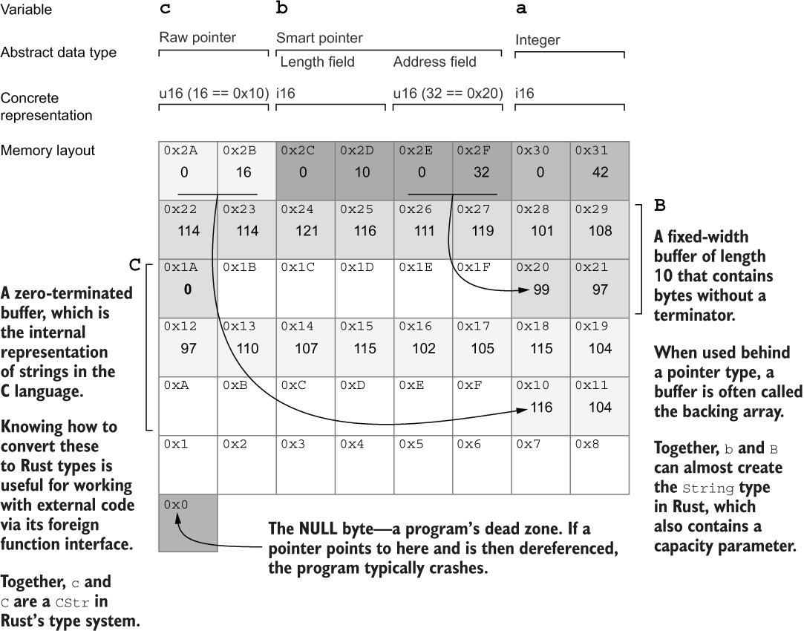

# 포인터


- 메모리는 공유 자원이며 운영체제는 중재자이다
    - 운영체제는 중계를 쉽게 하기 위해 메모리가 어느 정도 사용 가능한지, 어디에 위치해 있는지 프로그램에 거짓으로 알려준다
- 포인터란 컴퓨터가 직접 접근할 수 없는 데이터를 참조하는 방식
- 메모리 안에 저장된 데이터가 램 어딘가에 흩어져있으며, 이를 이용하기 위해 일종의 검색시스템이 필요한데 주소공간이 검색 시스템이다.

## 검색 방법

- 포인터는 어떤 메모리 주소를 기준점으로 하여 offset을 더해 접근한다. 이 기준 주소는 포인터가 보유한 메모리 주소값이다
    - 포인터의 offset 접근은 O(1) 시간 복잡도이다.
    - 포인터 접근은 단순히 기준 주소 + 바이트 수 계산이기 때문에 CPU가 한 번의 계산으로 바로 해당 메모리 주소에 접근할 수 있다

## 참조, 포인터, 메모리 주소

- 메모리 주소: 메모리의 단일 바이트를 참조하는 숫자이며, 어셈블리 언어에서 제공되는 추상화이다
    - 컴퓨터 메모리는 수많은 바이트(byte) 공간으로 나뉘어 있고, 각각은 고유한 번호(주소)를 가진다.
    - 이 숫자(주소)가 바로 메모리 주소다.
    - 어셈블리 언어에서는 이 주소를 직접 다루며, 하드웨어와 매우 가까운 수준의 표현이다.
        - `let x = 10;` 같은 걸 선언하면, 컴파일된 실행파일이 메모리를 요청하고, 그 변수는 예를 들어 0x1000이라는 가상 주소에 저장된다.
        - 이 0x1000은 실제 RAM 어딘가의 물리 주소로 연결되며, CPU는 MMU(메모리 관리 유닛)를 통해 이 매핑을 자동으로 처리한다. 여기서 0x1000이 메모리 주소이다.
- 포인터(raw pointer): 어떤 타입의 값을 가르키는 메모리 주소이다. 고수준 언어에서 제공되는 추상화이다.
    - 포인터는 "어떤 값이 저장된 메모리 주소"를 저장하는 변수다.
        - 메모리 주소 = “서울시 광진구 자양3동”
        - 포인터 = “그 주소가 적힌 쪽지”
    - 예를 들어 `let p = 0x1000`는 `0x1000` 주소에 있는 값을 의미한다.
    - Raw pointer는 러스트에서 *const T 또는 *mut T 같은 형태로, 안전성 검사 없이 직접 메모리 조작이 가능하다.
- 참조: 포인터이거나 동적 크기를 가지는 타입의 경우 포인터와 추가 보호조치가 된 정수이다. 참조는 러스트(각 언어)에서 제공되는 추상화이다
    - 참조는 "값을 안전하게 접근하기 위한 포인터"다.
    - 러스트에서는 &T나 &mut T처럼 사용하며, 빌림 검사기와 수명 등을 통해 안전하게 메모리를 빌려 쓸 수 있게 해준다.

## 포인터 예제

```rust
use std::mem::size_of;

static B: [u8; 10] = [99, 97, 114, 114, 121, 116, 111, 119, 101,108];
static C: [u8; 11] = [116, 104, 97, 110, 107, 115, 102, 105, 115, 104, 0];

fn main(){
    let a : usize = 42;
    let b : &[u8; 10] = &B;
    let c: Box<[u8]> = Box::new(C);

    println!("a (an unsigned integer):");
    println!(" location : {:p}", &a);
    println!(" size     : {:?} bytes", size_of::<usize>());
    println!(" value    : {:?}", a);
    println!();

    println!("b (a reference to B):");
    println!(" location : {:p}", &b);
    println!(" size     : {:?} bytes", size_of::<&[u8; 10]>());
    println!(" value    : {:p}", b);
    println!();

    println!("c (a \"box\" for C):");
    println!(" location : {:p}", &c);
    println!(" size     : {:?} bytes", size_of::<Box<[u8]>>());
    println!(" value    : {:?}", c);
    println!();

    println!("B (an array of 10 bytes):");
    println!(" location : {:p}", &B);
    println!(" size     : {:?} bytes", size_of::<[u8; 10]>());
    println!(" value    : {:?}", B);
    println!();
    
    println!("C (an array of 11 bytes):");
    println!(" location : {:p}", &C);
    println!(" size     : {:?} bytes", size_of::<[u8; 11]>());
    println!(" value    : {:?}", C);
    println!();
```

- 결과

```shell
a (an unsigned integer):
 location : 0x9df895f160
 size     : 8 bytes
 value    : 42

b (a reference to B):
 location : 0x9df895f168
 size     : 8 bytes
 value    : 0x7ff6dacfb4d0

c (a "box" for C):
 location : 0x9df895f170
 size     : 16 bytes
 value    : [116, 104, 97, 110, 107, 115, 102, 105, 115, 104, 0]

B (an array of 10 bytes):
 location : 0x7ff6dacfb4d0
 size     : 10 bytes
 value    : [99, 97, 114, 114, 121, 116, 111, 119, 101, 108]

C (an array of 11 bytes):
 location : 0x7ff6dacfb4da
 size     : 11 bytes
 value    : [116, 104, 97, 110, 107, 115, 102, 105, 115, 104, 0]
```

- 참조는 8바이트 공간을 차지한다
    - 64비트 운영체제여서 8바이트의 주소공간이 필요하기 때문
- Box가 16바이트가 나오는 이유는..(슬라이스 타입이기 때문)
    - 데이터의 시작 주소 (pointer) → 8바이트
    - 데이터의 길이 (len) → 8바이트
    - 길이가 자명하다면 포인터가 가르키는 위치에 차례대로 데이터를 쌓는다
- 메모리 모델 비교: Rust vs Java/Python

| 상황                         | 주소만 가짐       | 주소 + 길이 정보 있음 (fat pointer) | 힙에 헤더 있음 |
|------------------------------|-------------------|--------------------------------------|----------------|
| Rust - 고정 타입 (`Box<i32>`)   | O               | X                                   | X             |
| Rust - 슬라이스 (`Box<[u8]>`) | X               | O (스택에 길이 정보 포함)            | X             |
| Java, Python 등              | X                | O                                   | O             |

- fat pointer: Rust에서는 슬라이스나 동적 타입을 참조할 때, 포인터에 길이 등의 추가 정보를 함께 저장한 구조를 말한다
- 힙에 헤더: Java나 Python 같은 언어는 힙에 객체를 저장할 때, 객체 앞에 메타데이터(클래스타입, 길이, GC마크, 배열 길이, 배열 요소)를 담아 저장한다
- java의 참조도 rust와 같이 힙의 시작 위치를 8바이트로 가리킨다

- 해당 코드의 메모리 상태


## 원시 포인터 raw pointer

- 러스트가 안전을 보장하지 않는 메모리 주소이며, 참조(&T)와 달리 null이 될 수 있다
- *const T, *mut T로 사용된다

```rust
fn main(){
    let a:i64 = 42;
    let a_ptr = &a as *const i64;
    let a_addr: usize = unsafe {
        std::mem::transmute(a_ptr)
    };

    println!("a: {} ({:p} ... 0x{:x})", a, a_ptr, a_addr+7);
}
```
- 결과
```shell
a: 42 (0xe08db6f690 ... 0xe08db6f697)
```