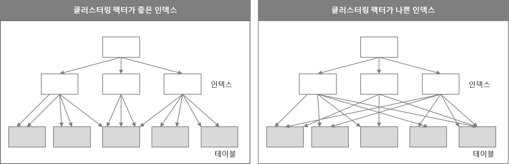

# 3. 인덱스 튜닝

- SQL튜닝은 랜덤 I/O와의 전쟁이다
- SQL 성능 향상을 위해 DBMS가 제공하는 많은 기능은 느린 랜덤 I/O를 극복하기 위해 개발됐다
- 조인 메소드의 발전은 물론 많은 튜닝 기법도 랜덤 I/O 최소화에 맞춰져 있다
  - 여기서 말하는 랜덤 I/O(Random I/O)는 "무작위"라는 의미가 아닌 디스크에서 데이터에 접근할 때 연속된 공간이 아니라 흩어진(비연속적인) 위치에 있는 데이터를 읽는 것을 뜻한다.

## Index의 ROWID란 무엇인가?

> 대량 데이터를 조회할 때 오히려 풀테이블 스캔보다 인덱스 스캔이 더 느려질 수 있다
> 그 이유는 바로 ROWID 때문이다

```sql
SQL> select * from 고객 where 지역 = '서울';
Execution Plan
------------------------------------------
0    SELECT STATEMENT Optimizer=ALL_ROWS
1 0   TABLE ACCESS BY INDEX ROWID OF '고객' (TABLE)
2 1    INDEX RANGE SCAN OF '고객_지역_IDX' (INDEX)
```

- INDEX 스캔을 하는 이유는 검색조건을 만족하는 소량의 데이터를 인덱스에서 빨리 찾고 거기서 테이블 레코드를 찾아가기 위한 주소값 ROWID를 얻으려는데 있다
  - ROWID는 포인터가 아닌, 논리적 주소이다
    - RDBMS마다 다르지만 일반적으로 물리적 위치를 직접 가리키기보단, 간접 식별할 수 있는 정보이다.
  - 포인터처럼 0에 가까운 COST가 드는 것이 아니라, 논리적인 주소로 되어있어서 접근하는데 많은 비용이든다
    - ROWID로 테이블에 접근하려면 디스크 I/O가 반드시 발생한다.
    - 특히 InnoDB에서는 인덱스 리프 노드에서 PK를 얻고, 그 PK로 다시 테이블을 조회해야 한다.
  - 그래서 대용량 데이터를 가진 테이블에서 꽤나 많은 데이터를 INDEX스캔으로 찾는다면, 접근하는데 많은 비용이 들어가 풀 테이블 스캔보다 효율이 떨어지는 상황이 나올 수도 있는 것이다
    - 조건에 맞는 row가 너무 많을 때 (예: 전체의 20~30% 이상)
    - 인덱스에서 수천 개를 찾고 → 다시 수천 번 테이블로 점프해야 한다면 → 랜덤 I/O 폭탄
    - 이럴 바엔 처음부터 Full Table Scan(연속 I/O)이 더 빠를 수 있다
    - 이 문제를 해결하기 위해 인덱스 튜닝을 하여야 한다

## 인덱스 클러스터링 팩터(CF)



- 인덱스의 순서와 테이블의 실제 레코드 저장 순서가 얼마나 잘 정렬되어 있는지를 수치로 나타낸 값이다.
- 수치가 낮을수록 좋다 (인덱스 순서와 테이블 레코드의 물리적 저장 순서가 비슷하다는 뜻)
- 수치가 높을수록 나쁘다 (인덱스의 연속된 값이 테이블에서는 이리저리 흩어져 있다는 뜻 → 랜덤 I/O가 많아짐)
