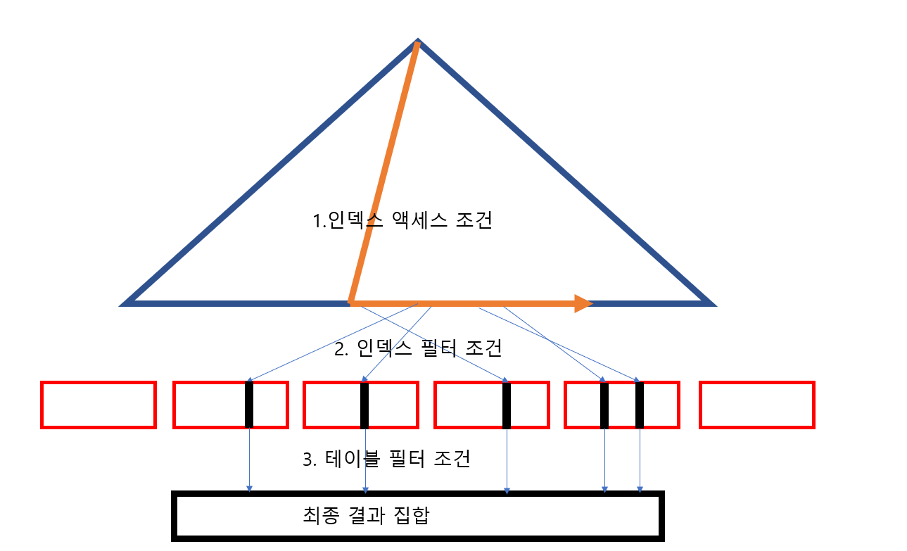

# 3. 인덱스 튜닝

- SQL튜닝은 랜덤 I/O와의 전쟁이다
- SQL 성능 향상을 위해 DBMS가 제공하는 많은 기능은 느린 랜덤 I/O를 극복하기 위해 개발됐다
- 조인 메소드의 발전은 물론 많은 튜닝 기법도 랜덤 I/O 최소화에 맞춰져 있다
  - 여기서 말하는 랜덤 I/O(Random I/O)는 "무작위"라는 의미가 아닌 디스크에서 데이터에 접근할 때 연속된 공간이 아니라 흩어진(비연속적인) 위치에 있는 데이터를 읽는 것을 뜻한다.

## Index의 ROWID란 무엇인가?

> 대량 데이터를 조회할 때 오히려 풀테이블 스캔보다 인덱스 스캔이 더 느려질 수 있다
> 그 이유는 바로 ROWID 때문이다

```sql
SQL> select * from 고객 where 지역 = '서울';
Execution Plan
------------------------------------------
0    SELECT STATEMENT Optimizer=ALL_ROWS
1 0   TABLE ACCESS BY INDEX ROWID OF '고객' (TABLE)
2 1    INDEX RANGE SCAN OF '고객_지역_IDX' (INDEX)
```

- INDEX 스캔을 하는 이유는 검색조건을 만족하는 소량의 데이터를 인덱스에서 빨리 찾고 거기서 테이블 레코드를 찾아가기 위한 주소값 ROWID를 얻으려는데 있다
  - ROWID는 포인터가 아닌, 논리적 주소이다
    - RDBMS마다 다르지만 일반적으로 물리적 위치를 직접 가리키기보단, 간접 식별할 수 있는 정보이다.
  - 포인터처럼 0에 가까운 COST가 드는 것이 아니라, 논리적인 주소로 되어있어서 접근하는데 많은 비용이든다
    - ROWID로 테이블에 접근하려면 디스크 I/O가 반드시 발생한다.
    - 특히 InnoDB에서는 인덱스 리프 노드에서 PK를 얻고, 그 PK로 다시 테이블을 조회해야 한다.
  - 그래서 대용량 데이터를 가진 테이블에서 꽤나 많은 데이터를 INDEX스캔으로 찾는다면, 접근하는데 많은 비용이 들어가 풀 테이블 스캔보다 효율이 떨어지는 상황이 나올 수도 있는 것이다
    - 조건에 맞는 row가 너무 많을 때 (예: 전체의 20~30% 이상)
    - 인덱스에서 수천 개를 찾고 → 다시 수천 번 테이블로 점프해야 한다면 → 랜덤 I/O 폭탄
    - 이럴 바엔 처음부터 Full Table Scan(연속 I/O)이 더 빠를 수 있다
    - 이 문제를 해결하기 위해 인덱스 튜닝을 하여야 한다
  - ROWID는 DB가 해석할 수 있는 위치 정보이며, 하드웨어 수준의 포인터는 아니다. 그러나 DB 내부에서는 가장 빠르게 특정 레코드에 접근할 수 있는 수단이므로, 마치 포인터처럼 쓰일 수 있는 “논리적 주소”라고 보면 된다.

### Oracle ROWID의 구성요소

- Oracle의 ROWID는 물리적 저장 위치를 암시적으로 표현하며, 다음 요소로 구성된다

| 구성 요소            | 설명                            |
| -------------------- | ------------------------------- |
| 데이터 오브젝트 번호 | 테이블 또는 세그먼트의 ID       |
| 파일 번호            | 행이 저장된 데이터 파일의 번호  |
| 블록 번호            | 행이 저장된 블록(Block) 번호    |
| 슬롯 번호 (오프셋)   | 블록 내에서의 행(Row) 위치 정보 |

### 인덱스 클러스터링 팩터(CF)

> 군집성 계수 라고 표현하는 것이 가장 맞다


- 인덱스의 순서와 테이블의 실제 레코드 저장 순서가 얼마나 잘 정렬되어 있는지를 수치로 나타낸 값이다.
- 수치가 낮을수록 좋다 (인덱스 순서와 테이블 레코드의 물리적 저장 순서가 비슷하다는 뜻)
- 수치가 높을수록 나쁘다 (인덱스의 연속된 값이 테이블에서는 이리저리 흩어져 있다는 뜻 → 랜덤 I/O가 많아짐)

#### index가 레코드가 다른 ROWID를 가르킨다면, 군집성과 상관없이 모두 검색하는건데 왜 중요한가?

- (오라클의 경우) 인덱스 ROWID로 테이블에 엑세스할 때, 어렵게 찾아간 테이블 블록에 대한 메모리 주소값을 해제하지 않고 일단 유지하고 마침 '직전과 같은' 테이블 블록을 가르킨다면 검색과정을 생략하고 테이블 블록을 읽을 수 있다
  - 즉, 논리적인 블록 I/O과정을 생략할 수 있는 것이다
  - 즉 군집성(CF)이 좋을수록 인덱스의 성능을 향상 시킬 수 있다

#### 그럼 인덱스에 따라 저장 순서를 선형으로 만드는게 가장 좋을텐데 그렇게는 왜 안함?

- 정렬된 저장이 성능에 유리하다는 건 맞다
  - 인덱스가 user_id 오름차순이면, 테이블 레코드도 그 순서대로 정렬돼 있으면 좋다
  - 이러면 인덱스 따라갈 때마다 같은 블록에 계속 접근하게 되고, 디스크 I/O가 거의 안 생긴다
  - 이런 구조를 클러스터형 테이블(Clustered Table) 또는 Index-Organized Table (IOT)이라고 부른다 (특히 Oracle/MySQL에서)
- 그런데 일반적으로 그렇게 저장하지 않는 이유
  - 데이터는 계속 추가·수정·삭제됨 (동적)
  - 테이블은 쓰기(write)가 계속 발생하는 구조다
  - 인덱스 순서대로 정렬 저장하려면, 새로운 데이터가 삽입될 때마다 정렬된 위치를 찾아 옮겨야 함
  - 블록 분할(split), 재배치 등 과도한 디스크 조작이 발생
  - 유지비용이 너무 크다
- 예상된 데이터 분포나 크기를 미리 모를 수 있음
  - 만약 특정 필드에 대해 고르게 정렬 저장할 필요가 있다면, 데이터가 어느 범위로 들어올지 예측해야 함
  - 현실에서는 사용자가 user_id 1 ~ 1,000,000으로 올지, UUID, 혹은 이메일로 올지 미리 모르거나 불균형할 수 있다
- 모든 쿼리가 같은 인덱스를 쓰지 않음
  - 어떤 쿼리는 user_id를, 어떤 쿼리는 created_at을, 또 어떤 쿼리는 email을 기준으로 정렬하거나 검색한다
  - 한 테이블은 한 기준으로밖에 물리적으로 정렬될 수 없다.
  - 어떤 쿼리엔 이득이지만, 다른 쿼리에겐 손해다
- 그래서 일부 상황에서만 사용한다
  - 삽입/갱신이 없는 정적 테이블에 사용된다
  - 범위 검색이 빈번한 테이블에 사용된다
  - 정렬된 출력이 항상 필요한 테이블
- 정렬 저장은 이상적이지만 현실적으론 trade-off가 크다

### 인덱스 손익 분기점

> 인덱스를 스캔한 후 ROWID로 테이블에서 실제 데이터를 다시 찾는 오버헤드 때문에, 일정 비율 이상을 읽는다면 전체 테이블 스캔(TFS)이 더 빠르다


- 인덱스 ROWID를 이용한 테이블 엑세스는 생각보다 고비용 구조이다
- 따라서 읽어야 할 데이터가 일정량을 넘어서는 순간, 테이블 전체를 스캔하는 것보다 오히려 느려진다
- 5~20%의 손익 분기점은 데이터 10~100만건의 테이블에 적용되는 수치이며, 1000만 건 수준의 테이블에서는 손익 분기점이 더 낮아진다
  - 10만건 테이블에서 10%는 만건이며, 만 건 정도라면 버퍼캐시에서 데이터를 찾을 가능성이 어느정도 있다
    - Oracle의 Buffer Cache는 일정 크기만큼 블록을 캐싱하고, 넘치면 오래된 것을 제거하는 구조
    - “접근 빈도”와 “최근 접근 시점”을 기준으로 정렬된 LRU 리스트를 사용하여 캐시를 관리, Queue 구조가 아닌 LRU리스트이다
  - 그러나 1000만건의 테이블이면, 인덱스 컬럼 기준으로 값이 같은 테이블 레코드가 근처에 모여있을 가능성이 매우 적다
    - 인덱스를 스캔하며 사실상 거의 모든 데이터를 읽게되며, 이런 경우 손익 분기점 자체가 의미가 없어진다
    - 만 건만 넘어도 Table Full Scan이 더 빠를 수 있다
- 테이블을 파티셔닝하는 이유는 결국 Full Scan을 빠르게 처리하기 위해서다
  - 파티셔닝이란 하나의 큰 테이블(논리적 테이블)을 여러 개의 물리적 단위로 나누는 것
  - 전체 테이블 스캔이 필요한 상황에서도, 파티셔닝을 통해 전체가 아니라 일부만 읽게 함으로써 성능을 개선할 수 있다
  ```sql
  CREATE TABLE logs (
  id NUMBER,
  log_date DATE,
  message VARCHAR2(1000)
  )
  PARTITION BY RANGE (log_date) (
    PARTITION p202406 VALUES LESS THAN (TO_DATE('2024-06-01','YYYY-MM-DD')),
    PARTITION p202407 VALUES LESS THAN (TO_DATE('2024-07-01','YYYY-MM-DD'))
  );
  SELECT * FROM logs WHERE log_date BETWEEN '2024-06-01' AND '2024-06-30';
  ```
  - 이때 파티션이 월별로 나뉘어 있다면, 2024년 6월 파티션 하나만 스캔하면 되므로, 전체 스캔보다 훨씬 빠르게 처리할 수 있다.
    - 이러한 최적화 과정을 "Partition Pruning (파티션 제거)"라고 부른다
      - 파티션 기준 컬럼(partition key)이 WHERE 절에 명시되면, 옵티마이저가 "어느 파티션에 데이터가 있을지 계산"하고 필요한 파티션만 읽도록 실행 계획을 줄이는 것
      - 즉, 저 경우 인덱스가 없어도 최적화 되어 특정 파티션만 스캔하게 된다
- 모든 성능 문제를 인덱스로 해결하려 해서는 안된다
  - 인덱스는 다양한 튜닝 도구 중 하나일 뿐이며, 큰 테이블에서 아주 적은 일부 데이터를 빨리 찾고자 할 때 주로 사용하는 것이다

## 부분 범위 처리 활용

- DB는 한번에 모든 데이터를 읽지 않고, 내부적으로 커서(Cursor)를 사용해 지연 로딩(Lazy Loading)을 수행한다.
  - 예: JDBC에서 `ResultSet.next()`는 내부적으로 커서에서 데이터를 한 행씩 `FETCH`하는 방식이다.
- 대용량 데이터 조회 시, 클라이언트가 요청한 전체 결과를 한꺼번에 가져오지 않고, 일부만 메모리에 로드하여 성능과 메모리 사용량을 절감한다.
- SQL에서 부분 조회는 다음과 같은 방식으로 가능하다:
  - `LIMIT`, `OFFSET`, `FETCH FIRST N ROWS ONLY` 등
  - `OFFSET`은 몇 번째 행부터 읽을지 지정하며, `LIMIT` 또는 `FETCH`는 몇 행을 가져올지 지정한다.
- JDBC에서는 `Statement.setFetchSize(n)`을 설정해 몇 행씩 배치 단위로 커서에서 데이터를 읽을지 제어할 수 있다.
  - 이 설정은 네트워크 왕복을 줄이고, 성능 최적화에 유리하다.
- JPA, Hibernate 등 ORM 도구도 내부적으로 커서 기반 처리와 fetchSize 제어를 지원한다.

## 인덱스 스캔 효율화



### 예시

```sql
CREATE TABLE employees (
  emp_id NUMBER,
  dept_id NUMBER,
  salary NUMBER,
  status VARCHAR2(10)
);

CREATE INDEX idx_emp_dept_salary ON employees(dept_id, salary);

SELECT *
FROM employees
WHERE dept_id = 10          -- 인덱스 액세스 조건 (인덱스 첫 컬럼)
  AND salary > 5000         -- 인덱스 필터 조건 (인덱스 키 두 번째 컬럼)
  AND status = 'ACTIVE';    -- 테이블 필터 조건 (인덱스에 없는 컬럼)
```

| 조건 종류              | 의미                                       | 적용 위치                                |
| ---------------------- | ------------------------------------------ | ---------------------------------------- |
| **인덱스 액세스 조건** | 인덱스 스캔 시작 위치를 결정하는 조건      | `dept_id = 10` (인덱스 첫 컬럼)          |
| **인덱스 필터 조건**   | 인덱스 범위 내 추가 필터링 조건            | `salary > 5000` (인덱스 키 두 번째 컬럼) |
| **테이블 필터 조건**   | 인덱스에서 걸러지지 않고 테이블에서 필터링 | `status = 'ACTIVE'` (인덱스 미포함 컬럼) |

1. 인덱스 액세스 조건(`dept_id = 10`)에 따라 인덱스 트리에서 조건에 맞는 구간을 탐색
2. 인덱스 필터 조건(`salary > 5000`)을 인덱스 내에서 적용하여 범위 좁힘
3. 조건에 맞는 ROWID로 테이블 접근
4. 테이블 필터 조건(`status = 'ACTIVE'`)을 실제 테이블 행에서 검사하여 최종 결과 결정

- 인덱스 액세스 조건과 필터 조건 모두 인덱스 키 컬럼에 해당해야 인덱스에서 효율적으로 처리 가능
- 인덱스에 없는 컬럼 조건은 테이블 액세스 후 필터링되므로 비용이 더 크다

## 인덱스 설계

- 인덱스가 많으면 편하기도 하지만, 많으면 문제가 생긴다
  - DML 성능 저하(= TPS 성능 저하)
  - 데이터 베이스 사이즈 증가(= 디스크 공간 낭비)
  - 데이터 베이스 관리 및 운영 비용 상승
- 인덱스 스캔에는 여러가지가 있지만, 가장 정상적이며 일반적인 방식은 Index Range Scan이며, 이를 위해 가장 중요한 두가지 선택 기준은 다음과 같다
  1. 조건절에 항상 사용하거나, 자주 사용하는 컬럼을 선정한다
  2. '=' 조건으로 자주 조회하는 컬럼을 앞쪽에 둔다

### 소트연산을 위한 컬럼 추가

- 정렬 기준 컬럼이 인덱스에 적절히 포함되어 있다면, DBMS는 정렬 연산(SORT)을 생략할 수 있다

```sql
select 계약ID, 청약일자, 입력자ID, 계약상태코드, 보험시작일자, 보험종료일자
from 계약
where 취급지점ID = :trt_brch_id
and   청약일자 between :sbcp_dt1 and :sbcp_dt2
and   입력일자 >= trunc(sysdate -3)
and   계약상태코드 in ( :ctr_stat_cd1, :ctr_stat_cd2, :ctr_stat_cd3)
order by 청약일자, 입력자ID
```

- 위 쿼리를 소트연산이 발생시키지 않기 위한 인덱스는
  - idx(청약일자, 입력자ID)가 된다(성능 고려X)
  - '=' 조건절 컬럼은 order by 절에 없더라도 인덱스 구성에 포함될 수 있다
    - 위 SQL에서는 취급지점ID이다
    - 즉, idx(청약일자, 취급지점ID, 입력자ID)로 사용가능하며, 위치는 앞,뒤,중간 어디든 상관없다
    - 그러나 '='조건이 아닌 조건절컬럼은 ORDER BY 컬럼보다 뒤쪽에 두어야 소트 연산을 생략할 수 있다, idx(청약일자, 입력자ID, 입력일자, 계약상태코드)
- 즉, I/O를 최소화하며 소트연산을 최소화하기 위한 공식은 다음과 같다
  - '='연산자로 사용한 조건절 컬럼 선정
  - ORDER BY절에 기술한 컬럼 추가
  - '=' 연산자가 아닌 조건절 컬럼은 데이터 분포를 고려해 추가 여부 결정

### 결합 인덱스 선택도

- 인덱스를 생성 여부를 결정할떄는 선택도가 충분히 낮은지가 중요한 판단 기준이다
- 선택도가 높고, 카디널리티가 높은 컬럼을 인덱스로 선택해야 한다
  - 전체 레코드중 조건에 맞는 비율이 선택도(0~1사이)
  - 서로 다른 고유한 값의 갯수(카디널리티)
    - 남자가 7, 여자가 3인 테이블에서 조건으로 '남자', '여자'가 걸릴 경우 선택도는 0.7/0.3으로 둘다 낮다(선택도가 1에 가까울수록 낮다, 선택도의 값이 낮을수록 선택도가 높다고 표현한다), 서로 다른 값의 갯수는 2개로 적다
    - SSN같이 Unique한 값의 경우 카디널리티가 높다고 표현한다