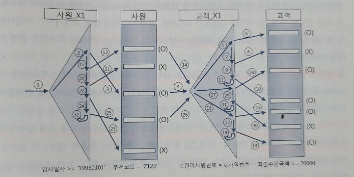
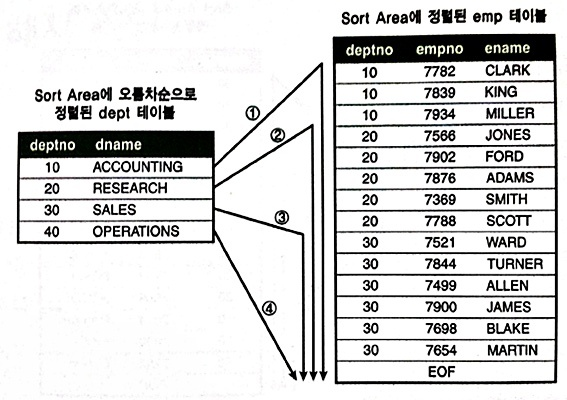
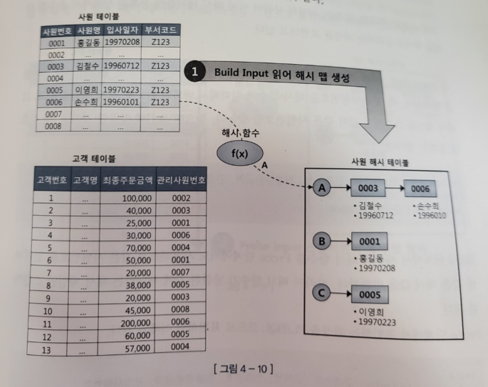

# 4. 조인 튜닝

## NL(Nested Loop) 조인

> 인덱스를 이용한 기본적인 조인 방법

- 아래 SQL을 코드로 나타내면 다음과 같은 수행구조이다(Nested Loop)

```sql
select e.사원명, c.고객명, c.전화번호
from 사원 e, 고객c
where e. 입사일자 >= '19960101'
and c.관리사원번호 = e.사원번호
```

```java
for(int i=0; i<100; i++) {
    for(int j=0l j<100; j++){
        // Do something...
    }
}
```

- 사원e 테이블을 iteration하며 같은 것을 찾아 테이블로 만들어내는 것이 핵심이다
  - SQL에서 양 테이블의 index를 이용해 위 java코드의 nested loop를 이용해 join 하는 것이 nl join이다
    - 즉, NL Join은 외부 테이블(사원)을 순회하면서, 내부 테이블(고객)을 인덱스로 빠르게 조회해 조건에 맞는 행을 찾는 방식이다
- 위 SQL에서는 JOIN 키워드를 명시적으로 사용하지 않았더라도, SQL에서 FROM A, B WHERE A.key = B.key 형태로 작성하면 옵티마이저가 내부적으로 조인을 수행한다.

### 제어 방법

- use_nl 힌트를 사용한다

```sql
select /*+ ordered use_nl(c)*/
        e.사원명, c.고객명, c.전화번호
from 사원 e, 고객 c
where e.입사일자 >= '19960101'
and   c.관리사원번호 = e.사원번호
```

### Where문과 Join문의 차이

- JOIN 문이 표준 SQL, 가독성, 유지보수성 모두에서 더 우수하다
- WHERE 방식은 복잡한 힌트 기반 성능 튜닝이 필요할 때만 사용하는 것이 일반적이다

| 항목            | `FROM A, B WHERE A.id = B.id` (암시적 조인)      | `FROM A JOIN B ON A.id = B.id` (명시적 조인)   |
| --------------- | ------------------------------------------------ | ---------------------------------------------- |
| 기본 의미       | INNER JOIN과 동일                                | 명시적으로 INNER / OUTER JOIN 표현 가능        |
| 가독성          | 복잡한 쿼리에서 가독성 떨어질 수 있음            | 조인 구조가 명확하여 가독성 우수               |
| 외부 조인 표현  | `(+)` 등 벤더 종속적 문법 사용 필요              | `LEFT JOIN`, `RIGHT JOIN` 등 표준 SQL 지원     |
| 조인 조건 위치  | `WHERE` 절에서 명시                              | `ON` 절에서 명시                               |
| 힌트 적용 편의  | `ORDERED`, `USE_NL`, `LEADING` 등 명확 적용 가능 | 힌트 적용이 다소 불명확하거나 제한적일 수 있음 |
| 옵티마이저 통제 | 조인 순서 및 방식 통제가 쉬움                    | 통제하려면 추가 힌트가 필요하거나 어려움       |

### NL조인 예제와 튜닝 포인트

> WHERE 문에서는 작성 순서와 관계없이, 옵티마이저가 내부적으로 가장 비용(Cost)이 낮은 조인 순서와 실행 계획을 선택한다.

```sql
select /* ordered use_nl(c) index(e) index(c) */
       e.사원번호, e.사원명, e.입사일자,
       c.고객번호, c.고객명, c.전화번호, c.최종주문 금액
from 사원 e, 고객 c
where c.관리사원번호 = e.사원번호   ...1
and e.입사일자 >= '19960101'       ...2
and e.부서코드 = 'Z123'            ...3
and c.최종주문금액 >= 20000         ...4

-- 인덱스 구성
사원_PK: 사원번호
사원_X1: 입사일자
고객_PK: 고객번호
고객_X1: 관리사원번호
고객_X2: 최종주문금액

-- 실행 계획
----------------------------------------------------------------------------
| ID | OPERATION                       |   NAME  |  Rows | Bytes | Cost |
----------------------------------------------------------------------------
|  0 | SELECT STATEMENT                |         |   5   |  58   |   5  |
|  1 |  NESTED LOOPS                   |         |   5   |  58   |   5  |
|  2 |   TABLE ACCESS BY INDEX ROWID  |  사원    |   3   |  20   |   2  | -- 부서코드 = 'Z123' 사용
|  3 |    INDEX RANGE SCAN            |  사원_X1 |   5   |       |   1  | -- e.입사일자 >= '19960101' 사용
|  4 |   TABLE ACCESS BY INDEX ROWID  |  고객    |   5   |  76   |   2  | -- 최종주문금액 >= 20000 사용
|  5 |    INDEX UNIQUE SCAN            | 고객_X1 |   8   |       |   1  | -- c.관리사원번호 = e.사원번호 사용
---------------------------------------------
```



- 이곳의 실행 계획은, 각 단계를 완료하고 다음 단계로 넘어가는 것이 아니라 한 레코드씩 순차적으로 진행된다
- ID순서대로 실행되지 않는다
- 2 -> 3 -> 1 -> 4 순으로 진행된다
  1. 사원\_X1, index range scan(2)
  2. 읽은 ROWID로 부서코드='Z123' 필터 조건 확인(3)
  3. 사원 테이블에서 읽은 값으로 고객 레코드를 찾기위해 고객\_X1 index range scan(1)
  4. 고객\_X1 index에서 읽은 ROWID를 이용해 고객테이블에 액세스해서 최종주문금액 >= 20000 필터 조건을 만족하는 것을 확인한다(4)
- 해당 계획에서의 튜닝 포인트는 2가지가 있다
  1. 사원\_X1을 읽은 후 사원테이블 엑세스 부분
     - 위 예제는 '=' 스캔으로 인해 잘됬음
  2. 고객\_X1을 읽은 후 인덱스 탐색 부분
     - 최종주문금액 >= 20000 에 필터링 되는 비율이 높다면, 고객\_X1 인덱스에 최종 주문 금액 컬럼을 추가하는 방안을 고려해야한다(RANDOM ACCESS 최소화)

### NL join Recap

- NL 조인의 중요한 특징
  1. 랜덤 액세스 위주의 조인이다
     - 레코드를 읽기 위해 블록을 통째로 읽는 랜덤 액세스 방식은 메모리 버퍼에서 빠르게 읽더라도 비효율이 존재한다
       - 인덱스 구성이 아무리 완벽하더라도 대량 데이터 조인에서 NL조인이 불리한 이유이다
  2. 조인을 한 레코드씩 순차적으로 진행한다
     - 첫번째 특징 때문에 대량 데이터 처리시 치명적인 한계가 있지만, 이 두 번째 특징때문에 아무리 큰 테이블에 조인하더라도 빠른 응답 속도를 낼 수 있다(부분범위 처리가 가능한 상황에서)
     - 이 특징은 DBMS시스템의 Lazy Loading이나 Cursor 기반 처리를 이야기한다
  3. 인덱스 구성 전략이 특히 중요하다
     - 조인 컬럼에 인덱스가 있느냐, 있다면 컬럼이 어떻게 구성 됐느냐에 따라 조인 효율이 크게 달라진다
  4. NL조인은 소량 데이터를 주로 처리하거나 부분 범위 처리가 가능한 온라인 트랜잭션 처리(OLTP) 시스템에 적합한 조인 방식이다

### NL조인 잘못된 예제와 해결

```sql
-- index 생성 요청
PRA_HST_STC_N1 : SALE_ORG_ID + STRD_GRP_ID + STRD_ID + STC_DT

-- 사용 쿼리
select *
from PRA_HST_STC a, ODM_TRMS b
where a.SALE_ORG_ID = :sale_org_id
and   a.STRD_GRP_ID = b.STRD_GRP_ID
and   a.STRD_ID     = b.STRD_ID
and   b.TRMS_DT     = :trms_dt
order by a.STC_DT desc
```

- 위 요청은 잘못되었다
  - PRA_HST_STC 인덱스는 현재 조인 컬럼이 이중으로 들어가 있다
  - 조인 키 중 하나만 남겨야한다 (STRD_ID or STRD_GRP_ID)

## 소트 머지 조인

- 조인 컬럼에 인덱스가 없을 때, 대량 데이터 조인이여서 인덱스가 효과적이지 않을 때 옵티마이저는 NL조인 대신 소트 머지 조인이나 해시조인을 선택한다
- 해시 조인이 더 유리한 경우가 많지만, 해시 조인을 사용할 수 없는 상황에서 대량 데이터 조인하고자 할 때 여전히 유용하다

### SGA vs PGA

> SGA는 프로세스의 힙메모리 PGA는 스레드의 stack와 유사하다

- 공유 메모리 영역인 SGA(System Global Area)에 캐시된 데이터는 여러 프로세스가 공유할 수 있다
  - 여러 프로세스가 공유할 수 있지만, 동시에 액세스 할 수 는 없다
  - 동시에 액세스하려는 프로세스 간 액세스를 직렬화 하기 위한 Lock 메커니즘으로서 래치(Latch)가 존재한다
  - 데이터 블록과 인덱스 블록을 캐싱하는 DB Buffer Cache는 SGA의 가장 핵심적인 구성요소 이다
  - 블록을 읽기 위해서는 Buffer Lock이 필요하다
- PGA(private global area)는 다른 프로세스와 공유하지 않는 독립적인 메모리 공간이다
  - 즉, Latch 메커니즘이 불필요하다
  - 같은 양의 데이터를 읽더라도 SGA Buffer Cache에서 읽을 때 보다 훨씬 빠르다

### 메커니즘

- 사용 방법

```sql
select /* ordered use_merge(c)*/
       e.사원번호, e.사원명, e.입사일자,
       c.고객번호, c.고객명, c.전화번호, c.최종주문 금액
from 사원 e, 고객 c
where c.관리사원번호 = e.사원번호   ...1
and e.입사일자 >= '19960101'       ...2
and e.부서코드 = 'Z123'            ...3
and c.최종주문금액 >= 20000         ...4
```

#### 순서

1. 아래 조건에 만족하는 사원 데이터를 읽어 조인컬럼인 사원번호 순으로 정렬한다
   - 정렬한 결과 집합은 PGA 영역에 할당된 Sort Area에 저장한다
   - 정렬한 결과집합이 PGA에 담을 수 없을 정도로 크면 Temp 테이블 스페이스에 저장한다

```sql
select 사원번호, 사원명, 입사일자
from 사원
where 입사일자 >= '19960101'
and 부서코드 = 'Z123'
order by 사원번호
```

2. 아래 조건에 해당하는 고객 데이터를 읽어 조인컬럼인 관리사원번호 순으로 정렬한다
   - 정렬한 결과 집합은 PGA 영역에 할당된 Sort Area에 저장한다
   - 정렬한 결과집합이 PGA에 담을 수 없을 정도로 크면 Temp 테이블 스페이스에 저장한다

```sql
select 고객번호, 고객명, 전화번호, 최종주문일시, 관리사원번호
from 고객 c
where 최종주문금액 >= 20000
order by 관리사원번호
```

3. PGA(or temp table space)에 저장한 사원 데이터를 스캔하면서 PGA(or temp table space)에 저장한 고객 데이터와 조인한다

- 1,2번이 sort 단계, 3번이 merge 단계이다



- sort merge join의 가장 큰 특징은 매번 Full Scan을 하지 않는다는 것이다
  - 데이터가 정렬되어 있으므로 조인 대상 레코드가 시작되는 지점을 쉽게 찾을 수 있고, 조인에 실패하는 레코드를 만나는 순간 바로 멈출 수 있다
  - sort area에 저장한 데이터가 인덱스 역할을 하므로 소트 머지 조인은 조인 컬럼에 인덱스가 없어도 사용가능하다
    - 조인 컬럼에 인덱스가 있어도 NL조인은 대량 데이터 조인에 불리하므로, 소트머지 조인을 사용할 수 있다

### 소트 머지 조인이 대용량 데이터 처리에 NL 조인보다 유리한 이유

- 소트머지조인은 두 테이블이 정렬된 상태로 순차 접근하므로 디스크나 메모리 I/O가 연속적이다.
- 연속적 접근은 디스크 입출력과 캐시 활용 측면에서 훨씬 효율적이라, 실제 비용이 크게 줄어든다.
- 반면, NL 조인은 한쪽 행마다 인덱스 타서 상대 테이블 데이터 위치를 찾아 랜덤하게 여러 위치를 읽어야 해서 디스크 헤드 이동, 캐시 미스가 잦다.
- 원래 흩어져 있는 데이터들을 정렬 과정을 통해 관련 키 값끼리 인접한 블록에 모아 놓는 것이 소트머지조인의 핵심이다
  - NL조인의 경우 데이터 블록은 흩어져있지만, 소트머지조인은 sort과정을 통해 인접한 블록으로 데이터를 모은다

### 소트머지조인 주 용도

- 해시 조인의 등장으로 이전만 못하다(대부분 해시조인이 더 빠르다)
- 하지만 해시조인은 조인 조건식이 등치(=) 조건이 아닐 때 사용할 수 없다는 단점이 있다
- 그래서 소트 머지 조인은 다음 상황에서 주로 사용된다
  - 조인 조건식이 등치조건이 아닌 대량 데이터 조인
  - 조인 조건식이 아예 없는 조인(Cross join, 카테시안 곱)

### Recap

- 소트 머지 조인은 조인을 위해 실시간으로 인덱스를 생성하는 것과 다름없다
- 양쪽 집합을 정렬한 다음 NL 조인과 같은 방식으로 진행하지만 PGA 영역에 저장한 데이터를 이용하기 때문에 빠르다
  - 따라서 소트 부하만 감수한다면 버퍼 캐시를 경유하는 NL 조인보다 빠르다
- NL 조인은 조인 컬럼에 대한 인덱스 유무에 크게 영향을 받지만, 소트 머지 조인은 영향을 받지 않는다
- 양쪽 집합을 개별적으로 읽고나서 조인을 시작한다는 특징도 있다
- 즉, 조인 컬럼에 인덱스가 없는 상황에서 두 테이블을 각각 읽어 조인 대상 집합을 줄일 수 있을 때 아주 유리하다
- 또한 스캔 위주의 액세스 방식을 사용한다
  - 하지만 조인 대상 레코드를 찾는 인덱스를 이용할 수도 있고, 이 경우 랜덤 액세스가 일어난다

## 해시 조인

### 해시조인 메커니즘

1. Build 단계: 작은 쪽 테이블(Build input)을 읽어 해시 테이블을 생성한다
2. Probe 단계: 큰 쪽 테이블(Probe Input)을 읽어 해시테이블을 탐색하면서 조인한다

- 사용 방법

```sql
select /* ordered use_hash(c)*/
       e.사원번호, e.사원명, e.입사일자,
       c.고객번호, c.고객명, c.전화번호, c.최종주문 금액
from 사원 e, 고객 c
where c.관리사원번호 = e.사원번호   ...1
and e.입사일자 >= '19960101'       ...2
and e.부서코드 = 'Z123'            ...3
and c.최종주문금액 >= 20000         ...4
```



> 사원을 Build로 삼아, Probe인 Customer에서 필요할 때마다 해시 테이블을 검색해 원하는 결과를 가져온다

1. Build 단계: 아래 조건에 맞는 사원 데이터를 읽어 해시테이블을 생성한다. 이때, 조인 컬럼인 사원번호를 테이블 키 값으로 사용한다
   - 즉, 사원번호를 해시함수에 입력해서 반환된 값으로 해시 체인을 찾고, 그 해시체인에 데이터를 연결한다
   - 해시 테이블은 PGA영역에 할당된 Hash Area에 저장한다
   - 해시 테이블이 너무 커 PGA에 담을 수 없다면 Temp 테이블 스페이스에 저장한다

```sql
select 사원번호, 사원명, 입사일자
from 사원
where 입사일자 >= '19960101'
and 부서코드 = 'Z123'
```

2. Probe 단계: 아래 조건에 해당하는 고객 데이터를 하나씩 읽어 앞서 생성한 해시 테이블을 탐색한다
   - 관리 사원번호를 해시 함수에 입력해서 반환된 값으로 해시 체인을 찾고, 그 해시 체인을 스캔해서 값이 같은 사원번호를 찾는다
   - 찾으면 조인에 성공한 것이고 못 찾으면 실패한 것이다

```sql
select 고객번호, 고객명, 전화번호, 최종주문금액, 관리사원번호
from 고객
where 최종주문금액 >= 20000
```

- 즉, 해시조인이란 고객(C) 테이블을 순차적으로 읽으며, 각 row의 관리사원번호를 해시 함수에 넣어 해시 테이블 내 해당 버킷(해시 체인)을 찾아 탐색한다. 해당 체인 내에서 사원번호가 일치하는 행이 있으면 조인이 성립하며, 이때 조인된 정보(사원 + 고객)를 출력한다

### 해시 조인이 빠른 이유

- Hash Area에 생성한 해시 테이블을 이용한다는 점만 다를 뿐 해시 조인도 조인 프로세싱 자체는 NL 조인과 같다
- 그런데도 해시 조인이 인덱스 기반의 NL 조인보다 빠른 결정적인 이유는 소트 머지 조인이 빠른 이유와 같다
  - 해시 테이블을 PGA 영역에 할당하기 때문이다
- NL조인은 Outer 테이블 레ㅗ드마다 Inner 쪽 테이블을 읽기 위해 래치 획득 및 캐시 버퍼 체인 스캔 과정을 반복하지만, 해시 조인은 래치 획득 과정 없이 PGA에서 빠르게 데이터를 탐색하고 조인한다

### 해시 테이블에 담기는 정보

- 해시 테이블에는 조인 키 값 뿐만아니라, SQL에 사용한 컬럼을 모두 저장한다
  - 사용한 컬럼이 모두 저장되어야 랜덤 I/O를 최소화 할 수 있는 해시조인의 강점을 이용할 수 있다
  - 즉, 해시조인은 Where문으로 걸러진 한쪽 SQL 결과 집합을 미리 메모리에 올려놓는다
    - 미리 저장하는 쪽은 Build 측이고, Probe 측은 한 줄씩 읽으며 조인 대상이 되는지만 검사한다.

### Recap

- 해시 조인은 NL 조인처럼 조인 과정에서 발생하는 랜덤 액세스 부하가 없고, 소트 머지조인 처럼 양쪽 집합을 미리 정렬하는 부하도 없다
- 해시 테이블을 생성하는 비용이 수반되지만, 둘 중 작은 집합을 Build Input으로 선택하므로 부담이 크지 않다
- Build Input이 PGA 메모리에 담길때, 즉 인메모리 조해시 조인일때 가장 효과적이다
- 설령 Temp 테이블 스페이스가 필요할 정도로 데이터가 크더라도 일반적으로 해시 조인이 가장 빠르다
- 즉 해시조인은 Build 쪽을 해시테이블로 만들어 올린다음에 Probe의 컬럼 값을 찾아가 join 가능한지 여부를 찾은 후, 맞다면 필요한 레코드의 값을 가져온다
  - Probe 단계에서 모든 레코드를 판별해도, NL 조인처럼 반복 랜덤 접근이 아니고, Probe 테이블을 한 번 순차 읽기 때문에 Latch 걸리는 횟수와 병목이 훨씬 적다. 이것이 Probe 접근과 NL 조인의 결정적 차이다.

### NL 조인과 Hash조인의 가장 큰 차이
- Probe 단계에서의 I/O 접근 차이

| 항목           | NL 조인 Probe (내부 테이블)                     | 해시 조인 Probe (큰 테이블)                 |
| -------------- | ---------------------------------------------- | ------------------------------------------ |
| 접근 방식      | 반복적이고 랜덤 I/O<br>외부 테이블 한 행당 내부 테이블에서 인덱스를 통해 조건에 맞는 행을 찾음 | 한 번만 순차적 스캔<br>큰 테이블을 처음부터 끝까지 한 번 읽음 |
| 데이터 읽기 횟수 | 외부 테이블 행 수 × 내부 테이블 검색 횟수만큼 반복 | 큰 테이블 전체를 딱 한 번 읽음             |
| Latch 걸리는 횟수 | 매우 많음 (랜덤 I/O시 버퍼 접근 시마다)            | 적음 (순차 스캔 시 버퍼 접근 빈도가 상대적으로 적음) |
