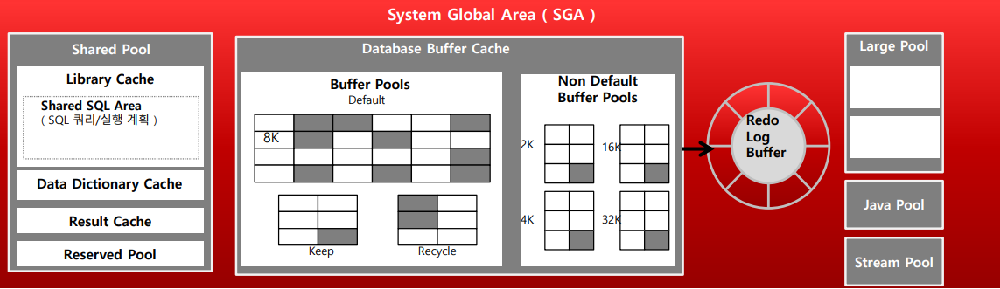
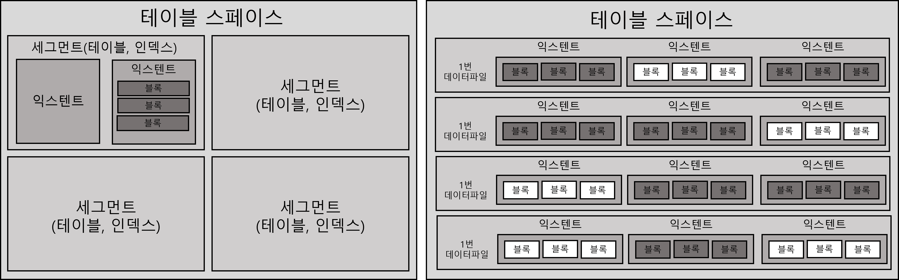

# SQL 처리 과정과 I/O

> db라는건 멀티스레드로 구성되어 트랜잭션이라는 규칙으로 정합성을 보장하는 멀티스레드 서버이다<br>
> 한 쿼리 하나가 하나의 스레드(또는 프로세스)에서 실행됨<br>
> MySQL(InnoDB), PostgreSQL, Oracle 모두 내부에 스레드/프로세스 풀 존재

## SQL의 특징

- SQL은 구조적(Structured)/집합적(set-based)/선언적인(declarative) 질의(Query) 언어다

#### 구조적

- SQL은 관계형 데이터 모델에 기반하며, 데이터를 행(row)과 열(column)의 구조로 표현한다.
- 테이블 자체가 구조화된 스키마를 따르고, 각 열은 명확한 타입과 제약 조건을 가진다.

```sql
CREATE TABLE employees (
    id INT PRIMARY KEY,
    name VARCHAR(100),
    department_id INT
);
```

#### 집합적

- SQL은 하나의 레코드가 아닌, 레코드의 집합(전체 행, 여러 행)을 대상으로 연산한다.
  - for loop같은 iteration의 결과물이 아니다
- 절차적으로 한 줄씩 처리하는 것이 아니라, 조건에 맞는 전체 데이터 집합을 한번에 처리한다.
  - SQL을 사용해 Database에 질의(Query)하면 DBMS 내부의 엔진이 SQL을 분석해 알맞는 집합(데이터 뭉치)를 주거나 에러를 발생시킨다
- 루프 없이, 집합 처리 방식으로 작동

```sql
SELECT name FROM employees WHERE department_id = 2;
→ department_id = 2인 모든 직원의 name을 한 번에 가져온다
```

#### 선언적

- SQL은 "무엇을 할지(What)"만 기술하고, "어떻게 처리할지(How)"는 DBMS가 결정한다.
- 사용자는 원하는 결과를 명시할 뿐, 반복문이나 처리 순서를 직접 작성하지 않는다.

```sql
SELECT COUNT(*) FROM employees WHERE department_id = 2;
```

- 사용자는 "몇 명인지 알려줘"만 지정함
- 실제로 인덱스를 쓸지, 테이블을 스캔할지는 DBMS의 옵티마이저가 자동 결정

### SQL 최적화

> SQL을 실행하기 전 최적화 과정을 세분화 하면 다음과 같다

1. SQL 파싱

- 파싱트리 생성: SQL문을 이루는 개별 구성요소를 분석해 파싱트리 생성
- Syntax 체크: 문법적 오류가 없는지 확인(사용할수 없는 키워드 사용, 순서, 누락된 키워드 확인)
- Semantic 체크: 의미상 오류가 없는지 확인(존재하지 않는 테이블/컬럼 사용, 사용한 오브젝트에 대한 권한 확인)

2. SQL 최적화

- Optimizer를 통해 이루어진다
  - 미리 수집한 시스템 및 오브젝트 통계 정보를 바탕으로 다양한 실행경로를 생성해서 비교한 후 가장 효율적인 하나를 선택한다
    - 오브젝트: 데이터베이스 내에 정의되어 있고, 이름으로 참조 가능한 모든 구조(Table, view, index, sequence,schema...)

3. 로우 소스 생성

- SQL 옵티마이저가 선택한 실행 경로를 실제 실행 가능한 코드 또는 프로시저 형태로 포맷팅 하는 단계다. 로우 소스 생성기가 그 역할을 맡는다

### SQL 옵티마이저

1. 사용자로부터 전달받은 쿼리를 수행하는데 후보가 될만한 실행 계획을 찾는다
2. 데이터 딕셔너리에 미리 수집해 둔 오브젝트 통계 및 시스템 통계정보를 이용해 각 실행계획의 예상 비용을 산정한다
3. 최저 비용을 나타내는 실행 계획을 선택한다

- CBO (Cost-Based Optimizer): 통계 기반으로 여러 실행 계획의 비용을 추정하여 가장 효율적인 계획 선택(대부분의 DBMS)
- 옵티마이저의 탐색 방식
  - 완전 탐색 (Exhaustive) → 작거나 단순한 쿼리
  - 휴리스틱 기반 pruning → 전부 다 보지 않고, 비효율적인 후보는 일찍 버리는 방식
  - 즉, 옵티마이저도 전수조사는 비효율적이라 판단되면 가능성이 낮은 실행 계획은 중간에 버린다
- 옵티마이저가 사용하는 정보는 다음과 같다
  - 테이블, 컬럼, 인덱스 구조에 관한 기본 정보
  - 오브젝트 통계: 테이블 통계, 인덱스 통계, 컬럼 통계
  - 시스템 통계: CPU 속도, Signle block I/O속도, multiblock I/O 속도 등
  - 옵티마이저 관련 파라미터 

### 옵티마이저는 최선의 결과만 낼까?

- 옵티마이저는 마치 자동차 네비게이션과 같고, 보편적으로 좋은 선택을 하지만 그 선택은 항상 최선이 아니다
- SQL옵티마이저 대부분 좋은 선택을 하지만, 완벽하진 않다
  - SQL이 복잡할수록 실수할 가능성도 더 크다
  - 운전자가 자신만 아는 정보나 경험을 활용해 더 빨리 목적지에 도착할 수 있는 것처럼 통계정보에 담을 수 없는 데이터 또는 업무 특성을 활용해 개발자가 직접 더 효율적인 액세스 경로를 찾아낼 수도 있다. 이럴 때 옵티마이저 힌트를 이용해 데이터 액세스 경로를 바꿀 수 있다
- 옵티마이저에게 일부만 힌트를 주고, 나머지는 알아서 판단하거나 모든 검색 방식을 힌트를 넣어 지정할 수 있다
  - 중요한 시스템일 수록 옵티마이저의 판단을 빼고 빈틈없이 기술하는 것이 중요하다

## SQL공유 및 재사용

### 소프트파싱 vs 하드파싱

- SQL 파싱, 최적화, 로우 소스 생성을 거쳐 생성한 내부 프로시저를 반복 재사용할 수 있도록 캐싱해두는 메모리 공간을 library cache라고 한다



- 오라클에는 SGA(System Global Area)라는 메모리 영역을 사용해 서버 전체가 공유 메모리를 사용한다(MySQL도 명칭만 다르지 구조는 크게 다르지 않음)
  - DBMS가 사용하는 메모리 중 "공용 메모리"를 의미하며,
  - 주로 SQL 처리, 캐시, 버퍼 관리 등 성능 최적화와 관련된 역할을 수행한다.
- Database Buffer Cache : Disk I/O의 영향도를 줄이기 위해 Data File 의 Data Block을 메모리에 가져다 놓는다. 
- Shared Pool : SQL 및 SQL 실행계획을 공유해서 같은 SQL의 Parsing은 권한 확인만 수행 하도록 만들어서 실행 속도를 높이도록 만든다. ( Data Dictionary Cache 를 활용해서 실행계획을 만들고 저장해서 공유한다. )
- Redo Log Buffer : 데이터 변경사항 ( DML 발생시) 정보를 가지며 Redo log file에 Write 되기 이전에 Memory에 먼저 Write 되는 영역
- SQL 질의 시 DBMS의 기본동작
```pseudo
input userQuery
do SQL parsing
if cache hit
  cache execute
  else 
    optimize query
    create source
    execute
```
- Cache hit의 경우 soft parsing이라고 불리며, 찾는데 실패하는 경우 hard parsing이라고 불린다
  - 로우 소스 생성과 optimize 과정은 하드해서 hardparsing이라고 불린다
    - 예를들어 다섯개의 테이블을 조인하는 쿼리문 하나를 최적화하는 데도 매우 많은 경우의 수가 존재한다(조인 순서만 고려해도 5!=120가지이다)
    - 여기에 조인 방식(NL, sort merge, hash..)이 다양하다
    - 테이블 전체 스캔/인덱스 스캔등 모든 경우의 수를 합치면 수십만 가지가 넘을 경우가 많다
    - SQL옵티마이저는 이외에도 많은 연산을 하지만 우리가 느끼지 못한다
    - 이렇게 어렵게 생성한 내부 프로시저를 한 번만 사용하고 버린다면 매우 비효율적이라 라이브러리 캐시를 사용한다
  
## 데이터 저장 구조 및 I/O 메커니즘

### SQL이 느린이유

- SQL이 느린 이유는 디스크 I/O 때문이다

### 데이터베이스 저장 구조



> 블록: 데이터를 읽고쓰는 단위<br>
> 익스텐트: 공간을 확장하는 단위, 연속된 블록 집합<br>
> 세그먼트: 데이터 저장공간이 필요한 오브젝트(테이블, 인덱스, 파티션 등)<br>
> 테이블 스페이스: 세그먼트를 담는 콘테이너<br>
> 데이터파일: 디스크 상의 물리적인 OS파일

- 익스텐트 내 블록은 연속된 공간에 있지만, 익스텐트끼리는 연속되지 않는다
- 세그먼트 공간이 부족해지면, 테이블 스페이스로부터 익스텐트를 추가로 할당받는데 이 때 세그먼트에 할당된 모든 익스텐트가 같은 데이터 파일에 위치하지 않을 수 있다
  - 추가 할당시 서로 다른 데이터 파일에 위치할 가능성이 더 높다
  - 테이블 스페이스를 여러 데이터파일로 구성하면 파일 경합을 줄이기위해 DBMS가 데이터를 가능한 여러 데이터 파일로 분산해서 저장한다