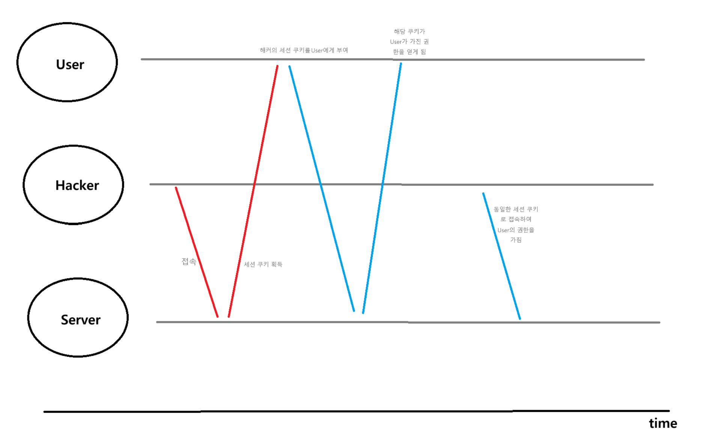

# 세션 고정 공격방법

해커가 세션 고정(Session Fixation) 공격을 수행할 때, 유저를 특정 세션 ID로 유도하는 것이 핵심이다. 이를 위해 해커는 다음과 같은 방법을 사용한다

## 1. 세션 ID 생성 및 확보
해커가 서버에서 세션 ID를 미리 생성한다.

해커는 의도적으로 웹사이트에 접속해 유효한 세션 ID를 얻는다.
예를 들어, JSESSIONID=ABC123라는 세션 ID를 확보한다.

일부 웹 서버는 클라이언트가 임의로 생성한 세션 ID를 허용할 수 있다.
해커는 자신이 원하는 세션 ID를 서버에 전달해 강제로 사용되도록 할 수도 있다.

## 2. 유저를 특정 세션 ID로 유도
해커가 확보한 세션 ID를 유저에게 사용하도록 만드는 단계는 다음과 같다

- 악성 링크 유도
해커는 다음과 같은 URL을 생성해서 링크를 이메일, 피싱 사이트, 악성 광고 등으로 유저에게 전달한다.

`https://example.com/login?JSESSIONID=ABC123`

유저가 이 링크를 클릭하면, 브라우저는 해당 세션 ID(ABC123)를 서버로 전달한다.

- 쿠키 조작
일부 경우, 해커는 XSS(Cross-Site Scripting) 공격을 통해 클라이언트의 브라우저에서 세션 쿠키를 강제로 설정할 수 있다.

`document.cookie = "JSESSIONID=ABC123";`

## 3. 유저가 세션 ID를 사용
유저는 공격자가 설정한 세션 ID(ABC123)로 서버에 요청을 보내게 된다.
서버는 해당 세션 ID를 유효하다고 간주하고, 로그인 후에도 동일한 세션 ID를 유지한다(sessionFixation().none() 설정의 경우)
.
## Role(역할)을 얻어오는 과정

### 1. 세션 ID와 유저 데이터의 매핑
서버는 세션 ID를 통해 유저 데이터를 조회한다.

유저가 로그인하면, 서버는 인증 정보를 기반으로 유저의 역할(Role)을 확인한다.
이 역할 정보는 보통 데이터베이스 또는 다른 저장소에 저장되어 있다.
`SELECT role FROM users WHERE username = 'exampleUser';`

서버는 조회한 역할 정보를 세션에 저장한다.
`session.setAttribute("userRole", "ADMIN");`

이후 유저가 요청을 보낼 때, 서버는 세션 ID를 통해 유저 역할 정보를 가져온다.
`String role = (String) session.getAttribute("userRole");`
### 2. 해커가 역할 정보를 사용하는 과정
- 공격자가 세션 ID를 확보한 경우
해커가 특정 세션 ID(ABC123)를 확보하고 유저가 해당 세션을 사용하게 유도하면, 이후 이 세션에 저장된 역할 정보도 해커가 사용할 수 있다.
ABC123 세션에 userRole=ADMIN이 저장되어 있다면, 해커는 관리자 권한을 가진 상태로 서버에 접근할 수 있다.
- 로그인 후 역할 정보 갱신
만약 서버가 로그인 시 세션 ID를 갱신하지 않는 경우(`sessionFixation().none()`), 해커가 미리 확보한 세션 ID에 유저의 역할 정보가 갱신된다.
해커는 자신이 얻은 세션 ID를 계속 사용해 유저의 역할로 서버를 조작할 수 있다.