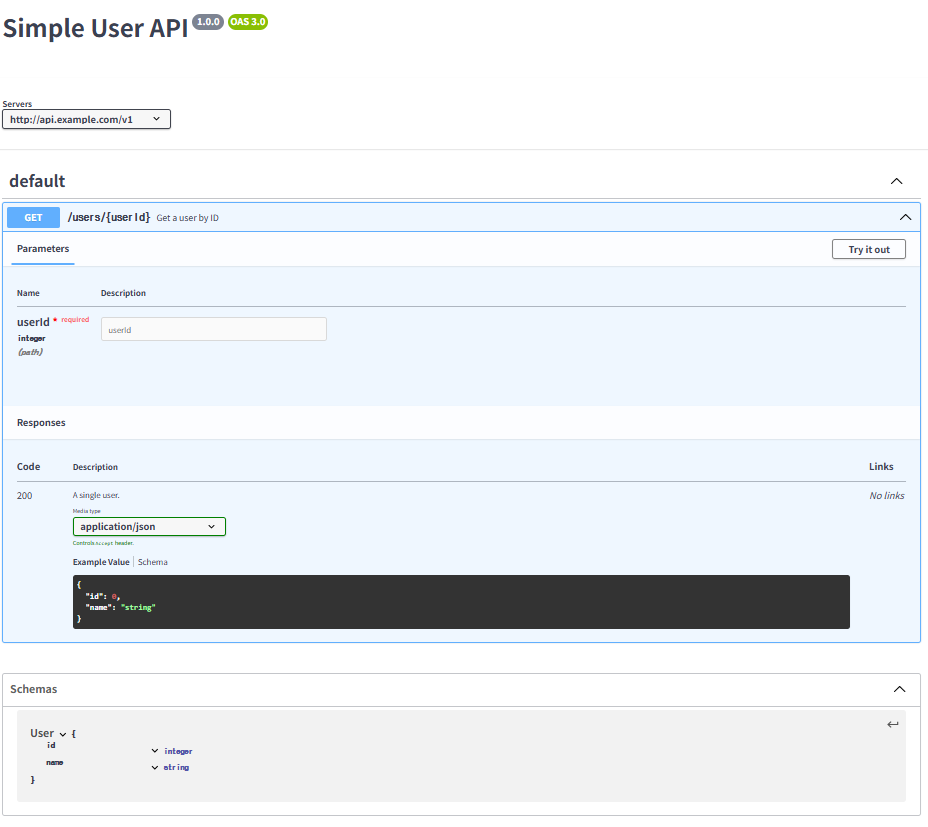

# OpenAPI Specification

> https://github.com/OAI/OpenAPI-Specification/blob/main/versions/3.0.4.md

- OpenAPI Specification은 REST API를 어떻게 만들어야 하는지에 대한 표준화된 규칙이자 설계도 양식이다
  - REST API에 대한 표준 양식이다
  - OAS를 실제로 REST API의 표준명세라고 많이들 표현하며, 실제로 표준 명세로 많이 사용한다(사실상의 표준)
    - Swagger UI,, Codegen 등 OAS를 지원하는 편리한 도구들 때문에 자연스럽게 개발자들이 OAS를 사용하게 되었다

## OpenAPI 명세의 핵심 구성 요소

OpenAPI 명세는 주로 YAML이나 JSON 형식으로 작성되며, 다음과 같은 주요 정보들을 담는다.

### 기본 정보 (Info)

API의 이름(title), 버전(version), 간단한 설명(description) 등 전반적인 정보를 담는다.

### 서버 정보 (Servers)

API를 호출할 수 있는 서버의 주소(URL)를 명시한다. 개발용 서버, 운영용 서버 등 여러 환경을 등록할 수 있다.

### 경로 (Paths)

API의 각 엔드포인트(Endpoint)에 대한 정보를 정의하는 가장 핵심적인 부분이다.
예를 들어, `/users/{id}` 같은 경로와 해당 경로에서 사용할 수 있는 GET, POST, DELETE 같은 HTTP 메서드를 정의한다.

### 오퍼레이션 (Operations)

각 경로와 HTTP 메서드 조합에 대한 상세 설명이다.
어떤 파라미터(parameters)를 받아야 하는지, 성공 시 어떤 응답(responses)을 주는지, 실패 시에는 어떤 응답을 주는지 등을 상세하게 기술한다.

### 컴포넌트 (Components)

API 전반에 걸쳐 재사용될 수 있는 요소들을 모아놓은 곳이다.
데이터 모델(Schemas), 보안 방식(Security Schemes), 재사용할 파라미터 등을 이곳에 정의해두고 여러 곳에서 참조하여 중복을 피할 수 있다.

### 간단한 YAML 예시

> https://editor.swagger.io/ 에서 테스트 가능

```yaml
# Info
openapi: 3.0.0
info:
  title: Simple User API
  version: 1.0.0
# Server
servers:
  - url: http://api.example.com/v1
# Path
paths:
  /users/{userId}:
    # Operation
    get:
      summary: Get a user by ID
      parameters:
        - name: userId
          in: path
          required: true
          schema:
            type: integer
      responses:
        '200':
          description: A single user.
          content:
            application/json:
              schema:
                $ref: '#/components/schemas/User' # components에서 정의한 User 모델 참조
# Component
components:
  schemas:
    User:
      type: object
      properties:
        id:
          type: integer
        name:
          type: string
```

#### 결과

