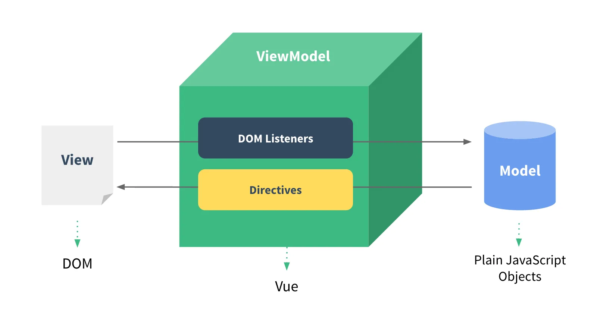
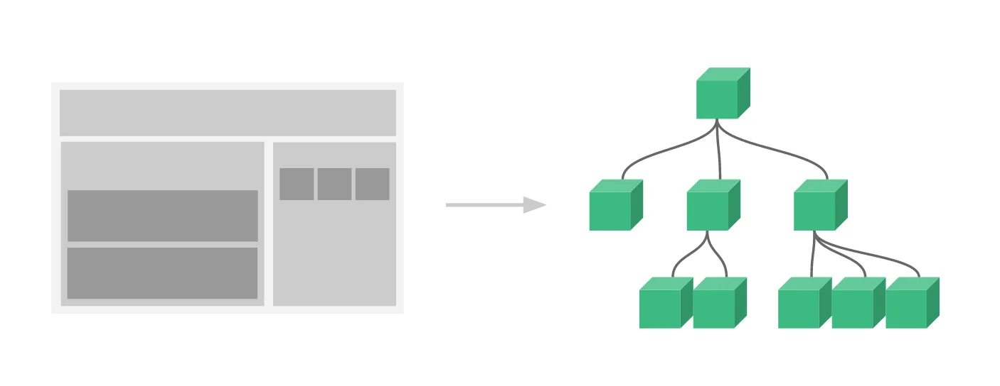
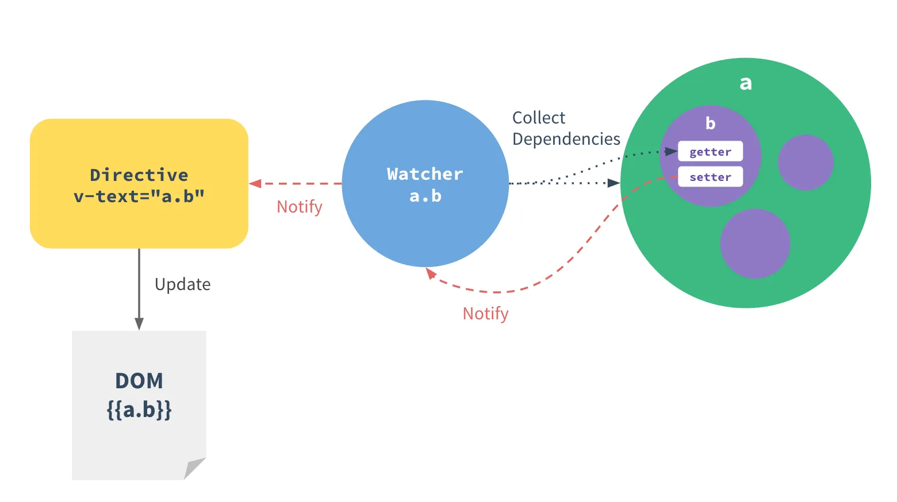
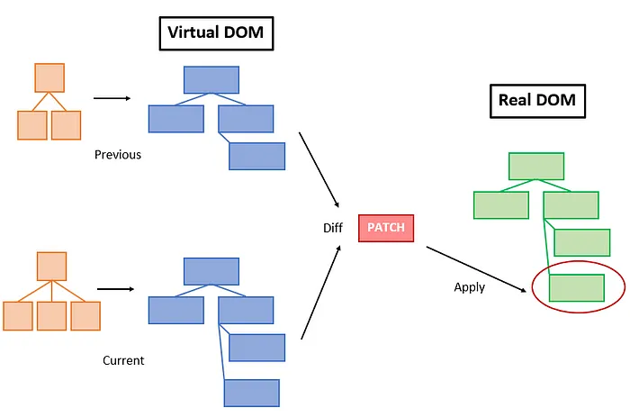
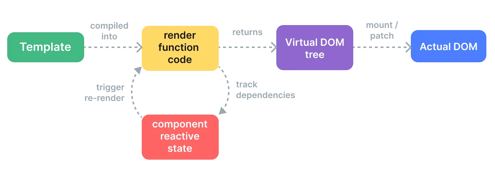
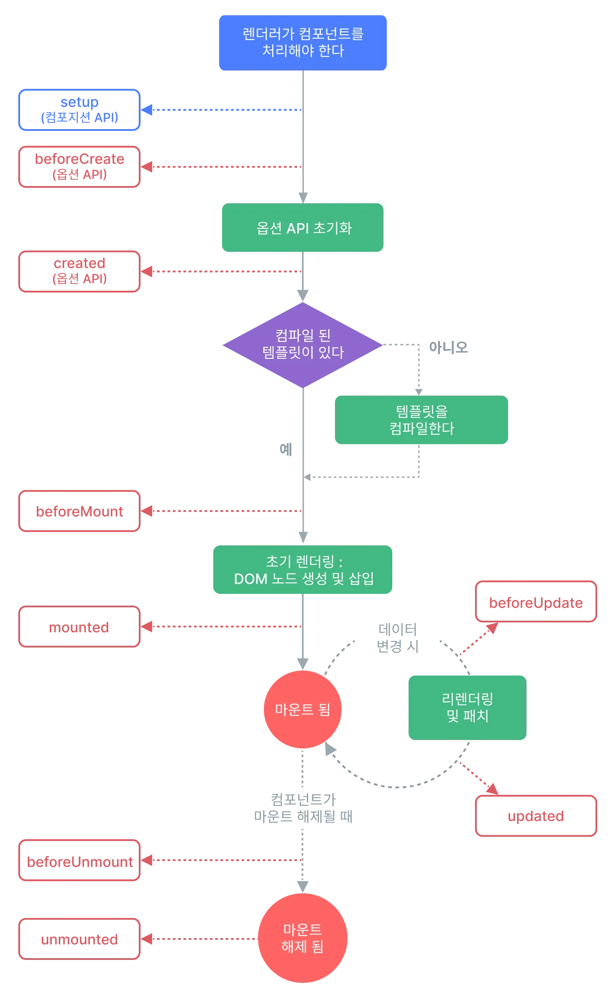

# Vue의 특징과 메커니즘

> Vue의 작동원리
> https://docs.google.com/document/d/1tkSOZJ8kHhfkm3khZPQxmRSLnorZCcH0S84cRSBobAA/edit?pli=1&tab=t.0<br>

- Vue가 가진 중요한 5가지 특징
  1. MVVM 패턴
  2. Component
  3. Data Binding
  4. Virtual DOM
  5. Vue Lifecycle

## 1. MVVM 패턴



- MVVM 패턴은 Model-View-ViewModel의 약자로, Vue.js에서 따르는 아키텍처 패턴 중 하나이다. Model과 View 사이에 ViewModel이라는 중간 계층을 두어, View와 Model 간의 결합도를 낮추는 패턴이다.
  - Model: 애플리케이션의 데이터와 비즈니스 로직이 정의되는 곳
  - View: 사용자에게 보여지는 화면
  - ViewModel: View와 Model 간의 인터페이스 역할을 하는 계층
- ViewModel은 View의 상태와 Model의 상태를 동기화시켜주는 역할을 한다. 이를 통해 View와 Model 간의 결합도를 낮추고, 애플리케이션의 유지보수성을 높일 수 있다. 또한 MVVM 패턴을 사용하면 개발자는 UI와 비즈니스 로직을 분리하여 개발할 수 있으므로, 코드의 가독성과 유지보수성이 향상된다.
- Vue.js에서는 ViewModel이 Object.defineProperty(Vue2), Proxy(Vue3)로 감싸진 데이터를 통해 View와 Model을 자동으로 동기화해주는 방식으로 MVVM 패턴을 구현한다

| 항목             | Vue 2 (옵션 API + defineProperty) | Vue 3 (Composition API + Proxy) |
| ---------------- | --------------------------------- | ------------------------------- |
| 반응형 방식      | `Object.defineProperty`           | `Proxy`                         |
| API 스타일       | option API 중심                   | Composition API 중심            |
| this 바인딩      | Vue 인스턴스에 자동 바인딩        | `setup()` 내에서는 사용 안 함   |
| 속성 접근 방식   | Vue 인스턴스에 프록시됨           | `ref`, `reactive`로 명시적 접근 |
| 동적 속성 반응성 | 불완전함                          | 완전 지원                       |
| 트리 쉐이킹      | 어려움                            | 쉬움                            |
| 성능 및 유연성   | 구조가 고정되어 유연하지 않음     | 더 나은 성능과 유연성 제공      |

### option API 사용시 this instance bind가 필요한 이유

- Vue 내부에서는 this.message를 사용할 수 있도록 this.\_data.message를 this.message에 프록시 처리한다
- 각 파일 조각은 각자의 Vue인스턴스가 되어, 하나의 파일은 하나의 this.\_data만이 존재한다(유지보수가 복잡해지는 핵심 이유)

## 2. Component 기반



- Vue.js는 컴포넌트 기반으로 개발이 가능하다. 컴포넌트란 작은 단위의 UI 조각으로, 화면을 구성하는 모든 요소를 컴포넌트로 만들어 조합할 수 있다. 이는 유지보수와 확장성 측면에서 큰 이점을 가진다.
- 컴포넌트 기반으로 개발하면, 독립적인 컴포넌트들을 조합하여 애플리케이션을 만들 수 있다. 이를 통해 컴포넌트 단위로 개발을 진행하면서, 각 컴포넌트를 재사용하거나 다른 컴포넌트와 조합하여 새로운 기능을 구현할 수 있다. 또한, 컴포넌트 단위로 개발을 진행하면 코드의 가독성과 유지보수성이 향상된다.

## 3. Data Binding



- Vue.js는 데이터와 UI 간의 일관성을 유지하면서 데이터를 업데이트할 수 있는 기능을 제공하는데, 이를 양방향 데이터바인딩이라고 한다. 이는 데이터와 UI 간의 상호작용이 자연스럽게 이루어지도록 해주는데, 사용자가 입력한 값이 자동으로 데이터에 반영되고, 데이터가 변경될 때마다 UI도 자동으로 업데이트된다.
- 반면, 단방향 데이터 흐름은 데이터의 흐름이 한 방향으로만 흐르는 것을 의미한다. Vue.js에서는 부모 컴포넌트에서 자식 컴포넌트로 데이터를 전달할 때 주로 사용된다.

## 4. Virtual DOM - 더 효율적인 렌더링





- Virtual DOM은 실제 DOM의 경량화된 자바스크립트 객체 표현이다
- 브라우저의 실제 DOM을 직접 건드리지 않고, 메모리 상에 가벼운 객체 구조로 DOM을 흉내내서 보관한다

```javascript
const vdom = {
  tag: "div",
  props: { id: "app" },
  children: [{ tag: "p", children: ["Hello World"] }],
};
```

### Virtual DOM 과 Real DOM 조작의 차이

| 항목             | 실제 DOM 조작                  | Virtual DOM 방식                                   |
| ---------------- | ------------------------------ | -------------------------------------------------- |
| 처리 방식        | DOM을 직접 수정                | 메모리 상에서 변경 사항 계산 후 최소 DOM 변경 수행 |
| 렌더링 비용      | 높음 (Reflow, Repaint 발생)    | 낮음 (필요한 부분만 업데이트)                      |
| 성능             | 변화가 많을수록 느려짐         | 변화가 많을수록 상대적 이점 커짐                   |
| 선언 방식        | 명령형 (Imperative)            | 선언형 (Declarative)                               |
| 업데이트 전략    | 변경 즉시 DOM 수정             | 변경 사항을 모아서 한 번에                         |
| diff 비교        | 불가능                         | 이전 Virtual DOM과 비교해 변경점 계산              |
| 활용 가능 최적화 | 낮음 (직접 최적화 필요)        | 높음 (프레임워크가 최적화 로직 내장)               |
| 비용 (자원 사용) | 비쌈 (브라우저 연산 자주 발생) | 저렴함 (메모리 연산 중심)                          |
| 변경 감지 방식   | 수동 감지                      | 자동 감지 및 효율적 렌더링 (프레임워크가 처리)     |

### 왜 효율적인가?

> Virtual DOM이 빠른 핵심 메커니즘

1. 변경을 메모리에서 먼저 처리함 (비용 저렴)
    - 실제 DOM은 조작하기 느림
    - 하지만 Virtual DOM은 JS 객체이므로 훨씬 빠름
    - 변경 사항을 Virtual DOM에서 먼저 계산

2. Diffing 알고리즘으로 변경점만 추적
    - Vue/React는 이전 Virtual DOM과 새 Virtual DOM을 비교 (diffing)
    - 어떤 부분이 바뀌었는지만 찾아냄
    - 결과적으로 최소한의 실제 DOM 조작만 수행
    - 이를 "patching" 이라고 부름

3. Batching 업데이트
    - 여러 변화가 발생해도 바로 DOM을 건드리지 않음
    - 비동기적으로 모아서 한번에 처리 (process.nextTick())
    - 브라우저 리소스를 덜 차지함

#### 일반 DOM 조작

```javascript
const el = document.getElementById("text");
el.innerText = "Hello";
el.style.color = "red";
// DOM 접근 → 스타일 계산 → 레이아웃 재계산 → 렌더링
// 조작할 때마다 브라우저는 성능 손실
```

#### Virtual DOM 조작 (Vue 내부 흐름)

```javascript
// 변경 사항이 상태에 반영됨
this.message = "Hello";

// 1. 메모리의 Virtual DOM 트리에 변경 발생
// 2. 이전 VDOM과 새로운 VDOM 비교 (diff)
// 3. 변경된 부분만 실제 DOM에 patch
```

#### Virtual DOM = 빠른 렌더링인가?

> 엄밀히 말하면 "빠른 렌더링"이 아니라 "더 효율적인 렌더링" 이다

- Virtual DOM이 항상 빠른 건 아님
- 작은 앱에선 오히려 비용이 더 들 수 있음 (diffing 오버헤드 존재)
- 많은 변화, 복잡한 구조에선 압도적으로 효율적

### Virtual DOM Recap

- Virtual DOM이 빠른 이유는 브라우저의 느린 실제 DOM을 직접 다루지 않고,
  메모리에서 변경을 먼저 계산한 뒤, 최소한의 변경만 실제 DOM에 적용하기 때문이다
- 이로 인해 불필요한 렌더링을 피하고, UI 업데이트 성능이 향상된다


## Vue의 생명주기


- 빨간색은 옵션 API(Vue2, Object.defineProperty), 파랑색은 컴포지션 API(Vue3, Proxy)를 나타낸다
- Vue는 컴포넌트의 생명 주기를 가지고 있다. Vue 인스턴스가 생성되고 소멸될 때, 그리고 화면에 렌더링될 때 등 여러 단계에서 훅이 호출된다
- Vue의 생명 주기 훅을 사용하여 컴포넌트의 데이터를 초기화하거나, 이벤트 리스너를 등록하거나, 외부 라이브러리와의 연동 등을 처리할 수 있다. 또한, 훅을 사용하여 컴포넌트의 상태를 추적하거나, 디버깅 정보를 출력하는 등의 작업을 수행할 수 있다