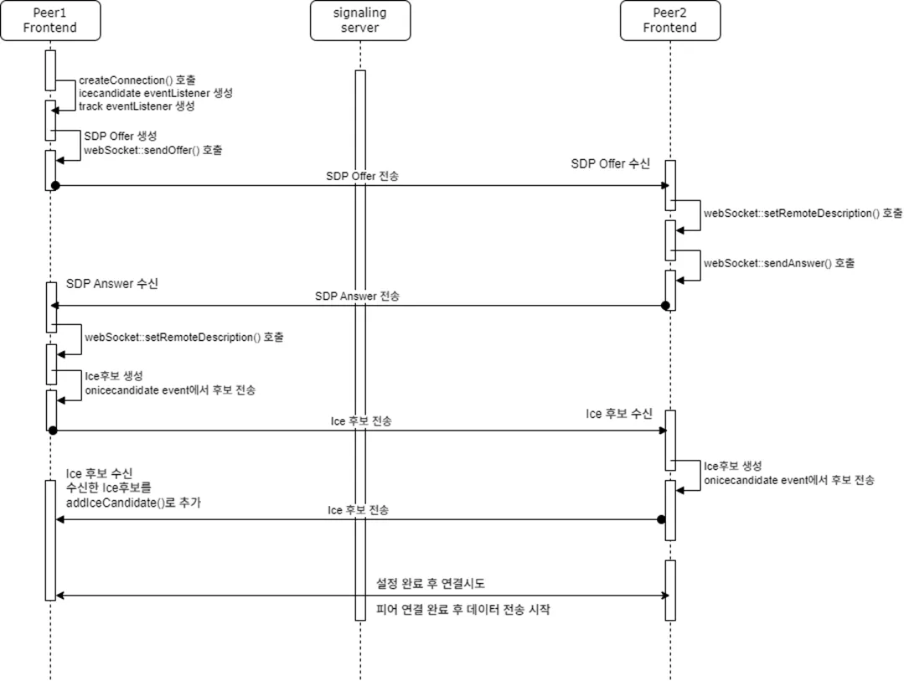

## sequence diagram 해석



- Peer1이 새로 입장한 경우의 sequence를 표시한다.
- SDP(Session Description Protocol)는 내 미디어 상태(오디오, 비디오 트랙, 코덱, 네트워크 정보 등)를 표시하는 프로토콜이다
- Peer2는 먼저 들어온 사람으로, js를 통해 eventListener가 생성되어 있는 상태이다 (icecandidate, track)

    - icecandidate : 네트워크 경로 후보
    - icecandidate는 WebRTC에서 피어 간의 연결을 설정하기 위해 사용되는 네트워크 경로 후보(ICE Candidate)가 생성될 때 발생하는 이벤트이다.

- 시퀀스 다이어그램에서 offer/answer, ice event 순서로 되어있지만, 사실 순서는 상관이 없고 두 개가 모두 이루어지면 연결이 시작된다

```javascript
  // ...
  // ICE 후보 목록 (네트워크 연결을 위한 후보 주소)
  // icecandidate 이벤트를 통해 내가 사용할 수 있는 네트워크 경로 후보를 상대에게 전송하고, 상대방도 자신의 후보를 보내면서 서로 연결할 수 있는 경로를 찾아 WebRTC 연결을 성립
  // 연결은 webrtc api를 통해서, 블랙박스 안에서 해결된다
"iceCandidates": [
    {
    // 내가 사용할 수 있는 네트워크 경로를 상대방에게 전송하는 정보
      "candidate": "candidate:842163049 1 udp 1677729535 192.168.1.2 54321 typ srflx raddr 0.0.0.0 rport 0",
      // 미디어 스트림 ID
      "sdpMid": "0",
      // SDP 내 m= 라인의 순서 인덱스
      // 미디어(비디오, 오디오) 스트림을 뜻한다
      "sdpMLineIndex": 0
    }
  ]
```


```javascript
// RTCPeerConnection 객체의 주요 구성
{
  // 🔹 현재 P2P 연결 상태 (new, connecting, connected, disconnected, failed, closed)
  "connectionState": "new",

  // 🔹 ICE(Interactive Connectivity Establishment) 연결 상태
  //    (new, checking, connected, completed, disconnected, failed, closed)
  "iceConnectionState": "new",

  // 🔹 ICE 후보(gathering) 수집 상태 (new, gathering, complete)
  "iceGatheringState": "new",

  // 🔹 WebRTC 시그널링(Signaling) 상태
  //    (stable, have-local-offer, have-remote-offer, have-local-pranswer, have-remote-pranswer, closed)
  "signalingState": "stable",

  // 🔹 로컬 SDP (Session Description Protocol) 정보 (Offer 또는 Answer 포함)
  "localDescription": {
    "type": "offer",
    // SDP(Session Description Protocol)는 내 미디어 상태(오디오, 비디오 트랙, 코덱, 네트워크 정보 등)를 표시
    "sdp": "v=0\r\no=- 4611735367920841259 2 IN IP4 127.0.0.1\r\ns=...(생략)"
  },

  // 🔹 상대방(원격) SDP 정보 (초기에는 null, 이후 수신한 Offer 또는 Answer가 들어감)
  "remoteDescription": null,

  // 🔹 아직 적용되지 않은 원격 SDP (예비 설정)
  "pendingRemoteDescription": null,

  // 🔹 아직 적용되지 않은 로컬 SDP (예비 설정)
  "pendingLocalDescription": null,

  // 🔹 ICE 후보를 Trickling(순차적으로 추가)할 수 있는지 여부 (true / false)
  "canTrickleIceCandidates": true,

  // 🔹 WebRTC 연결 설정
  "configuration": {
    // ✅ ICE 서버 목록 (STUN/TURN 서버)
    "iceServers": [
      {
        "urls": "stun:stun.l.google.com:19302"
      }
    ],
    // ✅ SDP 사용 방식 (unified-plan: 표준 방식, plan-b: 구형 방식)
    "sdpSemantics": "unified-plan"
  },

  // 🔹 오디오/비디오 송수신 트랜시버(Transceiver) 목록
  "transceivers": [
    {
      // ✅ Media Stream ID (MID)
      "mid": "0",
      // ✅ 송신자 정보 (로컬에서 보낼 트랙)
      "sender": {
        "track": {
          "kind": "video",   // 오디오(audio) 또는 비디오(video)
          "id": "abcd-1234", // 트랙 ID
          "enabled": true,   // 트랙 활성화 여부
          "muted": false,    // 음소거 여부
          "readyState": "live" // (live, ended)
        },
        "parameters": {}
      },
      // ✅ 수신자 정보 (원격에서 받을 트랙)
      "receiver": {
        "track": {
          "kind": "video",
          "id": "xyz-5678",
          "enabled": true,
          "muted": false,
          "readyState": "live"
        }
      },
      // ✅ 송수신 방향 (sendrecv, sendonly, recvonly)
      "currentDirection": "sendrecv"
    }
  ],

  // 🔹 ICE 후보 목록 (네트워크 연결을 위한 후보 주소)
  "iceCandidates": [
    {
      "candidate": "candidate:842163049 1 udp 1677729535 192.168.1.2 54321 typ srflx raddr 0.0.0.0 rport 0",
      "sdpMid": "0",
      "sdpMLineIndex": 0
    }
  ],

  // 🔹 P2P 데이터 채널 목록 (파일 전송, 채팅 등)
  "dataChannels": [
    {
      "label": "chat",       // 데이터 채널 이름
      "ordered": true,       // 메시지 순서 보장 여부
      "maxRetransmits": null, // 최대 재전송 횟수 (null이면 무제한)
      "protocol": "",        // 사용 프로토콜 (일반적으로 빈 문자열)
      "readyState": "open",  // 데이터 채널 상태 (connecting, open, closing, closed)
      "bufferedAmount": 0    // 아직 전송되지 않은 데이터 크기 (바이트 단위)
    }
  ]
}
```

## 실행 시퀀스
- startVideoConference()
- connectWebsocket()
    - 웹 소켓 연결
- getMedia()
    - getUserMedia() browser단의 카메라를 얻어온다
    - 없을 시 error를 throw(카메라 없으면 자동 화면 공유로 실행)
    - 있다면 자신의 카메라 화면을 만든다
- needMemberKey()
    - signaling Server로 방의 정보(projectNo)를  전송해 메모리에서 관리하는 그 방의 인원에게 memberNo를 요청보내서 `otherMemberNoSet`에 저장한다 
- roomlimit();
    - `otherMemberNoSet` 에 있는 멤버가 4명이상이면 종료시킨다
- `otherMemberNoSet` 을 통해 `peerConnectionMap` 을 관리한다.
    - `createConnection` 으로 `memberNo` 당 커넥션을 관리한다
    - `sendOffer` 을 방의 모든 `memberNo` 에게 전송한다
        - `setLocalDescription` 설정
        - `createOffer` 로 이용해 단일 타겟(`memberNo`)에게 전송
        - `createOffer` 에서 STUN Server("stun:stun.l.google.com:19302")를 세팅해 Ice candidate 후보를 수집하고 이를 전송해 peer들과 네트워크 경로를 설정하고 연결한다
          - STUN 서버를 통해 내 공인 IP와 포트가 확인되면, 해당 정보가 ICE 후보(ice candidate)로 생성되어 WebRTC에 전달
  - `createConnection` 을 통한 icecandidate 이벤트, icecandidate에서 세팅된 offer(sdp 미디어 스트림 id 교환) 이 이루어지면 이후 과정인 연결이 시작된다(P2P)

```javascript
// stun:stun.l.google.com:19302 반환값
"iceCandidates": [
  {
                                                       // 공인 네트워크 주소, 포트         // 로컬 네트워크 주소
    "candidate": "candidate:842163049 1 udp 1677729535 203.0.113.45 53478 typ srflx raddr 192.168.1.2 rport 54321",
    "sdpMid": "0",
    "sdpMLineIndex": 0
  }
]

// 같은 LAN 네트워크시 로컬 네트워크 이용, 인터넷을 이용한 접근일 경우 공인 네트워크 주소 이용
```

```javascript
const sendOffer = (myPeerConnection: RTCPeerConnection, targetNo: number) => {

    myPeerConnection.createOffer().then((offer: any) => {
        setLocal(myPeerConnection, offer);
        /*
        const setLocal = (myPeerConnection: RTCPeerConnection, offerOrAnswer: any) => {
            myPeerConnection.setLocalDescription(offerOrAnswer);
        }
        */
        socket.send(JSON.stringify({
            "type": "offer",
            "body": offer,
            "targetNo": targetNo,
            "makeAnswerMemberNo": memberNo,
            "projectNo": projectNo,
        }));
    })
}
```


```javascript
const createConnection = (otherMemberNo: number) => {

    const configuration = {
        iceServers: [
            {
                urls: [
                    "stun:stun.l.google.com:19302"
                ]
            }
        ]
    }

    const myPeerConnection = new RTCPeerConnection(configuration);

    myPeerConnection.addEventListener("icecandidate", (event) => {
        iceHandler(event, otherMemberNo);
    });

    myPeerConnection.addEventListener("track", (event) => {

        trackHandler(event, otherMemberNo);

    });

    if (myStream !== undefined) {
        myStream.getTracks().forEach(track => {
            myPeerConnection.addTrack(track, myStream);
        });
    }


    return myPeerConnection;

}
```