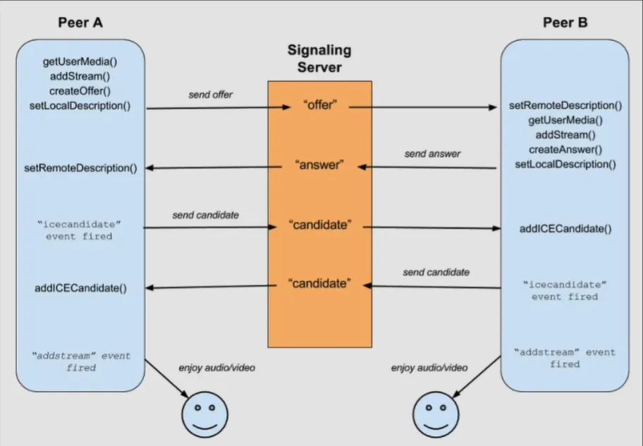
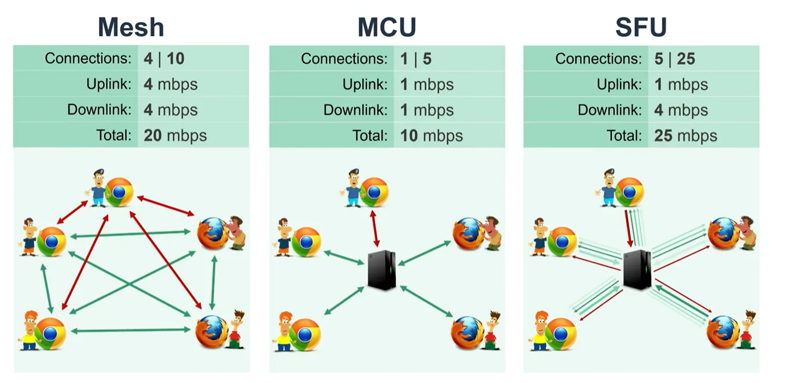

# WebRTC

> 제작한 화상회의 프로그램과 설명<br>
> https://github.com/gunhaa/Tlink

- webrtc?
    
    WEB REALTIME COMMUNICATION
    
    p2p 통신을 가능하게 만든다.
    
    websocket은 하나의 서버에 많은 웹 소켓들이 연결된 것이다.
    
    서버로 메시지를 보내면, 타겟을 찾아서 서버가 메세지를 대신 전달해줌
    
    하지만 WEBRTC는 이와는 다르게 p2p로 연결시킨다.
    
    브라우저끼리 연결시킴
    
- 서버로 전달되는 것
    
    각 유저의 Configuration,setting, 위치 등이 전달된다.
    
- 서버가 하는일?
    
    서버는 브라우저에게 다른 브라우저의 위치를 전달해준다.
    
- 영상과 비디오
    
    서버와 관계 없이 p2p로 전송된다.
    
- socket.io의 역할
    
    각 유저의 Configuration,setting, 위치 등을 socket io(websocket)를 이용해서 전달한다.
    
- 이미지로 정리
    
    
    
- getTrack()
    
    `myStream.getTracks().forEach(track => myPeerConnection.addTrack(track, myStream));` 코드는 WebRTC에서 `RTCPeerConnection` 객체에 미디어 트랙을 추가하는 과정에서 사용됩니다. 여기서 `track`을 첫 번째 파라미터로 넣는 이유는 WebRTC API의 `addTrack` 메소드의 요구 사항에 맞추기 위함입니다.
    
    ### `RTCPeerConnection.addTrack()` 메소드
    
    `addTrack()` 메소드는 다음과 같은 형식을 가집니다:
    
    ```jsx
    javascript코드 복사
    addTrack(track, stream);
    
    ```
    
    - **`track`**: `MediaStreamTrack` 객체로, 오디오 또는 비디오 트랙을 나타냅니다.
    - **`stream`**: `MediaStream` 객체로, 해당 트랙이 포함된 스트림을 나타냅니다.
    
    이 메소드는 두 개의 인자를 받습니다:
    
    1. **첫 번째 인자 (`track`)**: 추가할 `MediaStreamTrack` 객체입니다. 오디오 또는 비디오 트랙을 나타내며, 이 트랙을 `RTCPeerConnection`에 추가하여 피어 간의 연결을 통해 전송할 수 있게 합니다.
    2. **두 번째 인자 (`stream`)**: 트랙이 속한 `MediaStream` 객체입니다. 이 스트림은 트랙의 출처를 명시하며, 특정 트랙이 어떤 스트림에서 왔는지를 알려줍니다. 이 정보는 피어 간에 세션 설명을 교환할 때 중요한 메타데이터로 사용됩니다.
- icecandidate
    
    브라우저가 서로 소통하는 방법을 알려주는 것
    
    **`icecandidate`**는 WebRTC에서 피어 간의 연결을 설정하기 위해 사용되는 네트워크 경로 후보(ICE Candidate)가 생성될 때 발생하는 이벤트입니다.
    
- Sender
    
    getSender() : peer로 보내진  media stream track을 컨트롤한다
    
- STUN SERVER
    
    컴퓨터가 공용 IP주소를 갖게한다
    
    P2P 연결을 하고 있기 때문에 서로를 찾아야한다.
    
    → STUN서버를 이용, STUN 서버에 request를 보내면 내가 누군지 알려줌(공용IP)
    
- SFU selective forwarding unit
    
    
    
- MESH
    
    webrtc의 방식은 mesh라서 참가인원이 많아질수록 점점 느려진다
    
- createDatachannel
    
    데이터 채널을 만든다
    
- signalling server
    
    node js/java spring, 메타데이터를 주고 받을수 있게한다 socket io 이용
    
- 도식화
    
    ```
    피어 1 (Peer 1)                      시그널링 서버                     피어 2 (Peer 2)
    ---------------------------------------------------------------------------------------
    |                                |                                     |
    | 1. SDP Offer 생성               |                                     |
    |   - `createOffer()` 호출         |                                     |
    |                                |                                     |
    | 2. SDP Offer 전송                |                                     |
    |   - SDP Offer를 시그널링 서버로    |                                     |
    |     전송                          |                                     |
    |------------------------------->|                                     |
    |                                | 3. SDP Offer 수신                    |
    |                                |------------------------------------->|
    |                                | 4. SDP Answer 생성                  |
    |                                |   - `setRemoteDescription()` 호출   |
    |                                |   - `createAnswer()` 호출            |
    |                                |                                     |
    | 5. SDP Answer 전송               |<-------------------------------------|
    |   - SDP Answer를 시그널링 서버로 |                                     |
    |     전송                          |                                     |
    |<-------------------------------|                                     |
    |                                | 6. SDP Answer 수신                    |
    |   - `setRemoteDescription()` 호출|                                     |
    |                                |                                     |
    | 7. ICE 후보 생성 및 전송         |                                     |
    |   - `onicecandidate` 이벤트에서  |                                     |
    |     ICE 후보를 시그널링 서버로    |                                     |
    |     전송                          |                                     |
    |------------------------------->|                                     |
    |                                | 8. ICE 후보 수신                      |
    |                                |------------------------------------->|
    |                                | 9. ICE 후보 생성 및 전송              |
    |                                |   - `onicecandidate` 이벤트에서      |
    |                                |     ICE 후보를 시그널링 서버로 전송  |
    |                                |                                     |
    |10. ICE 후보 수신                |<-------------------------------------|
    |   - 수신한 ICE 후보를            |                                     |
    |     `addIceCandidate()`로 추가    |                                     |
    |<-------------------------------|                                     |
    |                                |11. 수신한 ICE 후보를                  |
    |                                |   `addIceCandidate()`로 추가          |
    |                                |                                     |
    | 12. 연결 시도 및 설정 완료        |                                     |
    |   - 피어 연결 완료 후            |                                     |
    |     데이터 전송 시작              |                                     |
    ---------------------------------------------------------------------------------------
    
    ```
    
- icecandidate, offer, answer
    
    **Offer/Answer (SDP)**
    
    - **역할:**
        - 멀티미디어 세션 설정 및 협상을 위한 정보 교환
        - 각 피어의 미디어 기능(코덱, 해상도 등) 및 선호 설정 정보 제공
    - **포함 정보:**
        - **미디어 정보 (m= 라인):**
            - 미디어 유형 (audio, video, application 등)
            - 포트 번호
            - 전송 프로토콜 (RTP/UDP, RTP/TCP 등)
            - 페이로드 타입 (코덱 목록)
        - **미디어 속성 (a= 라인):**
            - 코덱 (H.264, VP8, Opus 등)
            - 대역폭
            - 샘플링 레이트 (오디오)
            - 채널 수 (오디오)
            - 기타 세션 및 미디어 관련 속성
    - **교환 방식:**
        - Offer: 연결을 시작하는 피어가 생성하여 상대 피어에게 전송
        - Answer: Offer를 받은 피어가 생성하여 상대 피어에게 전송
    
    **ICE Candidate**
    
    - **역할:**
        - NAT 또는 방화벽 통과를 위한 네트워크 연결 정보 교환
        - 각 피어의 공용 IP 주소 및 포트 정보, NAT 유형 등 제공
    - **포함 정보:**
        - **candidate:** ICE candidate의 SDP 형식 문자열 표현
            - foundation
            - component (RTP 또는 RTCP)
            - protocol (UDP, TCP, TLS)
            - priority
            - ip
            - port
            - type (host, srflx, relay 등)
        - `sdpMid`: 관련된 미디어 스트림의 식별자
        - `sdpMLineIndex`: 관련된 미디어 설명의 인덱스
    - **교환 방식:**
        - 각 피어는 자신의 ICE candidate들을 수집하여 상대 피어에게 전송
        - `icecandidate` 이벤트를 통해 ICE candidate 정보를 얻고, 시그널링을 통해 교환
    
    **요약**
    
    | 구분 | Offer/Answer (SDP) | ICE Candidate |
    | --- | --- | --- |
    | **역할** | 멀티미디어 세션 설정 및 협상 | NAT/방화벽 통과 및 연결 정보 교환 |
    | **포함 정보** | 미디어 기능, 코덱, 대역폭 등 | 공용 IP 주소, 포트, NAT 유형 등 |
    | **교환 방식** | Offer -> Answer | 각 피어가 수집하여 상대 피어에게 전송 |
    
    Sheets로 내보내기
    
    **따라서, Offer/Answer는 미디어 관련 정보를, ICE candidate는 네트워크 연결 정보를 담당하며, 두 가지 정보 모두 WebRTC 연결 설정에 필수적입니다.**
    
    +
    
    - **Offer의 미디어 정보는 "어떤 종류의 물건을 보낼 것인가?"에 대한 정보입니다.** (예: 책, 옷, 가구 등)
    - **`sdpMid`와 `sdpMLineIndex`는 "어떤 택배 상자에 물건을 담을 것인가?"에 대한 정보입니다.**
    - **ICE candidate는 "택배 상자를 어떤 주소로 보낼 것인가?"에 대한 정보입니다.**
    
    **구체적으로 설명하면:**
    
    - **Offer:**
        - `m=` 라인: 어떤 종류의 미디어 스트림(audio, video 등)을 보낼 것인지, 어떤 포트를 사용할 것인지, 어떤 전송 프로토콜을 사용할 것인지 등을 명시합니다.
        - `a=rtpmap` 속성: 각 미디어 스트림에서 사용할 코덱 종류와 관련 정보(페이로드 타입, 클럭 레이트 등)를 명시합니다.
        - `a=bandwidth` 속성: 각 미디어 스트림의 최대 대역폭을 제한할 수 있습니다.
    - **ICE candidate:**
        - `sdpMid`: offer에서 정의된 여러 미디어 스트림 중 어떤 스트림과 관련된 ICE candidate인지 식별합니다. (예: `audio`, `video`)
        - `sdpMLineIndex`: offer에서 정의된 여러 미디어 스트림 중 몇 번째 `m=` 라인에 해당하는 스트림과 관련된 ICE candidate인지 식별합니다. (0부터 시작하는 인덱스)
    
    **따라서, ICE candidate는 offer에서 정의된 특정 미디어 스트림에 대한 연결 정보를 나타내며, offer 자체는 해당 미디어 스트림의 특성(종류, 코덱, 대역폭 등)을 정의하는 역할을 합니다.**


