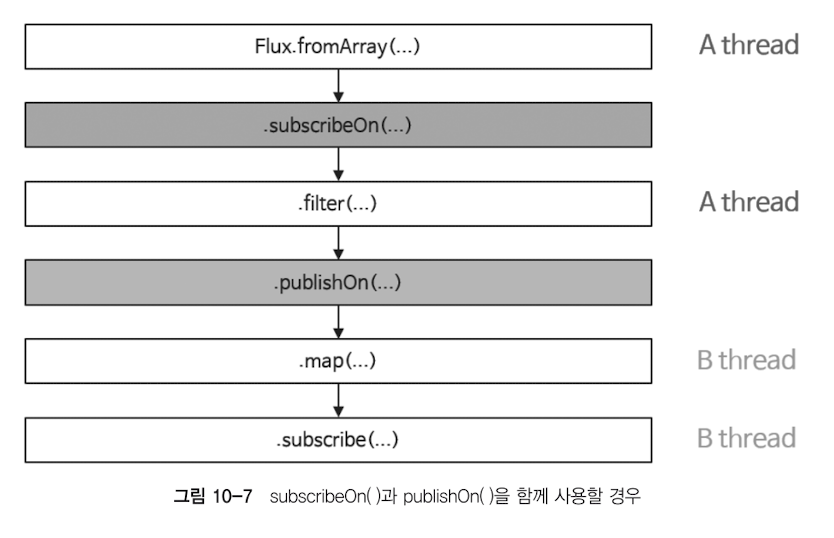

# Scheduler

- 스레드를 관리해주는 관리자의 역할을 한다
- 운영체제에서 사용되는 Scheduler의 의미와 비슷하다고 볼 수 있다
- Scheduler를 사용해 어떤 스레드에서 무엇을 처리할지 제어한다
  - 일반적으로 java프로그래밍에서 멀티스레드를 제어하는 것은 매우 어려운데, Race condition을 신중하게 고려해야하기 때문에 코드의 복잡도가 높아져 예상치 못한 오류가 자주 발생한다
  - Reactor에서는 Scheduler를 통해 이러한 문제를 최소화할 수 있다
  - Scheduler를 사용하면 코드 자체가 매우 간결해지고, Scheduler가 스레드의 제어를 대신해 주기 때문에 개발자가 직접 스레드를 제어해야 하는 부담에서 벗어날 수 있다
  

```java
    // subscribeOn()
    public static void main(String[] args) throws InterruptedException {
        Flux.fromArray(new Integer[] {1, 3, 5 ,7})
                // 원본 Publisher(Flux)의 동작을 처리하기 위한 스레드를 할당한다
                // Schedulers.boundedElastic()은 ExecutorService 기반의 스레드풀을 생성한 후
                // 그 안에서 정해진 수 만큼의 스레드를 사용하여 작업을 처리하고 작업이 종료된 스레드는 반납하여 재사용하는 방식이다
                // Blocking I/O작업을 효과적으로 처리하기 위한 방식이다
                .subscribeOn(Schedulers.boundedElastic())
                // doOnNext는 데이터 흐름에 영향을 주지 않고 몰래 엿보는 관찰자
                .doOnNext(data -> log.info("# doOnNext: {}", data))
                // 구독이 발생한 시점에 추가적인 처리가 필요하다면 동작 추가 가능
                .doOnSubscribe(subscription -> log.info("# doOnSubscribe"))
                // subscribe는 데이터 흐름을 실제로 발동시키고 최종적으로 소비하는 실행자
                .subscribe(data -> log.info("# onNext: {}", data));
        Thread.sleep(500L);
    }
```
```java
    // publishOn()
    public static void main(String[] args) throws InterruptedException {
        Flux.fromArray(new Integer[]{1, 3, 5, 7})
                .doOnNext(data -> log.info("# doOnNext: {}", data))
                .doOnSubscribe(subscription -> log.info("# doOnSubscribe"))
                // publishOn() Operator는 해당 publishOn()을 기준으로 Downstream의 실행 스레드를 변경한다
                .publishOn(Schedulers.parallel())
                .subscribe(data -> log.info("#onNext: {}", data));
        Thread.sleep(500L);
    }    
```
```java
    // parellelOn()
    public static void main(String[] args) throws InterruptedException {
        Flux.fromArray(new Integer[]{1,3,5,7,9,11,13,15,17,19})
                .parallel()
                // parellel()의 경우 라운드 로빈 방식으로 CPU코어 개수만큼의 스레드를 병렬로 실행한다
                // (물리적인 코어 갯수가 아닌 논리적인 코어의 개수, intel은 하이퍼스레딩으로 인해 1개의 코어에서 2개의 논리적인 스레드로 사용된다)
                // 예를 들어 4코어 8스레드의 CPU라면 총 8개의 스레드를 병렬로 실행한다
                .runOn(Schedulers.parallel())
                .subscribe(data -> log.info("# onNext: {}", data));
        Thread.sleep(100L);
    }
```
- parallel(4) 
  - 형식으로 Thread의 숫자 지정 가능
- 

## Scheduler의 종류

> Scheduler는 리액티브 스트림의 특정 처리 단계를 어느 스레드에서 실행할지 결정하는 실행 전략이다

- Scheduler.immediate()은 별도의 스레드를 추가적으로 생성하지 않고, 현재 스레드에서 작업을 처리한다
- Scheduler.single()은 스레드 하나만 생성해서 Scheduler가 제거되기 전까지 재사용 한다
- Scheduler.boundedElastic()은 ExecutorService 기반의 스레드풀을 생성한 후, 그 안에서 정해진 수만큼의 스레드를 사용하여 작업을 처리하고 작업이 종료된 스레드는 반납하여 재사용한다
- Scheduler.parallel()은 Non-Blocking I/O에 최적화되어 있는 Scheduler로서 CPU코어 수만큼의 스레드를 생성한다
- Scheduler.newSingle(), - Scheduler.newBoundedElastic(), - Scheduler.newParallel() 메서드를 사용해서 새로운 Scheduler 인스턴스를 생성할 수 있다

## 참고: 스레드란?

- 컴퓨터 시스템에서 스레드는 물리적인 스레드와 논리적인 스레드로 구별한다
- 코어는 CPU의 명령을 처리하는 반도체 유닛이다
  - 일반적으로 코어의 갯수가 많으면 더 많은 수의 명령어를 더 빠르게 병렬로 처리할 수 있다
- 물리적인 스레드(=코어)
  - 하드웨어와 관련된 스레드는 물리적인 스레드이다
  - 1물리 코어 = 1물리 스레드지만, 하이퍼 스레딩을 통해 확장할수있다
    - 하이퍼스레딩 (Hyper-Threading / SMT): 인텔(Intel)이나 AMD에서 사용하는 기술로, 하나의 물리 코어를 두 개의 논리 코어처럼 보이게 만든다. 코어 내부의 자원을 효율적으로 활용해 전반적인 멀티태스킹 성능을 약 15~30% 향상시킨다
- 논리적인 스레드
  - 소프트웨어적으로 생성되는 스레드를 의미하며, Java 프로그래밍에서 사용되는 스레드는 바로 이러한 논리적인 스레드라고 볼 수 있다
  - 논리적인 스레드는 우리가 흔히들 프로그램이라고 부르는 프로세스 내에서 실행되는 세부 작업의 단위가 된다
  - 이론적으로는 메모리가 허용하는 범위 내에서 얼마든지 만들 수 있지만 물리적인 스레드의 가용 범위 내에서 실행될 수 있다
- 물리적인 스레드는 병렬성과 관계 있으며, 논리적인 스레드는 동시성과 관련이 있다
